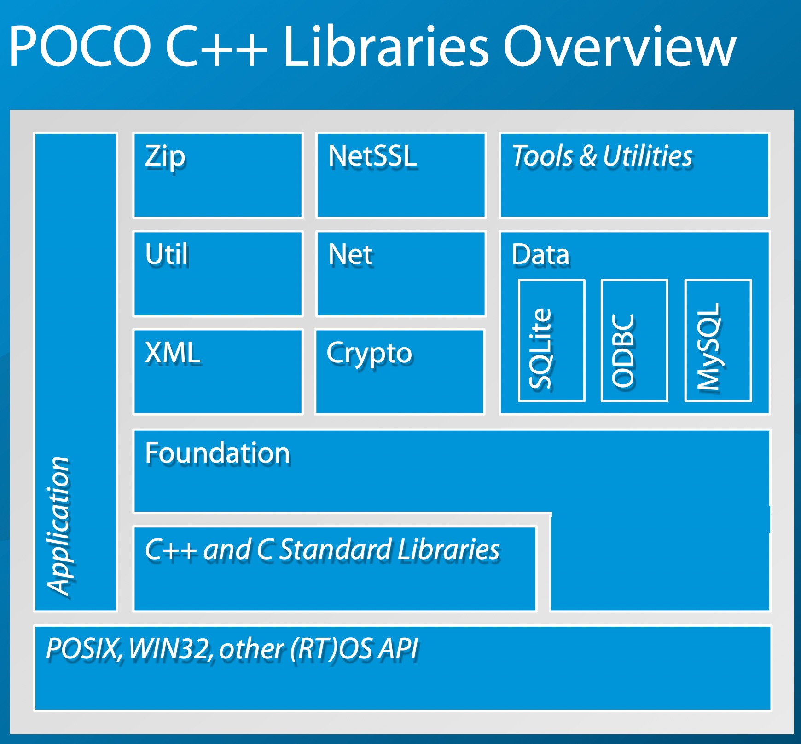

## poco

Poco库是开源的C++的库，类似Java类库，.Net框架，Apple的Cocoa。旨在帮助C++开发者更加容易地去构建一个C++的应用程序。与其说Poco是一个库，倒不如说它是一个C++框架。

Poco的主要的库是Foundation、XML、Util、Net这四个库

其中Foundation库是整个Poco库的核心，Foundation库是对底层平台、常用类和函数的抽象层。由上述架构图可以看出，Poco库的其他库功能都是基于Foundation库的。

* XML库是使C++更方便的读取，处理以及写入XML文件。除了支持XML文件，Poco还提供了Json数据格式的相关库。

* Util库包含了创建命令行和服务器应用的框架。包括命令行参数处理支持和管理配置信息

* Net库提供了各种网络层的实现函数，无论应用是纯TCP socket的收发数据，还是构建一个Http Server，都可以通过Net库进行实现。

* NetSSL库提供了对openSSL的支持，使得我们可以创建安全的sockets以及对Https的支持

* Crypto库提供了对称/非对称加密的算法

* Data库为我们对不同的数据库提供了统一的数据库接口，现在支持的数据库有sqlite、MySQL，PostgreSQL，MongoDB、Redis
  