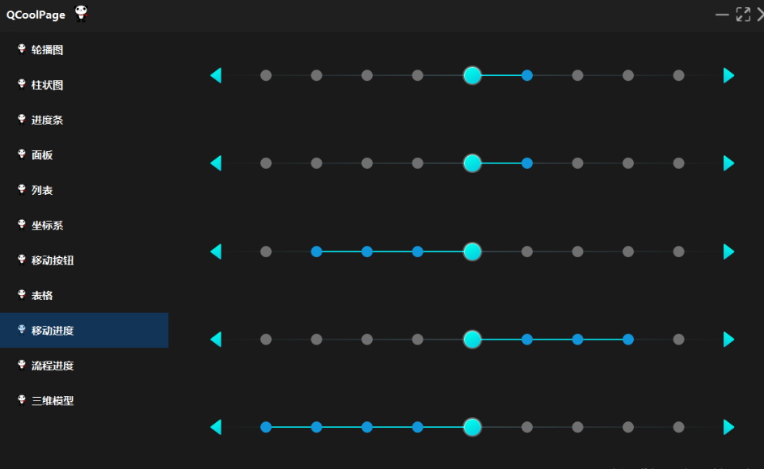

## qt-material-widgets

https://github.com/laserpants/qt-material-widgets

## feiyangqingyun/QWidgetDemo

https://gitee.com/feiyangqingyun/QWidgetDemo

Qt编写的一些开源的demo，支持Qt4、Qt5、Qt6，支持任意系统，有100多个，代码简洁易懂注释详细，每个都是独立项目

## qskinny

https://github.com/uwerat/qskinny

* 只支持Qt版本>Qt5.12

## QCoolPage

https://github.com/YYC572652645/QCoolPage

