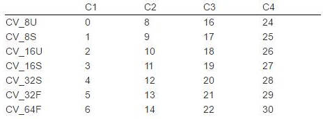

## cv::Mat

Mat结构为cv中的一个class(虽然我觉得他更适合作为struct)，它是作为图像矩阵载体的数据结构。

## 矩阵类型

## Mat常用成员变量与函数

| 成员名           | 类型(或返回类型) | 介绍                                                         |
| ---------------- | ------------------------------------------------------------ | ------------------------------------------------------------ |
| data             | uchar*                                                       | 存放矩阵数据的指针，为一维                                   |
| dims             | int                                                          | 矩阵的维度                                                   |
| rows             | int                                                          | 矩阵的行数                                                   |
| cols             | int                                                          | 矩阵的列数                                                   |
| channels()       | int                                                          | 图片每个像素数据的通道数                                     |
| depth()          | int                                                          | 用来度量每一个像素中每一个通道的精度，但它本身与图像的通道数无关Mat.depth()得到的是一个0~6的数字，分别代表不同的位数enum{CV_8U=0,CV_8S=1,CV_16U=2,CV_16S=3,CV_32S=4,CV_32F=5,CV_64F=6} |
| elemSize()       | size_t                                                       | 矩阵中一个像素的大小(以8bit为单位)，比如rgb24的矩阵导入后该函数返回3 |
| elemSize1()      | size_t                                                       | 矩阵中一个像素每个通道的大小，相当于返回 elemSize/channels   |
| step=step[0]     | size_t                                                       | 矩阵第一行元素的总字节数                                     |
| step[1]          | size_t                                                       | 矩阵中一个元素的字节数                                       |
| step1()=step1(0) | size_t                                                       | 矩阵中一行有几个通道数                                       |
| step1(1)         | size_t                                                       | 一个元素有几个通道数(channel())                              |
| type()           | int                                                          | mat的类型对应值如下表                                        |

* type()返回值对应的类型

