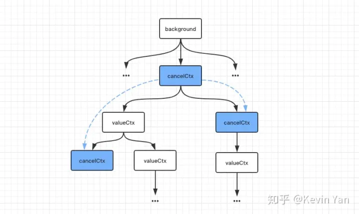

## Context

Context用于管理多个Goroutine之间共享数据的机制。Context提供了一种标准的方式来传递请求的截止时间、取消信号以及请求域的值等元数据，使得这些数据可以在整个应用程序中流动，方便地跨越多个函数和Goroutine。

`Context接口`

```go
type Context interface {

    Deadline() (deadline time.Time, ok bool)

    Done() <-chan struct{}

    Err() error

    Value(key interface{}) interface{}
}
```

`Context`接口包含四个方法：

- `Deadline`：返回绑定当前`context`的任务被取消的截止时间；如果没有设定期限，将返回`ok == false`。
- `Done`： 当绑定当前`context`的任务被取消时，将返回一个用来发送关闭信号的`channel`；如果当前`context`不会被取消，将返回`nil`，协程可以一直监听改通道，如果该通道有数据传入，则说明该协程需要取消了。
- `Err` ：如果`Done`返回的`channel`没有关闭，将返回`nil`;如果`Done`返回的`channel`已经关闭，将返回非空的值表示任务结束的原因。如果是`context`被取消，`Err`将返回`Canceled`；如果是`context`超时，`Err`将返回`DeadlineExceeded`。
- `Value` ：返回`context`存储的键值对中当前`key`对应的值，如果没有对应的`key`,则返回`nil`

## emptyCtx结构

`emptyCtx`是一个`int`类型的变量，但实现了`context`的接口。`emptyCtx`没有超时时间，不能取消，也不能存储任何额外信息，所以`emptyCtx`用来作为`context`树的根节点。

```go
type emptyCtx int

func (*emptyCtx) Deadline() (deadline time.Time, ok bool) {
    return
}

func (*emptyCtx) Done() <-chan struct{} {
    return nil
}

func (*emptyCtx) Err() error {
    return nil
}

func (*emptyCtx) Value(key interface{}) interface{} {
    return nil
}

func (e *emptyCtx) String() string {
    switch e {
    case background:
        return "context.Background"
    case todo:
        return "context.TODO"
    }
    return "unknown empty Context"
}

var (
    background = new(emptyCtx)
    todo       = new(emptyCtx)
)

func Background() Context {
    return background
}

func TODO() Context {
    return todo
}
```

一般不会直接使用`emptyCtx`，而是使用由`emptyCtx`实例化的两个变量，分别可以通过调用`Background`和`TODO`方法得到。

* `Background`和`TODO`只是用于不同场景下： `Background`通常被用于主函数、初始化以及测试中，作为一个顶层的`context`，一般创建的`context`都是基于`Background`；而`TODO`是在不确定使用什么`context`的时候才会使用。

`使用示例`

```go
ctx := context.Background()
fmt.Println(ctx)
ctx := context.TODO()
fmt.Println(ctx)
```

## valueCtx结构

```go
type valueCtx struct {
    Context
    key, val interface{}
}

func (c *valueCtx) Value(key interface{}) interface{} {
    if c.key == key {
        return c.val
    }
    return c.Context.Value(key)
}
```

`valueCtx`类型携带一组键值对。`valueCtx`实现了`Value`方法，用以在`context`链路上获取`key`对应的值，如果当前`context`上不存在需要的`key`,会沿着`context`链向上寻找`key`对应的值，直到根节点。

> WithValue方法

`WithValue`用以向`context`添加键值对：

```text
func WithValue(parent Context, key, val interface{}) Context {
    if key == nil {
        panic("nil key")
    }
    if !reflect.TypeOf(key).Comparable() {
        panic("key is not comparable")
    }
    return &valueCtx{parent, key, val}
}
```

这里添加键值对不是在原`context`结构体上直接添加，而是以此`context`作为父节点，重新创建一个新的`valueCtx`子节点，将键值对添加在子节点上，由此形成一条`context`链。

### cancelCtx结构体

```go
type cancelCtx struct {
    Context

    mu       sync.Mutex            // protects following fields
    done     chan struct{}         // created lazily, closed by first cancel call
    children map[canceler]struct{} // set to nil by the first cancel call
    err      error                 // set to non-nil by the first cancel call
}

type canceler interface {
    cancel(removeFromParent bool, err error)
    Done() <-chan struct{}
}

func (c *cancelCtx) Done() <-chan struct{} {
    c.mu.Lock()
    if c.done == nil {
        c.done = make(chan struct{})
    }
    d := c.done
    c.mu.Unlock()
    return d
}

func (c *cancelCtx) Err() error {
    c.mu.Lock()
    err := c.err
    c.mu.Unlock()
    return err
}

func (c *cancelCtx) cancel(removeFromParent bool, err error) {
    if err == nil {
        panic("context: internal error: missing cancel error")
    }
    c.mu.Lock()
    if c.err != nil {
        c.mu.Unlock()
        return // already canceled
    }
    // 设置取消原因
    c.err = err
    设置一个关闭的channel或者将done channel关闭，用以发送关闭信号
    if c.done == nil {
        c.done = closedchan
    } else {
        close(c.done)
    }
    // 将子节点context依次取消
    for child := range c.children {
        // NOTE: acquiring the child's lock while holding parent's lock.
        child.cancel(false, err)
    }
    c.children = nil
    c.mu.Unlock()

    if removeFromParent {
        // 将当前context节点从父节点上移除
        removeChild(c.Context, c)
    }
}

```

变量`done`表示一个`channel`，用来传递关闭信号；`children`表示一个`map`，存储了当前`context`节点下的子节点；`err`用于存储错误信息表示任务结束的原因。

>  WithCancel方法

`WithCancel`函数用来创建一个可取消的`context`，即`cancelCtx`类型的`context`。`WithCancel`返回一个`context`和一个`CancelFunc`，调用`CancelFunc`即可触发`cancel`操作。

```go
type CancelFunc func()

func WithCancel(parent Context) (ctx Context, cancel CancelFunc) {
    c := newCancelCtx(parent)
    propagateCancel(parent, &c)
    return &c, func() { c.cancel(true, Canceled) }
}

// newCancelCtx returns an initialized cancelCtx.
func newCancelCtx(parent Context) cancelCtx {
    // 将parent作为父节点context生成一个新的子节点
    return cancelCtx{Context: parent}
}

func propagateCancel(parent Context, child canceler) {
    if parent.Done() == nil {
        // parent.Done()返回nil表明父节点以上的路径上没有可取消的context
        return // parent is never canceled
    }
    // 获取最近的类型为cancelCtx的祖先节点
    if p, ok := parentCancelCtx(parent); ok {
        p.mu.Lock()
        if p.err != nil {
            // parent has already been canceled
            child.cancel(false, p.err)
        } else {
            if p.children == nil {
                p.children = make(map[canceler]struct{})
            }
            // 将当前子节点加入最近cancelCtx祖先节点的children中
            p.children[child] = struct{}{}
        }
        p.mu.Unlock()
    } else {
        go func() {
            select {
            case <-parent.Done():
                child.cancel(false, parent.Err())
            case <-child.Done():
            }
        }()
    }
}

func parentCancelCtx(parent Context) (*cancelCtx, bool) {
    for {
        switch c := parent.(type) {
        case *cancelCtx:
            return c, true
        case *timerCtx:
            return &c.cancelCtx, true
        case *valueCtx:
            parent = c.Context
        default:
            return nil, false
        }
    }
}
```

`cancelCtx`取消时，会将后代节点中所有的`cancelCtx`都取消，`propagateCancel`即用来建立当前节点与祖先节点这个取消关联逻辑。

1. 如果`parent.Done()`返回`nil`，表明父节点以上的路径上没有可取消的`context`，不需要处理；
2. 如果在`context`链上找到到`cancelCtx`类型的祖先节点，则判断这个祖先节点是否已经取消，如果已经取消就取消当前节点；否则将当前节点加入到祖先节点的`children`列表。
3. 否则开启一个协程，监听`parent.Done()`和`child.Done()`，一旦`parent.Done()`返回的`channel`关闭，即`context`链中某个祖先节点`context`被取消，则将当前`context`也取消。

`为什么先是祖先节点而不是父节点的原因`

当前`cancelCtx`的父节点`context`并不是一个可取消的`context`，也就没法记录当前`children`。



### timerCtx

`timerCtx`是一种基于`cancelCtx`的`context`类型，是一种可以定时取消的`context`。

```go
type timerCtx struct {
    cancelCtx
    timer *time.Timer // Under cancelCtx.mu.

    deadline time.Time
}

func (c *timerCtx) Deadline() (deadline time.Time, ok bool) {
    return c.deadline, true
}

func (c *timerCtx) cancel(removeFromParent bool, err error) {
    将内部的cancelCtx取消
    c.cancelCtx.cancel(false, err)
    if removeFromParent {
        // Remove this timerCtx from its parent cancelCtx's children.
        removeChild(c.cancelCtx.Context, c)
    }
    c.mu.Lock()
    if c.timer != nil {
        取消计时器
        c.timer.Stop()
        c.timer = nil
    }
    c.mu.Unlock()
}
```

`timerCtx`内部使用`cancelCtx`实现取消，另外使用定时器`timer`和过期时间`deadline`实现定时取消的功能。`timerCtx`在调用`cancel`方法，会先将内部的`cancelCtx`取消，如果需要则将自己从`cancelCtx`祖先节点上移除，最后取消计时器。

> WithDeadline

`WithDeadline`返回一个基于`parent`的可取消的`context`，并且其过期时间`deadline`不晚于所设置时间`d`。

```go
func WithDeadline(parent Context, d time.Time) (Context, CancelFunc) {
    if cur, ok := parent.Deadline(); ok && cur.Before(d) {
        // The current deadline is already sooner than the new one.
        return WithCancel(parent)
    }
    c := &timerCtx{
        cancelCtx: newCancelCtx(parent),
        deadline:  d,
    }
    // 建立新建context与可取消context祖先节点的取消关联关系
    propagateCancel(parent, c)
    dur := time.Until(d)
    if dur <= 0 {
        c.cancel(true, DeadlineExceeded) // deadline has already passed
        return c, func() { c.cancel(false, Canceled) }
    }
    c.mu.Lock()
    defer c.mu.Unlock()
    if c.err == nil {
        c.timer = time.AfterFunc(dur, func() {
            c.cancel(true, DeadlineExceeded)
        })
    }
    return c, func() { c.cancel(true, Canceled) }
}
```

1. 如果父节点`parent`有过期时间并且过期时间早于给定时间`d`，那么新建的子节点`context`无需设置过期时间，使用`WithCancel`创建一个可取消的`context`即可；
2. 否则，就要利用`parent`和过期时间`d`创建一个定时取消的`timerCtx`，并建立新建`context`与可取消`context`祖先节点的取消关联关系，接下来判断当前时间距离过期时间`d`的时长`dur`：
3. 如果`dur`小于0，即当前已经过了过期时间，则直接取消新建的`timerCtx`，原因为`DeadlineExceeded`；
4. 否则，为新建的`timerCtx`设置定时器，一旦到达过期时间即取消当前`timerCtx`。

> WithTimeout

与`WithDeadline`类似，`WithTimeout`也是创建一个定时取消的`context`，只不过`WithDeadline`是接收一个过期时间点，而`WithTimeout`接收一个相对当前时间的过期时长`timeout`:

```go
func WithTimeout(parent Context, timeout time.Duration) (Context, CancelFunc) {
    return WithDeadline(parent, time.Now().Add(timeout))
}
```
