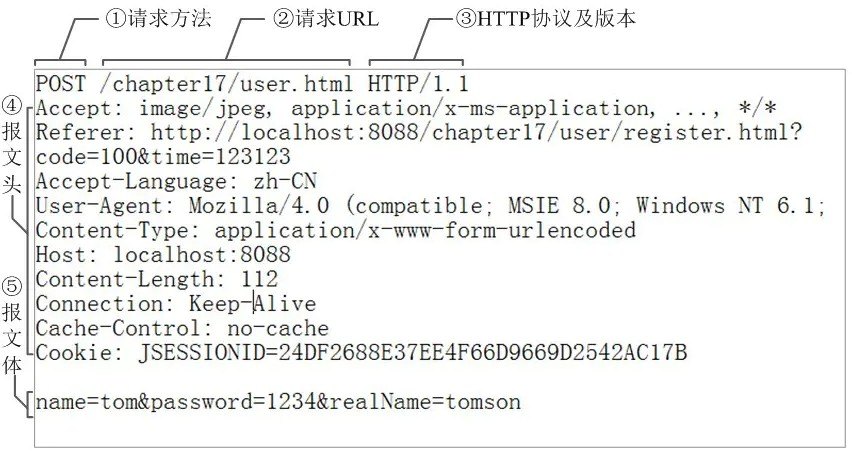
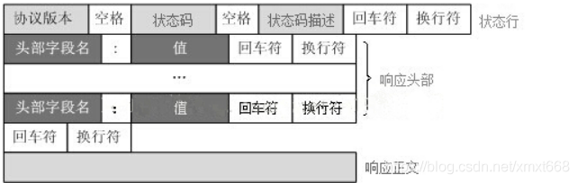
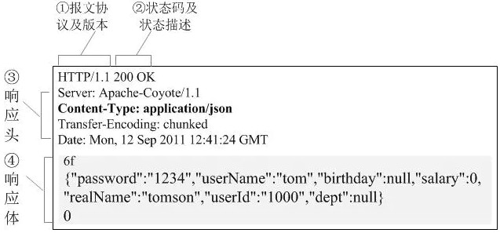

## HTTP请求报文
HTTP请求报文由三部分组成。

请求行+请求头+请求体

> 一个http请求报文实例




上述中的1 2 3组成了请求行  

4为请求头    
请求头中包含若干个头域，请求头包含了与HTTP请求相关的详细信息。

5为请求体  
一般请求体承载多个的传给服务器的数据。不但报文体可以传递请求参数，请求URL也可以通过类似于
```
    /chapter15/user.html? param1=value1&param2=value2
```
的方式传递请求参数。

> http请求报文详细格式



## HTTP响应报文
HTTP请求的响应报文也由三部分组成。

响应行+响应头+响应体

> 一个http响应报文实例



上述中的1 2组成了响应行

3为响应头
响应头中包含若干个头域，响应头中包含若干个头域，响应头包含了与HTTP响应相关的详细信息。

4为响应体   
响应体中一般承载了http对于请求响应数据，可以为json或是一个文件内容。


> http响应报文格式


## 头域
每个头域由一个域名，冒号（:）和域值三部分组成。域名是大小写无关的，域值前可以添加任何数量的空格符，头域可以被扩展为多行，在每行开始处，使用至少一个空格或制表符。

`例子`
```
    Host: localhost:8080
```

HTTP的头域包括通用头，请求头，响应头和实体头四个部分。

通用头与实体头在HTTP请求报文与响应报文的头部中都可以存在。

而响应头只能在响应报文中存在，请求头只能在请求报文中存在。

> 通用头

通用头域包含请求和响应消息都支持的与HTTP相关信息的头域，比如目标主机的地址Host等。

> 请求头

请求头只包含了与请求有关相关信息的头域。

> 响应头

响应头只包含了与响应有关相关信息的头域。

> 实体头

实体头字段可以用于请求消息或响应消息。实体头字段中包含消息实体正文的有关信息，如使用的编码格式。

