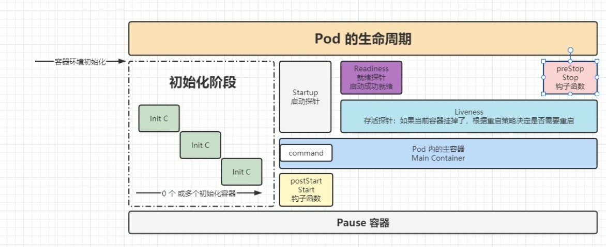

[toc]

## 生命周期流程



1. 将每个容器都初始化
2. 运行启动探针
3. 运行postStart钩子函数，钩子函数和容器内设定的CMD命令可能同时运行
4. Endpoint删除pod的ip地址
5. pod变为terminating(默认30s)状态，该状态用于给容器以及preStop钩子函数来释放资源
6. 执行preStop钩子函数(受到terminating的时长影响，如果钩子函数的执行时间大于terminating的持续时间，则会强制结束钩子函数)

## preStop的使用

```
//pod创建实例的yaml

apiVersion: v1
kind: Pod
.....
spec:
  .....
  containers:
  - name: nginx
    image: nginx:1.7.9
    imagePullPolicy: IfNotPresent
    lifecycle:
    	postStart:
    		exec:
    			command:
    			- sh
    			- -c
    			- "echo 'start--------' > /tmp/start.test"
    	preStop:
    		exec:
    			command:
    			- sh
    			- -c
    			- "echo 'end---------' > /tmp/stop.test"
  .....
```

## 设置terminating持续时间

```
//pod创建实例的yaml

apiVersion: v1
kind: Pod
.....
spec:
  .....
  terminationGracePeriodSeconds: 60   #设置为60s
  containers:
  - name: nginx
    image: nginx:1.7.9
    imagePullPolicy: IfNotPresent
    lifecycle:
    	postStart:
    		exec:
    			command:
    			- sh
    			- -c
    			- "echo 'start--------' > /tmp/start.test"
    	preStop:
    		exec:
    			command:
    			- sh
    			- -c
    			- "echo 'end---------' > /tmp/stop.test"
  .....
```

