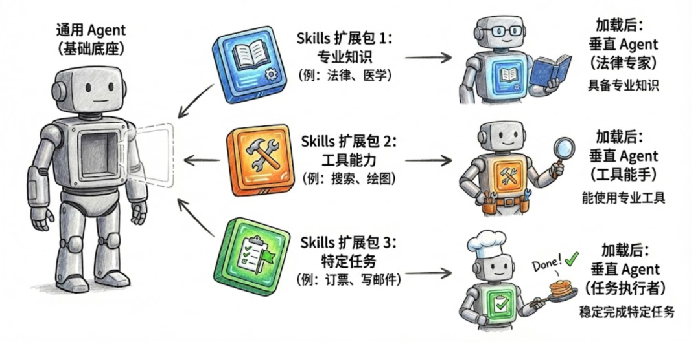
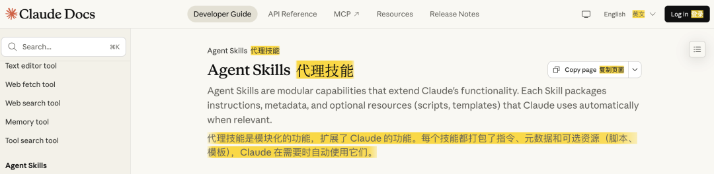
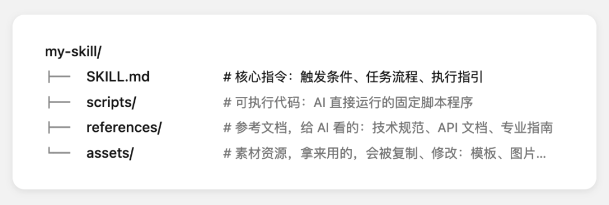

## skills

可以把 **Skills 理解为“通用 Agent 的扩展包**”

Agent 可通过加载不同的 Skills 包，来具备不同的专业知识、工具使用能力，稳定完成特定任务。

最常见的疑惑是：这和 MCP 有什么区别？

- **MCP** 是一种开放标准的协议，关注的是 AI 如何以统一方式调用外部的工具、数据和服务，本身不定义任务逻辑或执行流程。
- **Skill** 则教 Agent 如何完整处理特定工作，它将执行方法、工具调用方式以及相关知识材料，封装为一个完整的「能力扩展包」，使 Agent 具备稳定、可复用的做事方法。

Skills  是模块化的能力，扩展了 Agent 的功能。每个Skill 都打包了 LLM 指令、元数据、可选资源（脚本、模板等），Agent 会在需要时自动使用他们。

我有个更直观的解释：Skill 就像给 Agent 准备的工作交接 SOP 大礼包：

想象你要把一项工作交给新同事。若不准口口相传，只靠文档交接（而且你想一次性交接完成，以后不被打扰），

你会准备什么？

- 任务的执行 SOP 与必要背景知识（这件事大致怎么做）
- 工具的使用说明（用什么软件、怎么操作）
- 要用到的模板、素材（历史案例、格式规范）
- 可能遇到的问题、规范、解决方案（细节指引补充）

Skill 的设计架构，几乎是交接大礼包的数字版本：

相对标准的 Skill 结构示例，实际案例中，只有 SKILL.md 是必需的，其他结构为可选项

在 Skill 中，指令文档用于灵活指导，代码用于可靠性调用，资源用于事实查找与参考。

当 Agent 运行某个 Skill 时，就会：

1. 1.以 SKILL.md 为第一指引
2. 2.结合任务情况，判断何时需要调用代码脚本（scripts）、翻阅参考文档（ref.）、使用素材资源（assets）
3. 3.通过“规划-执行-观察”的交错式反馈循环，完成任务目标

当然，Skill 也可以用来扩展 Agent 的工具、MCP 使用边界，通过文档与脚本，也可以教会 Agent 连接并使用特定的外部工具、MCP 服务。

**举个例子，这是 PPTX Skill 的文件目录：**

- 整个文件夹就是一个完整的能力包，用来支持 AI 创建、编辑和分析 PowerPoint 演示文稿。

- 核心文件是 **SKILL.md**，包含技能的元数据和任务指导，告诉 agent 什么时候使用这个技能、如何按步骤处理任务。

  特别的，独立子技能往往会被拆为子文档（如教 AI 把 html 导出为 pptx 流程的 html2pptx.md），以避免一次性加载过长的 skill 文档，节省上下文窗口

- Scripts/ 包含 Agent 可用的各类预先写好的程序脚本，比如 html 转 pptx 的一键程序脚本。这样 Agent 运行任务时就无需临时开发工具，直接调用，节省 tokens ，避免出错，提升速度

- 也有一些参考文档（此项目打包的不算规范，但根据 SKILL.md ，Agent 也能理解哪些文档可以参考），比如 ooxml.md，是对 ooxml 格式文件的解析指南

整个 Skill 以简明的形式，把技能指引文档、代码脚本、参考文档和可用资源组合，定向扩展了 Agent 完成 pptx 生成相关的工作能力。