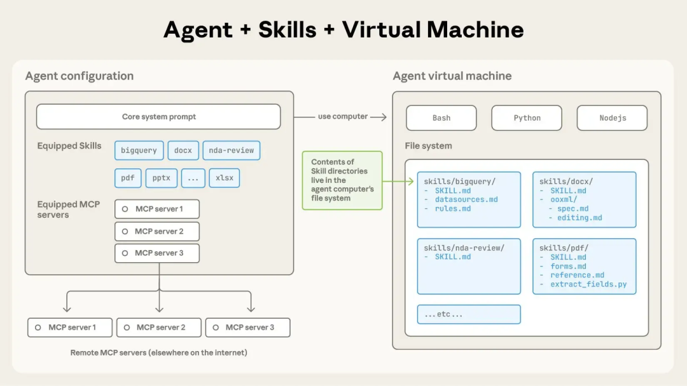
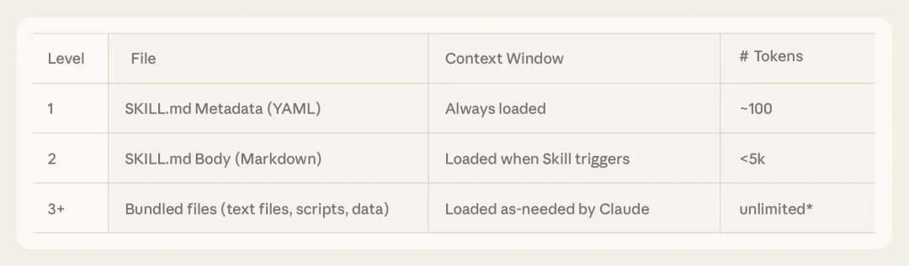
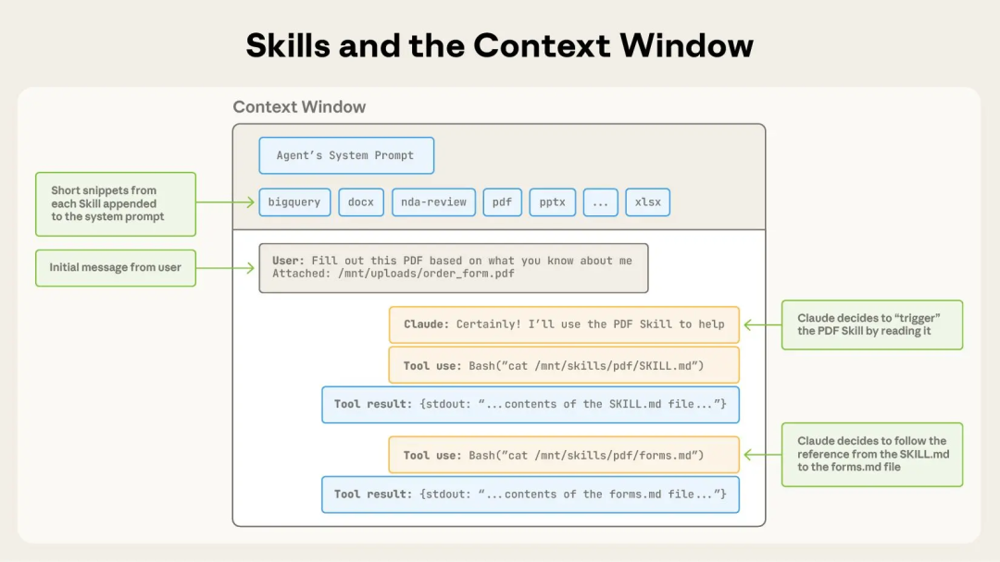
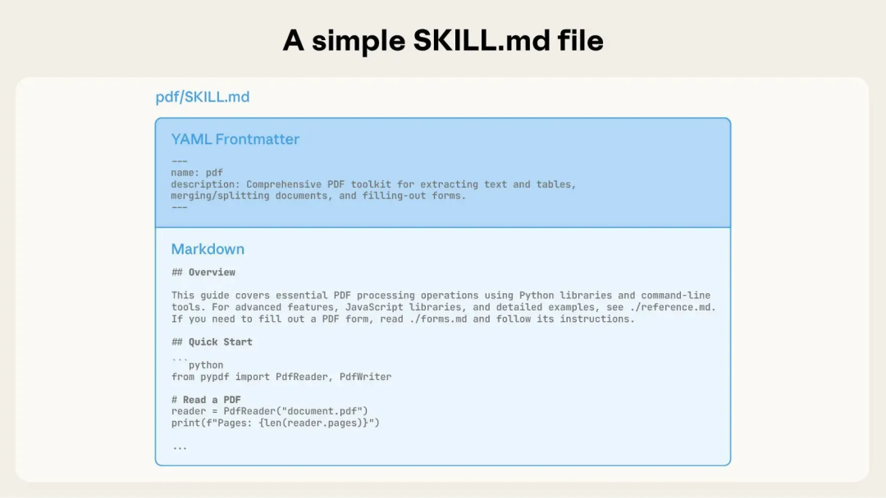
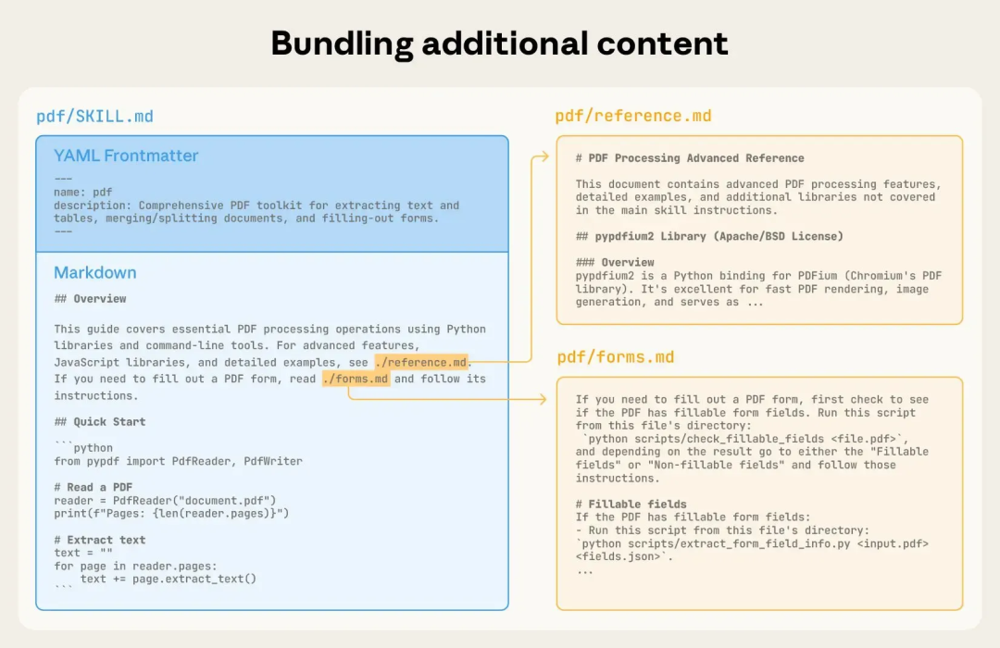

### **Skills 核心运行机制：渐进式披露**

 Skills 运作的核心机制之一：渐进式披露。

正如 [有效的 Context 工程](https://mp.weixin.qq.com/s?__biz=MzIzNDU0NzY1MA==&mid=2247488056&idx=1&sn=4f42f0f2031273300ccbac8162fdb5e9&scene=21#wechat_redirect) 所论证的，上下文过长容易导致模型能力下降。

由于 Skills 的本质就是 Context 工程，所以这个问题也需在 Skill Agent 中注意。


一个完整装载了 Skill 的 Agent 架构是这样的：



Skill 包放在 Agent 文件系统（右侧）中，并非默认全量加载在 Context Window 中。


根据 Context 加载顺序、优先级的不同，Skill 被划分为了 3 种层级：




Skill 内容物的 3 种渐进披露优先级



渐进披露的流程图解

**1）Level 1（元数据，始终加载）：**

SKILL.md 文档内的元数据，包含名称与用途描述。长度约 100 tokens。

Agent 启动时，就在 Context Window 中加载 Skill 元数据，将其包含在系统提示中。

AI 通过理解用户消息与 Skills 元数据的匹配情况，判断是否需要自动使用技能。


```
---
name: pdf
description: 全面的 PDF 操作工具包，用于提取文本和表格、创建新 PDF、合并/拆分文档以及处理表单。当 Claude 需要填写 PDF 表单或大规模地程序化处理、生成或分析 PDF 文档时使用。
---
```

默认只加载元数据 → 意味着可以给一个 Agent 同时安装很多 Skills 但不影响上下文性能。

**2）Level 2（指令，触发时加载）：**

SKILL.md 文档内的正文内容，也就是主要技能指令，一般包含工作流程、最佳实践和指导。

建议少于 5000 tokens。

当用户发出的消息与Skill 元数据的描述匹配，需要调用 Skill 时，Agent 才会用 bash 读取文档正文 。读取时文档内容加载到 Context Window 中。




SKILL.md 的结构：分为 YAML 元数据与 MD 正文

**3）Level 3（子技能指令** **/** **资源 / 代码，按需动态加载）：**

由子技能文档、代码脚本、参考文档、可用资源等文件构成。

也有 Agent Skill 规范文档将它们统称为「Resource」。相对来讲，Level 3 结构要求没那么严谨。

- **Sub-SKILL.md 子技能文档**：相对独立、复杂的子技能指令，单独放在 Level3 拆分加载

  

  

  随着一个 Skill 的复杂度提升，可能因为技能知识的上下文过长，或者有些知识仅在特定场景使用，而不适合放入单个SKILL.md，可被分拆为独立指令文档，仅在必要时加载。

- **Scripts 代码脚本**：视作“Agent 的可执行资源”，而不算 tool use（tool use 是 Agent 外部调用的独立服务）

  Agent 在 Agent 电脑（虚拟机）中直接调用脚本，脚本代码本身不进 Context Window，只有脚本运行完成后的输出会进 Agent 的 Context。

- **Reference 参考文档、Assets 可用资源**，当然都是 Level 3，仅在必需时动态读取加载。


Level 3 因为按需加载的特性，文件在被访问前不会占用 Context 长度，所以没有内容大小限制，可按业务实际说明需要添加材料。

⬇️

小结：整个 Skill 运行过程中，Agent 自动判断哪些技能与任务相关，根据 skills 的元信息，动态判断、加载完成任务所需模块：


```
Level 1: SKILL.md 元数据（name + description）
         ↓
Level 2: SKILL.md 完整内容
         ↓
Level 3: Resources 中的具体文件（按需读取）
```

不过，即使 Agent Skill 支持「渐进式披露」。

但在商业化的 Agent 产品中，单个或多个 Skills 联用，如何稳定控制运行过程中的 Context 长度，依然是绕不过的工程问题。