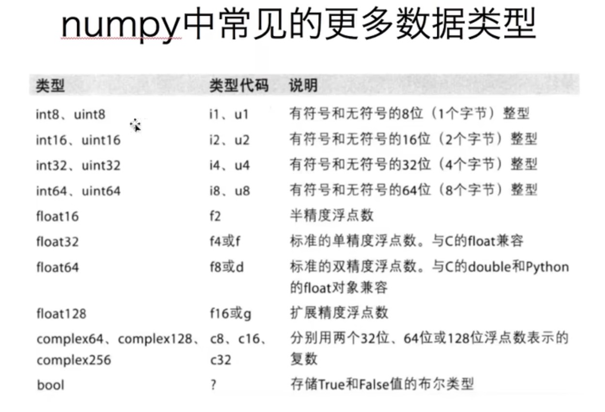

## numpy

numpy时一个python中做科学计算的基础库，重在数值计算，也是大部分python科学计算库的基础库，多用于在大型、多维数组上执行数值运算。

* numpy只能进行数值(包括虚数与bool)的处理，对于str、object等类型其无法处理。

## numpy中结构

* numpy的组成为ndarray。

## numpy中常见数值类型




## ndarray的使用

> 创建

```python
a = numpy.array([1,2,3,4,5])
b = numpy.array(rage(1,6))
c = numpy.arange(1,6)

# a = b = c, type = ndarray
#ndarray为numpy中的数组类型


#创建时指定数组类型
d = numpy.array(range(1,4),dtype=float)
d2 = numpy.array(range(1,4),dtype="int64")
d3 = numpy.array(range(1,4),dtype="i1")
d4 = numpy.array([1,0,1,1,0,1],dtype=bool)


#多维创建
#二维数组
e = numpy.array([[1,2],[3,4],[5,6]])
#e.shape = (3,2) 意思是3*2的二维

#构造全0数组
np.zeros(1,2) #构造1行2列的全0数组

#构造全1数组
np.ones(2,1) #构造2行1列的全1数组

#构造对角线数组
numpy.eye(10)	#构建一个10行10例的数组，除了索引为 [n,n] (0<=n<=9) 为1外，其余的都为0
```

> 常用成员

| 成员  | 作用                                       |
| ----- | ------------------------------------------ |
| dtype | 获取numpy中的数值类型(比如int64 float32等) |
| shape | 获取数组每个维度的个数                     |

> 常用方法

| 方法                                                         | 作用                                                        |
| ------------------------------------------------------------ | ----------------------------------------------------------- |
| astype()        #d.astype(bool)，d.astype("i2")              | 切换数组中数据的类型                                        |
| round()         #round(d,2)，把d这个ndarray中的全部小数取两位 | 取小数                                                      |
| reshape()      #reshape(2,3,4)表示切换为2\*3\*4的三维数组，有几个参数就是切换成几维<br />该方法不会改变原数组，而是返回一个新的数组 | 维度切换                                                    |
| flatten()        #该方法不会改变原数组，而是返回一个新的数组 | 数组维度变为1返回                                           |
| +、-、*、/、%等数值运算符重载，一个ndarray与一般的数值和ndarray运算都是可行的<br />t=numpy.array([1,2])，t2=numpy.array([2,3])<br />t+t2，t+5，t/5都是可行的<br />不同维度的数据运算也是可以的，但是进行运算的双方必须有一个维度上的长度是一致的，详情见广播原则。 | 对数组中的所有数值操作                                      |
| /0                                                           | 对于0/0会返回nan(无值)，<br />对于非0除以0会返回inf(无穷大) |
| clip()           #clip(10,18) 表示将所有小于10的数变为10，将所有大于10的数变为18，不影响nan | 裁剪                                                        |

> numpy的轴

轴为维度的标识，第一维度为0轴，第二维度为1轴，以此类推，shape方法返回的元祖的从左到右的下标就是轴的值。

> 索引与切片

| 索引或切片方式                              | 作用                                                         |
| ------------------------------------------- | ------------------------------------------------------------ |
| operator[index]                             | 获取下一个维度第index个数据(从第一维开始)                    |
| operator[index,index2,index3,...]           | 上面那个循环，从第一个维度到左后一个维度<br />比如二维 t[1,3]表示取第2行第4个 |
| 下列仅针对二维                              |                                                              |
| operator[ [index,index2,index3 ] ]          | 取不连续多行                                                 |
| operator[:,2:]                              | 逗号前表示行切片，逗号后表示列切片，这里表示要所有行的第2列之后的数值 |
| operator[2:, [0,2] ]                        | 表示取第二行后所有行的第1列和第3列数据                       |
| operator[ [row1,col1] , [row2,col2] , ... ] | 取多个不相邻点                                               |

> bool索引

```python
#数组中所有小于10的值为3
t[t<10] = 3

#数组中所有小于10的数变为True，否则为False
t[t<10]

#将数组中小于10的值换为0，否则换为10
numpy.where(t<10,0,10)

```

> 行列交换

```python
#交换第2，3行
t[[1,2],:] = t[[2,1],:]

#交换0，1，2列
t[:,[0,2]] = t[:,[2,0]]
```


## numpy的使用

> 常用方法

```python
#从文本文件中读取数据txt不止表示txt文件
numpy.loadtxt(frame,dtype="float64",delimiter=None,skiprows=0,usecols=None,unpack=False)

#参数
#frame 文件、字符串或产生器，可以是.gz或bz2压缩文件
#dtype 数据类型，默认读入的数据转换成float
#delimiter 分隔字符出串，默认是任何空格
#skiprows 跳过前x行，一般拿来跳过表头
#usecols 读取指定的列，索引，元祖类型
#unpack 为True则产生多维数组，否则产生一维数组


t = numpy.array([[0,1,2,3,4,5],[6,7,8,9,10,11]])
t2 = numpy.array([[0,1,2,3,4,5],[6,7,8,9,10,11]])
#竖直拼接数组
numpy.vstack((t1,t2))
# = numpy.array([[0,1,2,3,4,5],[6,7,8,9,10,11],
#								[0,1,2,3,4,5],[6,7,8,9,10,11]])

#水平拼接数组
numpy.hstack((t1,t2))
# = numpy.array([[0,1,2,3,4,5,0,1,2,3,4,5],
#								[6,7,8,9,10,11,6,7,8,9,10,11]])

#获取最小最大值位置
numpy.argmax(t,axis=0) #如果t为二维，则axis=0表示获取每一列中最小值位置，axis=1表示获取每一行中
numpy.argmin(t,axis=1) 
```

