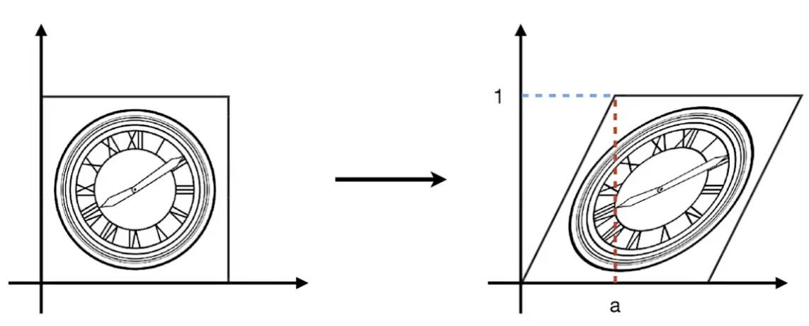
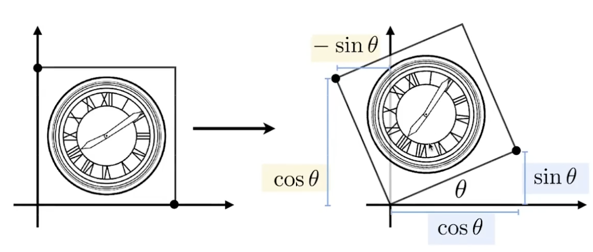

## 缩放

$$
\left[
\matrix{
  x'\\
  y'
}\right]
=
\left[
\matrix{
s & 0\\             
0 & s'
}\right]
\left[
\matrix{
x\\             
y
}\right]
$$

## 翻转

$$
\left[
\matrix{
  x'\\
  y'
}\right]
=
\left[
\matrix{
-1 & 0\\             
0 & 1
}\right]
\left[
\matrix{
x\\             
y
}\right]
=
\left[
\matrix{
-x\\             
y
}\right]
$$

$$
\left[\matrix
{  
x'\\
y'
}\right]
=
\left[\matrix
{
1 & 0\\
0 & -1
}\right]
\left[
\matrix
{
x\\
y
}\right]
=
\left[\matrix
{
x\\             
-y
}\right
]
$$

$$
\left[\matrix
{  
x'\\
y'
}\right]
=
\left[\matrix
{
-1 & 0\\
0 & -1
}\right]
\left[
\matrix
{
x\\
y
}\right]
=
\left[\matrix
{
-x\\             
-y
}\right
]
$$

## 切变

* x正方向为a，负方向为-a

$$
\left[\matrix{  x'\\y'}\right]=\left[\matrix{1 & a\\             
0 & 1}\right]\left[\matrix{x\\y}\right]=\left[\matrix{x+ay\\             
y}\right]
$$

* y正方向为a，y负方向为-a

$$
\left[\matrix{  x'\\y'}\right]=\left[\matrix{1 & 0\\             
a & 1}\right]\left[\matrix{x\\y}\right]=\left[\matrix{x\\             
ax+y}\right]
$$

##  旋转

* 矩阵变幻中的旋转默认以(0.0)为中点
* 矩阵变换中的旋转默认为逆时针方向

$$
\left[\matrix{ x'\\y'}\right]=
\left[\matrix{cosθ & -sinθ\\sinθ & cosθ}\right]
\left[\matrix{x\\y}\right]=
\left[\matrix{xcosθ-ysinθ\\xsinθ+ycosθ}\right]
$$
