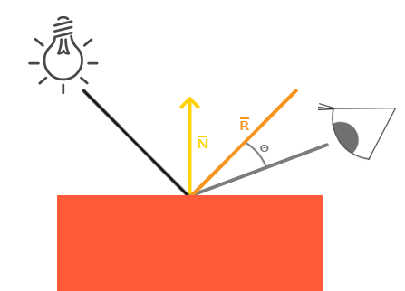

[toc]

## 冯氏光照模型

* 冯氏光照不涉及到光源到物体距离的衰减
* 在顶点着色器中实现的冯氏光照模型叫做Gouraud着色，而不是冯氏着色。记住由于插值，这种光照连起来有点逊色。冯氏着色能产生更平滑的光照效果。

冯氏光照模型的主要结构由3个元素组成：环境(Ambient)、漫反射(Diffuse)和镜面(Specular)光照。这些光照元素看起来像下面这样：


- 环境光照(Ambient Lighting)：即使在黑暗的情况下，世界上也仍然有一些光亮(月亮、一个来自远处的光)，所以物体永远不会是完全黑暗的。我们使用环境光照来模拟这种情况，也就是无论如何永远都给物体一些颜色。
- 漫反射光照(Diffuse Lighting)：模拟一个发光物对物体的方向性影响(Directional Impact)。它是冯氏光照模型最显著的组成部分。面向光源的一面比其他面会更亮。
- 镜面光照(Specular Lighting)：模拟有光泽物体上面出现的亮点。镜面光照的颜色，相比于物体的颜色更倾向于光的颜色。

### 限制

**冯氏光照模型”是 Ambient + Diffuse + Specular 三个分量组合后的完整模型。** 如果只使用其中任意一个或两个分量，**就不能严格称为“冯氏光照模型”本身**。

## 环境光照

把环境光照添加到场景里非常简单。我们用光的颜色乘以一个(数值)很小常量环境因子，再乘以物体的颜色，然后使用它作为片段的颜色

```c
void main()
{
    float ambientStrength = 0.1f;
    vec3 ambient = ambientStrength * lightColor;
    vec3 result = ambient * objectColor;
    color = vec4(result, 1.0f);
}
```

上述代码模拟了简单的环境简单光照，环境光照作用于物体所有顶点。

## 漫反射光照

漫反射光照需要使用顶点的法向量和光源到该顶点形成的向量来计算。

* 法向量：法向量(Normal Vector)是垂直于顶点表面的(单位)向量。


个单位向量的角度越小，它们点乘的结果越倾向于1。当两个向量的角度是90度的时候，点乘会变为0。这同样适用于θ，θ越大，光对片段颜色的影响越小。

漫反射光照使用顶点的法向量和光照到该点形成的向量来计算光照应该有多少强度应该依附在该顶点上。

### 不正确的法向量

法向量在随着物体进行不等比缩放后，他很有可能将不再垂直于该顶点所在平面，所以物体不等比缩放变换后，法向量也需要用一定算法来变换。


这个将原有法向量变为正常的向量被称为正规矩阵。正规矩阵被定义为“模型矩阵左上角的逆矩阵的转置矩阵”。

* openGL片段着色器，计算漫反射光照

```c
#version 330 core
out vec4 color;
in vec3 FragPos;
in vec3 Normal;

uniform vec3 lightPos;
uniform vec3 objectColor;
uniform vec3 lightColor;

void main()
{
float ambientStrength = 0.1f;
vec3 ambient = ambientStrength * lightColor;
vec3 norm = normalize(Normal);\n"
vec3 lightDir = normalize(lightPos - FragPos);
float diff = max(dot(norm, lightDir), 0.0);
vec3 diffuse = diff * lightColor;
vec3 result = (ambient + diffuse) * objectColor;
color = vec4(result, 1.0f);
}
```

* openGL顶点着色器，使用正规矩阵校准

```c
static const GLchar* vertexShaderSource =
        "#version 330 core\n"
        "layout (location = 0) in vec3 position;\n"
        "layout (location = 1) in vec3 normal;\n"
        "out vec2 TexCoord;\n"
        "out vec3 Normal;\n"
        "out vec3 FragPos;\n"
        "uniform mat4 model;\n"
        "uniform mat4 view;\n"
        "uniform mat4 projection;\n"
        "void main()\n"
        "{\n"
        "gl_Position = projection * view * model * vec4(position, 1.0f);\n"
        "FragPos = vec3(model * vec4(position, 1.0f));\n"
        "Normal = mat3(transpose(inverse(model))) * normal;"        // mat3(transpose(inverse(model))) 生成正规矩阵，并强制转换为3×3矩阵，保证它失去了平移属性
        //正规矩阵用于解决模型不等比缩放后，法线不再垂直于顶点的问题
        "}\n";
```

## 镜面光照

镜面光照(Specular Lighting)同样依据光的方向向量和物体的法向量，但是这次它也会依据观察方向，例如玩家是从什么方向看着这个片段的。镜面光照根据光的反射特性。如果我们想象物体表面像一面镜子一样，那么，无论我们从哪里去看那个表面所反射的光，镜面光照都会达到最大化。



完整冯氏光照着色器

```c
static const GLchar* fragmentShaderSource =
        "#version 330 core\n"
        "out vec4 color;\n"

        "in vec3 FragPos;\n"
        "in vec3 Normal;\n"

        "uniform vec3 lightPos;\n"
        "uniform vec3 objectColor;\n"
        "uniform vec3 lightColor;\n"
        "uniform vec3 viewPos;\n"
        "void main()\n"
        "{\n"

        "float ambientStrength = 0.1f;\n"
        "vec3 ambient = ambientStrength * lightColor;\n"

        "vec3 norm = normalize(Normal);\n"
        "vec3 lightDir = normalize(lightPos - FragPos);\n"
        "float diff = max(dot(norm, lightDir), 0.0);\n"
        "vec3 diffuse = diff * lightColor;\n"
        //镜面光照
        "float specularStrength = 0.5f;\n"
        "vec3 viewDir = normalize(viewPos - FragPos);\n"
        "vec3 reflectDir = reflect(-lightDir, norm);\n"
  			//这个32是高光的发光值(Shininess)。一个物体的发光值越高，反射光的能力越强，散射得越少，高光点越小。
        "float spec = pow(max(dot(viewDir, reflectDir), 0.0), 32);\n"
        "vec3 specular = specularStrength * spec * lightColor;\n"
        "vec3 result = (ambient + diffuse + specular) * objectColor;\n"
        "color = vec4(result, 1.0f);\n"
        "}\n";
```

