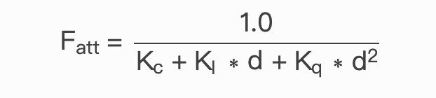

[toc]

## 定向光

当一个光源很远的时候，来自光源的每条光线接近于平行。这看起来就像所有的光线来自于同一个方向，无论物体和观察者在哪儿。当一个光源被设置为无限远时，它被称为定向光(Directional Light)，因为所有的光线都有着同一个方向；它会独立于光源的位置。

我们知道的定向光源的一个好例子是，太阳。太阳和我们不是无限远，但它也足够远了，在计算光照的时候，我们感觉它就像无限远。在下面的图片里，来自于太阳的所有的光线都被定义为平行光：

 

因为所有的光线都是平行的，对于场景中的每个物体光的方向都保持一致，物体和光源的位置保持怎样的关系都无所谓。由于光的方向向量保持一致，光照计算会和场景中的其他物体相似。

我们可以通过定义一个光的方向向量，来模拟这样一个定向光，而不是使用光的位置向量。

## 点光源

定向光作为全局光可以照亮整个场景，这非常棒，但是另一方面除了定向光，我们通常也需要几个点光源(Point Light)，在场景里发亮。点光是一个在时间里有位置的光源，它向所有方向发光，光线随距离增加逐渐变暗。想象灯泡和火炬作为投光物，它们可以扮演点光的角色。

在大多数3D仿真场景中，我们更希望去模拟一个仅仅能照亮靠近光源点附近场景的光源，而不是照亮整个场景的光源。

### 衰减

## 衰减

随着光线穿越距离的变远使得亮度也相应地减少的现象，通常称之为**衰减(Attenuation)**。一种随着距离减少亮度的方式是使用线性等式。这样的一个随着距离减少亮度的线性方程，可以使远处的物体更暗。然而，这样的线性方程效果会有点假。在真实世界，通常光在近处时非常亮，但是一个光源的亮度，开始的时候减少的非常快，之后随着距离的增加，减少的速度会慢下来。我们需要一种不同的方程来减少光的亮度。

幸运的是一些聪明人已经早就把它想到了。下面的方程把一个片段的光的亮度除以一个已经计算出来的衰减值，这个值根据光源的远近得到：

在这里d代表片段到光源的距离。为了计算衰减值，我们定义3个（可配置）项：**常数**项KcKc，**一次**项KlKl和**二次**项KqKq。

- 常数项通常是1.0，它的作用是保证分母永远不会比1小，因为它可以利用一定的距离增加亮度，这个结果不会影响到我们所寻找的。
- 一次项用于与距离值相乘，这会以线性的方式减少亮度。
- 二次项用于与距离的平方相乘，为光源设置一个亮度的二次递减。二次项在距离比较近的时候相比一次项会比一次项更小，但是当距离更远的时候比一次项更大。

由于二次项的光会以线性方式减少，指导距离足够大的时候，就会超过一次项，之后，光的亮度会减少的更快。最后的效果就是光在近距离时，非常量，但是距离变远亮度迅速降低，最后亮度降低速度再次变慢。下面的图展示了在100以内的范围，这样的衰减效果。

* 可以看到当距离很近的时候光有最强的亮度，但是随着距离增大，亮度明显减弱，大约接近100的时候，就会慢下来。这就是我们想要的。

### 常用衰减值

面的表格展示一些各项的值，它们模拟现实（某种类型的）光源，覆盖特定的半径（距离）。第一栏定义一个光的距离，它覆盖所给定的项。这些值是大多数光的良好开始。

| 距离 | 常数项 | 一次项 | 二次项   |
| ---- | ------ | ------ | -------- |
| 7    | 1.0    | 0.7    | 1.8      |
| 13   | 1.0    | 0.35   | 0.44     |
| 20   | 1.0    | 0.22   | 0.20     |
| 32   | 1.0    | 0.14   | 0.07     |
| 50   | 1.0    | 0.09   | 0.032    |
| 65   | 1.0    | 0.07   | 0.017    |
| 100  | 1.0    | 0.045  | 0.0075   |
| 160  | 1.0    | 0.027  | 0.0028   |
| 200  | 1.0    | 0.022  | 0.0019   |
| 325  | 1.0    | 0.014  | 0.0007   |
| 600  | 1.0    | 0.007  | 0.0002   |
| 3250 | 1.0    | 0.0014 | 0.000007 |

常数项Kc一直都是1.0。一次项KI为了覆盖更远的距离通常很小，二次项Kq就更小了。尝试用这些值进行实验，看看它们在你的实现中各自的效果。我们的环境中，32到100的距离对大多数光通常就足够了。

## 聚光

聚光是一种位于环境中某处的光源，它不是向所有方向照射，而是只朝某个方向照射。结果是只有一个聚光照射方向的确定半径内的物体才会被照亮，其他的都保持黑暗。聚光的好例子是路灯或手电筒。

聚光用世界空间位置，一个方向和一个指定了聚光半径的切光角来表示。我们计算的每个片段，如果片段在聚光的切光方向之间（就是在圆锥体内），我们就会把片段照亮。下面的图可以让你明白聚光是如何工作的：

- `LightDir`：从片段指向光源的向量。
- `SpotDir`：聚光所指向的方向。
- `Phi`ϕϕ：定义聚光半径的切光角。每个落在这个角度之外的，聚光都不会照亮。
- `Theta`θθ：`LightDir`向量和`SpotDir`向量之间的角度。θθ值应该比ΦΦ值小，这样才会在聚光内。

所以我们大致要做的是，计算`LightDir`向量和`SpotDir`向量的点乘（返回两个单位向量的点乘，还记得吗？），然后在和切光角ϕϕ对比。