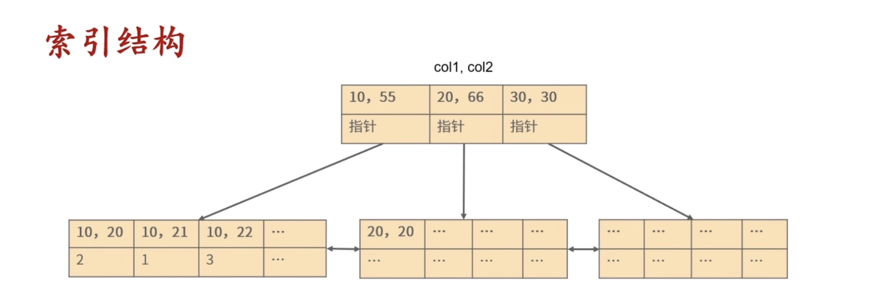

## 组合索引

多个列组成一个索引

## 最左原则

组合索引的使用满足以下规则：

* 必须从左到右连续使用，并且必须包含创建时的第一个列。

### 原理

`例图`

组合索引，在B+树，是按列的顺序在节点中排序索引的，即满足以下规则：

* 如果有n个列，则按第一列的所有值排序，第一列排序后的基础上，在第二列的所有值排序，直到第n列。

这导致，使用组合索引时，必须满足最左原则。

