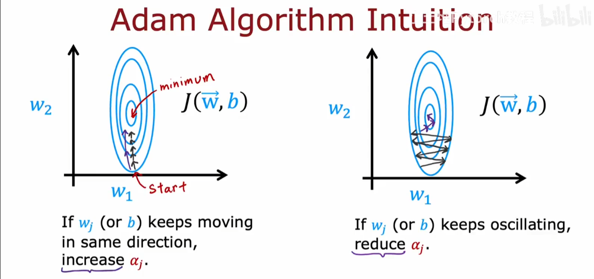

## Adam算法

全称Adaptive Moment Estimation，Adam算法不是用一个全局学习率，**而是为参数的每一个**“**维度**”**设置一个独立的学习率**，并且其可以自动逐步的优化学习率。

* adam算法在学习过程中如果发现下降梯度在同一个方向上缓慢移动，则其会逐渐提高学习率，让其更快的达到梯度。
* adam算法在学习过程中如果发现下降梯度在不同的方向上来回震荡，则其会逐渐提高降低率，让其能更好的在一个方向上移动。



## python中使用TensorFlow实现

```python
model = Sequential([
    tf.keras.layers.Dense(units=25,activation='sigmoid'),
    tf.keras.layers.Dense(units=15,activation='sigmoid'),
    tf.keras.layers.Dense(units=19,activation='linear'),
])

#初始全局学习率为10^-3
#optimizer 参数的作用：指定模型训练时用哪种优化器来更新权重
model.compile(optimizer=tf.keras.optimizers.Adam(learning_rate=1e-3),loss=tf.keras.losses.SparesCategoricalCrossentropy(from_logits=True))

model.fit(input_,flag_output,epochs=100)
```

