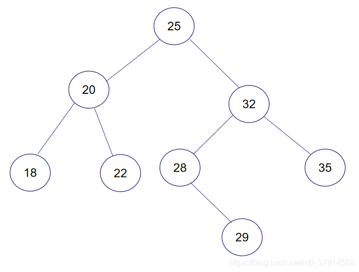
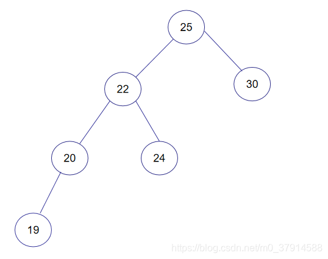

[toc]

## 定义

左子树和右子树的高度之差(平衡因子)的绝对值不超过1，且它的左子树和右子树都是一颗平衡二叉树。

`图(正常平衡二叉树)`

`图(非平衡二叉树)`

25节点的右子树最大高度为5，左子树的最大高度为3。

## 平衡调整

平衡二叉树在删除节点或插入节点后，如果平衡被破坏，则需要进行结构调整，让他变得平衡。

因为插入只会导致上面的那个一层开始破坏，所以破坏氛围LL形、RR形、LR形、RL形。

* 下面只介绍插入导致的破坏，删除时导致的破坏原理一致。需要寻找到破坏结构。

### LL形破坏

插入的位置，为破坏的节点的左子树的左边节点，下图中如果在19号节点的右边，也算作LL形破坏。

* 解决办法，以25节点为基础进行右旋转，20将成为根节点，19将作为左子树，25将作为右子树，22将作为25的左子树

### RR形破坏

插入的位置，为破坏的节点的左子树的左边节点，下图中如果在30号节点的右边，也算作RR形破坏。

* 解决办法，以20节点为基础进行左旋转，25将成为根节点，20将作为左子树，30将作为右子树，22将作为20的右子树

### LR形破坏

插入的位置，为破坏的节点的左子树的右边节点，下图中如果在24号节点的左边，也算作LR形破坏。

* 解决办法，以20节点为基础进行左旋转，22将成为根节点，20将作为22左子树，24将作为22的右子树。
* 
* 然后再以25为基础进行右旋转

### RL形破坏

插入的位置，为破坏的节点的右子树的左边节点，下图中如果在21号节点的右边，也算作LR形破坏。

* 解决办法，以25节点为基础进行右旋转，22将成为根节点，21将作为22左子树，25将作为22的右子树。
* 
* 然后再以20为基础进行左旋转

## 优点

完全的保证树的平衡，保证树不会太过偏左偏右导致查询效率降低。

## 局限性

过于注重严格的平衡，导致插入和删除操作的成本较高。

#### 局限性具体表现：

- **旋转次数多**：
  - 在插入或删除节点时，AVL 树需要频繁检查树的平衡因子并进行调整（单旋转或双旋转）。对于频繁的插入或删除操作，旋转的代价较大。
- **内存开销增加**：
  - 每个节点需要存储额外的信息（如高度或平衡因子），以便随时检查平衡性。这增加了内存使用。
- **读写操作性能差异**：
  - AVL 树的读性能较优（因为它高度严格平衡），但插入和删除性能相对较差，不适合写操作较多的场景。