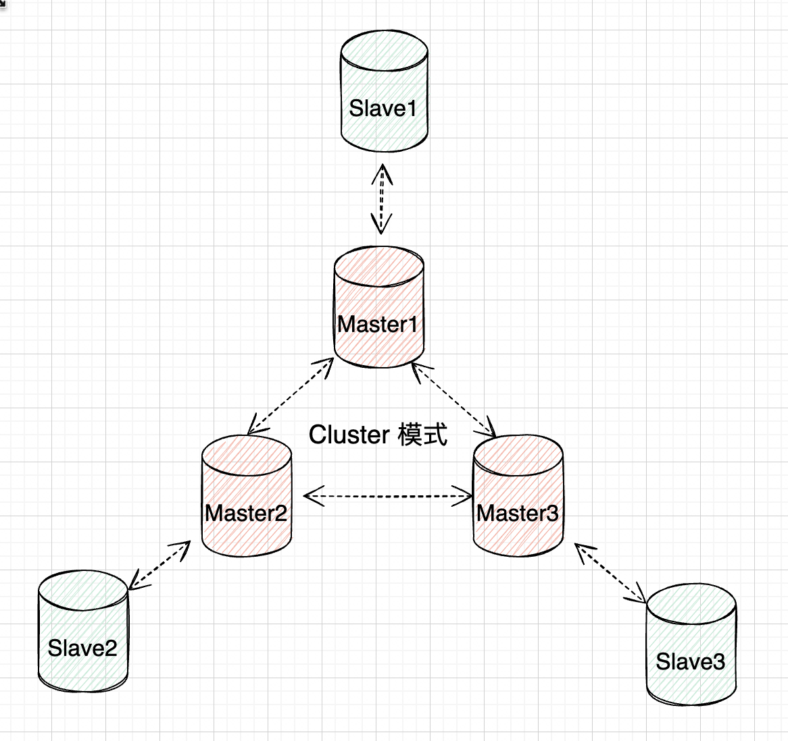

[toc]

## 介绍

一种高级集群模式，它通过数据分片和分布式存储实现了负载均衡和高可用性。在Cluster模式下，Redis将所有的键值对数据分散在多个节点上。每个节点负责一部分数据，称为槽位。通过对数据的分片，Cluster模式可以突破单节点的内存限制，实现更大规模的数据存储。

* 改模式也常被称作无中心化集群



## 集群的组成

Redis无中心化集群由N个配置了主从复制的主机群组成，每个主机群的master主机在集群中负责主机群之间的联系。

简单的来说，集群由N个参与主从复制的master主机组成，这N个master主机每个都有很多的从机。

* 每个主机复制群为一个节点，而不是一个主机为一个节点。

* 无中心化集群中的节点自带哨兵功能。

当集群中的某个节点全部挂掉后(节点中的主从全部挂掉)，集群仍然能正常工作。

## 数据分片原理

redis集群将数据划分为 16384（2的14次方）个哈希槽（slots），如果你有多个实例节点，那么每个实例节点将管理其中一部分的槽位，槽位的信息会存储在各自所归属的节点中。

一个Redis集群一共有16384个哈希槽，你可以有1 ~ n个节点来分配这些哈希槽，可以不均匀分配，每个节点可以处理0个 到至多 16384 个槽点。
当16384个哈希槽都有节点进行管理的时候，集群处于online 状态。同样的，如果有一个哈希槽没有被管理到，那么集群处于offline状态。

### 计算方式

实际存储的Redis键值信息也必然归属于这 16384 个槽的其中一个。slots 与 Redis Key 的映射是通过以下两个步骤完成的：

- 使用 CRC16 算法计算键值对信息的Key，会得出一个 16 bit 的值。
- 将 第1步中得到的 16 bit 的值对 16384 取模，得到的值会在 0 ～ 16383 之间，映射到对应到哈希槽中。

### hash tag

在一些特殊的情况下，需要某些key固定到同一个实例节点上。hash tag可以强制 key 所归属的槽位等于 tag 所在的槽位。
其实现方式为在key中加个{}，例如test_key{1}。使用hash tag后客户端在计算key的crc16时，只计算{}中数据。如果没使用hash tag，客户端会对整个key进行crc16计算。

`hash tag使用`

```ruby
127.0.0.1:6380> cluster keyslot user:case{1}
(integer) 1024
127.0.0.1:6380> cluster keyslot user:favor
(integer) 1023
127.0.0.1:6380> cluster keyslot user:info{1}
(integer) 1024
```

如上，使用hash tag 后会对应到通一个hash slot：1024中。

## 集群的自动分配

启动集群后，会根据命令来自动的分配集群节点(每个节点中主机与他们的从机)，分配规则使用以下的规则。

`尽量保证每个master运行在不同的IP地址与地址段，每个从库与主库不在一个IP地址与地址段上。`