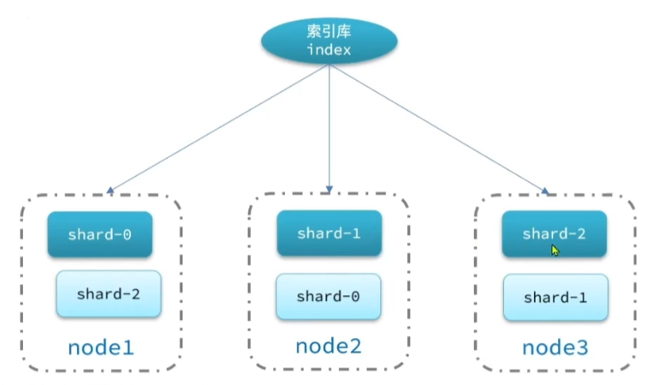
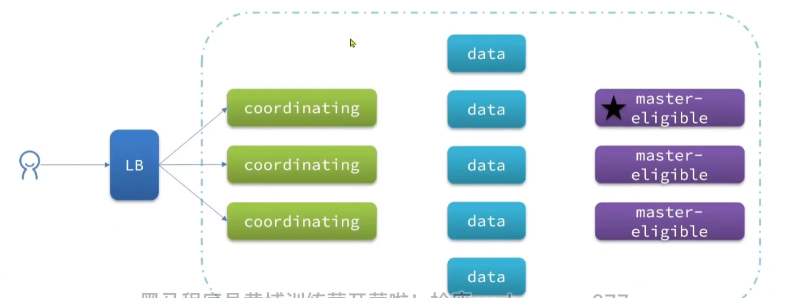

[toc]

## 结构

ES集群中，会将索引库从逻辑上拆分为N个切片，存储到多个节点。并且该切片会被备份并放置在另外的节点上



## 节点角色

| 节点类型                    | 配置参数                                          | 默认值 | 职责                                                         |
| --------------------------- | ------------------------------------------------- | ------ | ------------------------------------------------------------ |
| master eligible(备选主节点) | node.master                                       | true   | 可以管理和记录集群状态，决定分片在哪个节点，处理创建和删除索引库的请求 |
| data(数据节点)              | node.data                                         | true   | 存储数据、实现实际的CRUD                                     |
| ingest                      | node.ingest                                       | true   | 数据存储前的预处理，比如文档插入前，增删某些字段(一般程序中对数据预处理完了，一般不使用这种节点) |
| coordinating(协调节点)      | 上面三个参数都为false时，自动变为coordinating节点 | true   | 将用户请求，路由到其他节点，并合并其他节点的处理结果，返回给用户 |



## 脑裂现象

默认情况下，每个节点都是备选master节点，一旦master节点宕机，则其他候选节点会选举一个成为主节点，但当新的master节点和另外master节点连不上时(但和data等其他节点网络正常)，将会导致另外的master节点又选举出了一个新的master节点。

### 解决方案

当选票超过 (备用master节点数量+1)/2 时才能当选为主节点，除非特别复杂的网络情况，不然该情况下，一般不会再有脑裂现象。

* 最好配置备选master节点数量为奇数

## 负载均衡模式

### 数据插入

当插入数据时，ES的coordinating节点会通过hash算法来计算文档应该存储到哪个分片

```bash
shard = hash(_routing) % 切片数量
```

* _routing默认为文档id
* 算法与切片数量有关，索引库一旦创建，分片数量不再支持修改。

### 数据查询

ES的查询分为两个阶段

* scatter phase：分三阶段，coordinating node会把请求分发到每一个切片
* gather phase：聚集阶段，coordinating node汇总所有data node的搜索结果，并处理为最终结果集返回给用户

### 故障转移

集群的master节点会监控集群中的节点状态，如果右节点宕机，会立刻将宕机节点的分片数据迁移到其他节点。

* 因为每个节点中的切片在其他节点有复制，所以某节点挂了后，master节点可以恢复其原来的数据。