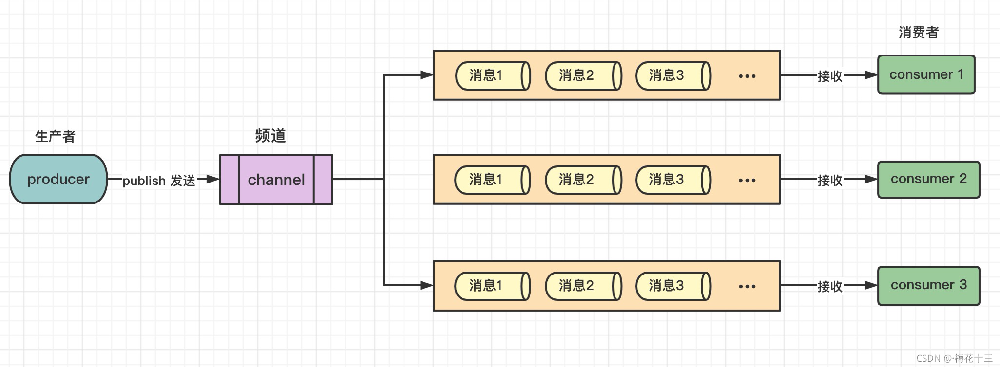

## 结构



## 发布订阅模式

redis中允许发布订阅模式，当redis服务器中开通一个频道后，客户端可以订阅这个频道，当该频道中有消息发送时，订阅者就会收到该消息。

redis中的一个客户端可以订阅多个频道。

* 在集群中，所有的节点公用一个频道系统，即主机a的频道T1，主机b中往T1发送消息，主机a仍然能接收到。
* 新发布，再订阅，订阅者不会受到之前发布的消息。
* 订阅接受来自发布者的消息是一对多。
* 该机制是进程、线程安全的

## 发布订阅命令
### 客户端订阅一个频道

```    bash
subscribe <频道名1> [频道名2] [...]

psubscribe pattern1  [pattern...]
#订阅一个或多个符合给定模式的频道
#每个模式以 * 作为匹配符；例如 cn* 匹配所有以cn开头的频道：cn.java、cn.csdn
```

订阅频道后，客户端将处于接收消息的模式，此时无法使用redis命令，只能等待频道的消息，频道的订阅是临时的，频道并不是永久存在的。

### 查看频道列表

```bash
pubsub channels
```

### 查看订阅数

```bash
pubsub numsub <key1> [key2]
```

### 退订频道

```bash
unsubscribe  channel  [channel ... ]

punsubscribe [pattern [pattern ...] ] 
#退订所有给定模式的频道
#说明：pattern 未指定，则订阅的所有模式都会被退订，否则只退订指定的订阅的模式
```

* 如果没有给出任何channel，则默认退订所有。

### 向某个频道发送一个消息

```
    publish <频道名> <消息>
```

* 一次只能向一个频道发送消息


