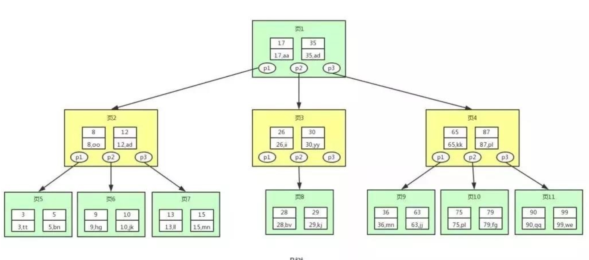
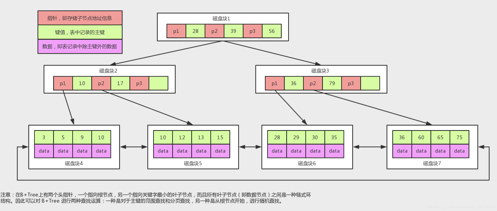

[toc]

## B树

B树的每个节点上都存储了到下一层的索引，以及数据。

`结构`

## B+树

B+树的非叶子节点不存储数据，他们只存储到下一层的索引。

* mysql中B+类型的索引每一页的存储大小默认是16kb。
* Innodb引擎主键索引也是B+树。

`结构`

B+树的叶子结点在B+树外，也组成了一个循环链表，这导致B+树范围查找性能比B树更好

* B+树范围查找时，只需要查询到范围的某个边界，然后他就可以通过叶子中的链表，来遍历查找数据了。	

  B树则需要去范围中寻找一个个的数据。

* 当一个节点的大小不足一页时，mysql不会去读取其他节点来让本次IO的读取数量接近于一页的大小。

## B+树比B树快的原因

B+树的每个节点对比B树都能存储更多的索引，每次磁盘IO，B+树都能够读取更多的索引数量。所以在通过索引寻找数据时，B+树比B树能够在更少的磁盘IO中寻找到数据的地址。

* 磁盘IO非常缓慢(每一次结点的寻址，都是一次磁盘IO，IO的寻址单位是页)
* b树和b+树的每一个节点都是以页为单位来存储数据的，所以每一次的读取节点，都是一次磁盘的IO。
* 磁盘的IO理论上的速度，比b树一个节点中的遍历寻找某个节点的速度要慢很多，因为当b树的一个节点读取后，其寻址是在内存中。
* b树的结构，导致数据插入时，树更宽，梯度更低，寻找数据时的平均IO次数更少。

## 为何不使用其他的数据结构作为索引的结构

对于其他的数据结构，并不能完美的适配每次IO读取一个节点这个特性，这导致使用除了B树和B+树以外的数据结构，会导致非常高的磁盘IO数量。