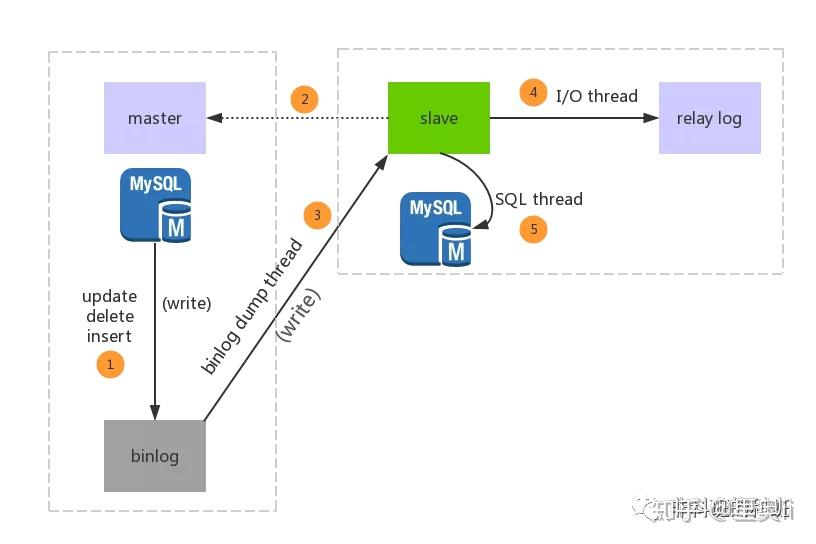

## 定义

在实际的生产中，为了解决Mysql的单点故障已经提高MySQL的整体服务性能，一般都会采用**「主从复制」**。

主从复制中分为**「主服务器（master）「和」从服务器（slave）」**，**「主服务器负责写，而从服务器负责读」**，Mysql的主从复制的过程是一个**「异步的过程」**。

这样读写分离的过程能够是整体的服务性能提高，即使写操作时间比较长，也不影响读操作的进行。

## 原理

Mysql的主从复制中主要有三个线程，Master一条线程和Slave中的两条线程。：

* `master（binlog dump thread）`：主要负责Master库中有数据更新的时候，会按照`binlog`格式，将更新的事件类型写入到主库的`binlog`文件中。并且，Master会创建`log dump`线程通知Slave主库中存在数据更新，这就是为什么主库的binlog日志一定要开启的原因。

* `slave（I/O thread）`：该线程用于请求Master，Master会返回binlog的名称以及当前数据更新的位置、binlog文件位置的副本。然后，将`binlog`保存在 **「[relay log](https://zhida.zhihu.com/search?content_id=124693344&content_type=Article&match_order=1&q=relay+log&zhida_source=entity)（中继日志）」** 中，中继日志也是记录数据更新的信息。
* `slave（SQL thread）`：当Slave检测到中继日志有更新，就会将更新的内容同步到Slave数据库中，这样就保证了主从的数据的同步。

## 主从复制同步策略

1. **「同步策略」**：Master会等待所有的Slave都回应后才会提交，这个主从的同步的性能会严重的影响。
   * mysql不支持该同步策略
2. **「[半同步策略]**：Master至少会等待一个Slave回应后提交。
3. **「[异步策略]**：Master不用等待Slave回应就可以提交。
4. **「[延迟策略]**：Slave要落后于Master指定的时间。