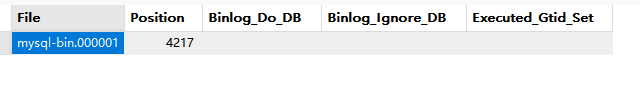

[toc]

## 1.主库和从库设置server-id

* master config

```
[mysqld]
server-id=100
user=mysql
port=3306
character-set-server=utf8mb4
collation-server=utf8mb4_unicode_ci
log-bin=mysql-bin
bind-address = 0.0.0.0

[client]
default-character-set=utf8mb4
```

* sub config

```
[mysqld]
server-id=109
user=mysql
port=3306
character-set-server=utf8mb4
collation-server=utf8mb4_unicode_ci
bind-address = 0.0.0.0

[client]
default-character-set=utf8mb4
```

## 2.从库设置需要同步的库或表（不设置则默认从复制开始的节点，复制一切主库操作）

* sub config

```
[mysqld]
server-id=109
user=mysql
port=3306
character-set-server=utf8mb4
collation-server=utf8mb4_unicode_ci
bind-address = 0.0.0.0
replicate-do-db=test #只同步test库 精确匹配库
replicate-wild-do-table=testdb.user% #同步testdb中user开头的表 %通配匹配表
replicate-do-table=testdb.user_name #同步testdb中的user_name表

[client]
default-character-set=utf8mb4
```

## 3.创建mysql_native_password类型用户并给予复制权限

```mysql
-- 创建复制用户，使用 mysql_native_password 插件
CREATE USER 'repl_user'@'%' IDENTIFIED WITH mysql_native_password BY '123456';

-- 授权复制权限
GRANT REPLICATION SLAVE ON *.* TO 'repl_user'@'%';

--REPLICATION SLAVE → 授权 从库复制权限
--*.* → 适用于 所有数据库
--'repl_user'@'%' → 用户和允许连接的 Host：
--'%' 表示允许 任何 IP 连接


-- 刷新权限
FLUSH PRIVILEGES;
```

## 4.查询master当前最新的blog节点

```
show master status;		
```



## 5.使用master中创建的用户，以及master的blog位置，在从节点中设置主从复制

```mysql
--执行前先停下slave
stop slave;

--这是从库和主库连接的关键一步，host是主库的ip，user是前面创建的slave用户，
--file和pos是主库show master status的信息

change master to
master_host='<master_ip>',master_port=3307,master_user='repl_user',master_password='123456',master_log_file='mysql-bin.000001',master_log_pos=4217;

--执行后启动slave
start slave;
```

## 6. 检查从节点状态和报错

```mysql
show slave status;
```

Slave_IO_Running为yes 并且

Slave_SQL_Running为yes 时

主从复制设置成功