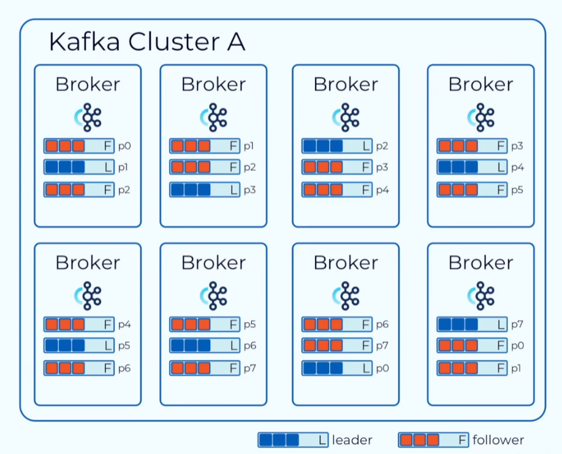

[toc]

## 主题(topic)

kafka中的消息存储在topic中，topic类似于数据库中的表，一个topic可以存储不同类型的消息

## 分区(partitions)

一个主题可以包含多个分区，分区是kafka分布式的基础，分区使得kafka具有拓展性，kafka将一个topic的分区存储在不同的服务器上，这使得kafka具有拓展性。

* 可以通过调整分区数量和服务器节点的数量来对kafka进行拓展。

* 分区是一个线性增长且不可变的提交日志
* kafka给每个存入分区的消息提供偏移量(offset)，可以通过offset对消息进行提取，分区中每个消息的offset在该分区中是唯一的、递增的。不同分区之间的偏移量可以重复。

### 每条消息的目的分区

kafka的消息以键值对的方式进行存储，消息分配到哪个分区，由key来决定。

* 不指定key时，key为空，kafka会以轮询的方式将消息写到每个分区中。
* 指定同一个消息的key时，会被写入到同一个分区。
* 每个broker可能含有同一个topic的多个分区。

## 副本

副本是对分区的备份，副本是为了防止某个服务器宕机后，分区中的消息不可用的情况。

当指定topic具有n个副本时，kafka将会把该topic中的所有分区，复制n-1份。

* kafka会选择n个副本中的一个副本作为主分区(leader)。所有数据的写入和读取都是在leader中完成。子分区(follower)负责从leader中复制数据，保持数据的一致。
* kafka会监控副本间同步状态。在topic中会维护一个ISR(同步副本主机集)，如果有一个副本不能正常的同步数据，或落后过多，那么ISR中会移除该副本主机，直到他追赶上。
* leader和follower的概念在分区中，如果一个topic有8个分区，并且副本因子为3，那么该topic的每个分区都会有1个leader和2个follower。
* 副本的数量不能超过集群中broker的数量，因为超过后，多余副本不再有意义。

## 消息代理(broker)

borker就是一个部署了一台kafka的主机。

## 概念图

上述图中，一个8broker的kafka集群中，含有一个topic副本因子为3，有8个分区。

* 上述第一个broker中，该broker只负责分区1的读写，以及分区0和分区2的数据同步。