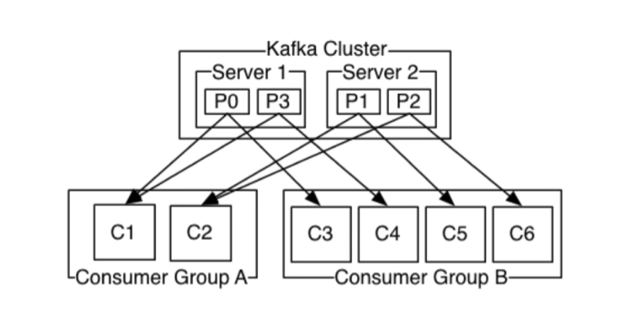
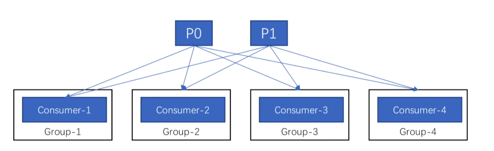
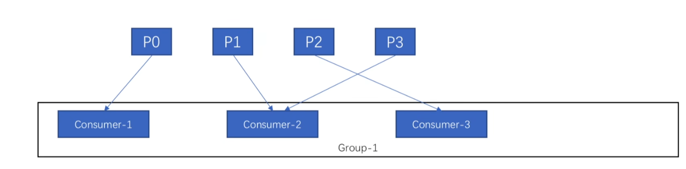

[toc]

## 消费型队列

kafka的消息时间在指定时间之前，大小达到指定大小之前，是不会被删除的，无论是否有消费者或消费者组能消费他。

* kafka保留策略都是都是基于时间和大小去删除的，没有基于单独某个消费者去删除

## 消费者和消费组

### 消费者

单一的消费客户端

* Kafka 的“消费者组”是逻辑上的抽象，**哪怕你只有一个消费者实例，也必须指定一个 `group.id`**，否则就默认是匿名组或者用 `group.id = ""`（某些客户端不支持）。

### 消费组

由多个消费者组成，他们有一个根据一个唯一的标识来标识他们属于同一消费组。

### 分区的消费

分区时最小的并行单位

* 消费者可以消费多个分区
* 一个分区可以同时被多个消费者组里的消费者消费
* 一个分区不能同时被同一消费者组里的消费者消费

## 分区和消费顺序

### 生产

同一个生产者发送到同一个分区的消息，先发送的offset比后发送的offset小。

同一个生产者发送到不同分区的消息，offset无法保证。

### 消费

消费者按照消息在分区里的存放顺序进行消费

分区间的消费顺序，kafka不能保证顺序消费。

## 常见消费模式

### 发布订阅

每个消费者都属于不同消费组，每个消费者都能接收到新产生的某条消息。

### 点对点

所有消费者都属于同一个消费者组，消费组中，只有一个消费者能收到新消息。

## 消息传递语义

消息传递语义需要生产者和消费者共同保证。

### 最多一次

消息的消费/生产可能会丢失

* 消息消费/生产一次后，无论是否成功，不再重试。
* kafka中通过先提交offset，再进行消息的读取/推送来实现。当第二步失败时，将不会再次消费/生产该消息。

### 最少一次

消息的消费/生产可能会重复

* 消息消费/生产一次后，至少成功一次。
* kafka中通过先进行消息的读取/推送，再提交offset来实现。当第二步失败时，本次该消息将一直消费/生产。

### 精确一次

* kafka 0.11.0后的版本才实现。

消息一定被消费一次。

* 生产者的精确一次，可由kafka本地api参数来保证。
* 消费者的精确一次，往往需要程序来实现，通常再消息中加入唯一id，来在业务中通过判断id成功来实现。