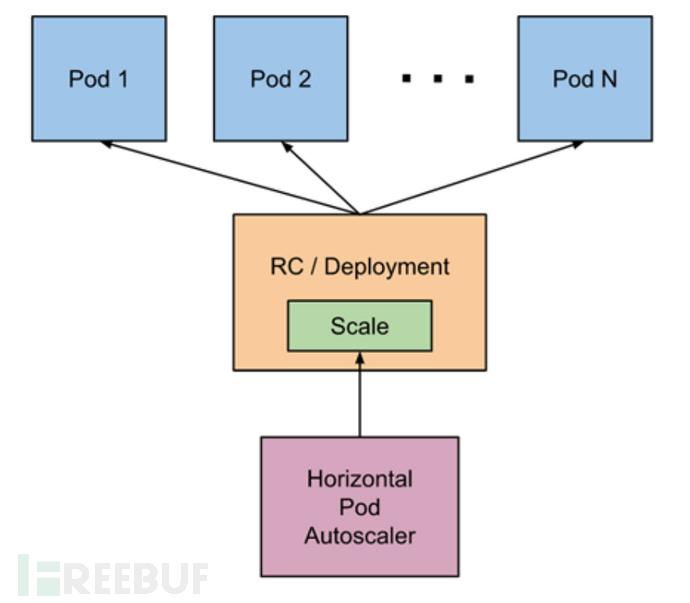

[toc]

## 介绍

Horizontal Pod Autoscaler（HPA，Pod水平自动伸缩），根据平均 CPU 利用率、平均内存利用率或你指定的任何其他自定义指标自动调整 Deployment 、ReplicaSet 或 StatefulSet 或其他类似资源，实现部署的自动扩展和缩减，让部署的规模接近于实际服务的负载。HPA不适用于无法缩放的对象，例如DaemonSet。
实际生产中，一般使用这四类指标：

1. Resource metrics——CPU核 和 内存利用率指标。
2. Pod metrics——例如网络利用率和流量。
3. Object metrics——特定对象的指标，比如Ingress, 可以按每秒使用请求数来扩展容器。
4. Custom metrics——自定义监控，比如通过定义服务响应时间，当响应时间达到一定指标时自动扩容。

默认情况下，Horizontal Pod Autoscaler 控制器会从一系列的 API 中检索度量值。 集群管理员需要确保下述条件，以保证 HPA 控制器能够访问这些 API：

1. 对于资源指标，将使用 [metrics.k8s.io](http://metrics.k8s.io/)API，一般由 metrics-server 提供。 它可以作为集群插件启动。
2. 对于自定义指标，将使用 [custom.metrics.k8s.io](http://custom.metrics.k8s.io/)API。 它由其他度量指标方案厂商的“适配器（Adapter）” API 服务器提供。 检查你的指标管道以查看是否有可用的 Kubernetes 指标适配器。
3. 对于外部指标，将使用 [external.metrics.k8s.io](http://external.metrics.k8s.io/)API。可能由上面的自定义指标适配器提供。
4. 自动检测周期由 kube-controller-manager 的 --horizontal-pod-autoscaler-sync-period 参数设置（默认间隔为 15 秒）。
5. metrics-server 提供 [metrics.k8s.io](http://metrics.k8s.io/)API 为pod资源的使用提供支持。

### Kubernetes Metrics Server：

- Kubernetes Metrics Server 是 Cluster 的核心监控数据的聚合器，kubeadm 默认是不部署的。
- Metrics Server 供 Dashboard 等其他组件使用，是一个扩展的 APIServer，依赖于 API Aggregator。所以，在安装 Metrics Server 之前需要先在 kube-apiserver 中开启 API Aggregator。
- Metrics API 只可以查询当前的度量数据，并不保存历史数据。
- Metrics API URI 为 /apis/[metrics.k8s.io/，在](http://metrics.k8s.io/，在)[k8s.io/metrics](http://k8s.io/metrics)下维护。
- 必须部署 metrics-server 才能使用该 API，metrics-server 通过调用 kubelet Summary API 获取数据。

## 配置

```bash
# CPU使用率大于20时自动扩容，最小2个，最大5个
kubectl autoscale <resource_type> <resource_name> -cpu-percent=20 --min=2 --max=5

# MEM使用率大于20时自动扩容，最小2个，最大5个
kubectl autoscale <resource_type> <resource_name> --min=2 --max=5 --metric=memory --value=20

```

## 监控插件

```bash
wget https://github.com/kubernetes-sigs/metrics-server/releases/download/metrics-server-helm-chart-3.8.2/components.yaml

## 修改components.yaml中
# args
#	在- --kubelet-use-node-status-port下方
# - --kubelet-insecure-tls
# 跳过证书检验

kubectl apply -f components.yaml
```

### 安装后使用命令

```bash
kubectl top nodes #node资源使用情况

kubectl top pods #pod资源使用情况
```

## HPA工作原理



1. 自动检测周期由 kube-controller-manager 的 --horizontal-pod-autoscaler-sync-period 参数设置（默认间隔为 15 秒）。
2. metrics-server 提供 [metrics.k8s.io](http://metrics.k8s.io/)API 为pod资源的使用提供支持。

## HPA对象定义

```yaml
apiVersion: autoscaling/v2beta2 #表示 HPA 使用的 API 版本。
kind: HorizontalPodAutoscaler #资源类型是 HPA。
metadata: # HPA 对象的名称。
  name: nginx
spec:
  behavior: #定义 HPA 的缩放行为。
    scaleDown: #定义缩减副本时的行为策略。
      policies:
      - type: Pods #type: Pods- 每次缩减固定数量的 Pod。
        value: 4 #每次缩减 4个 Pod。
        periodSeconds: 60 #每 60 秒执行一次该策略。
      - type: Percent #Percent- 每次缩减副本的百分比
        value: 10 #每次缩减 10% 的 Pod。 
        periodSeconds: 60 #每 60 秒执行一次该策略。
      stabilizationWindowSeconds: 300 #缩减副本时的稳定窗口期，为 300 秒。
      
  scaleTargetRef: #指定 HPA 关联的目标对象。
    apiVersion: apps/v1
    kind: Deployment
    name: nginx
  minReplicas: 1 #最小副本数量。
  maxReplicas: 10 #最大副本数量。
  metrics: #定义缩放的指标。
  - type: Resource #HPA 基于资源（如 CPU 或内存）的使用情况进行扩缩容。
  								# 一般使用Resource 使用其他的比较偏运维。
  								# 可取值：
  								#    Pods：基于自定义 Pod 指标。
                  #    Object：基于 Kubernetes 对象的指标。
                  #    External：基于外部指标系统的指标。

    resource:
      name: cpu #基于 CPU 资源的利用率。
      target:
        type: Utilization #使用利用率作为指标
        averageUtilization: 50 #所有 Pods总计 CPU 利用率为 50%。
        												# HPA 的目标是使所有 Pod 的平均 CPU 利用率保持在 50%
        												#多会扩容，少会缩容
   - type: Resource
    resource:
      name: memory # 基于内存的扩缩容
      target:
        type: Utilization
        averageUtilization: 70 # 所有 Pods总计内存利用率为 70% 
   - type: Resource
    resource:
      name: memory
      target:
        type: Value #直接基于绝对的资源使用量
        value: 500Mi # 单个 Pod 内存使用量目标为 500Mi
   - type: Resource
     resource:
       name: cpu
       target:
         type: AverageValue #资源平均值
         averageValue: 250m # 所有 Pods 的平均 CPU 使用量目标为 500m
        
        
        
###HPA对象默认行为
behavior:
  scaleDown:
    stabilizationWindowSeconds: 300
    policies:
    - type: Percent
      value: 100
      periodSeconds: 15
  scaleUp:
    stabilizationWindowSeconds: 0
    policies:
    - type: Percent
      value: 100
      periodSeconds: 15
    - type: Pods
      value: 4
      periodSeconds: 15
    selectPolicy: Max
```
