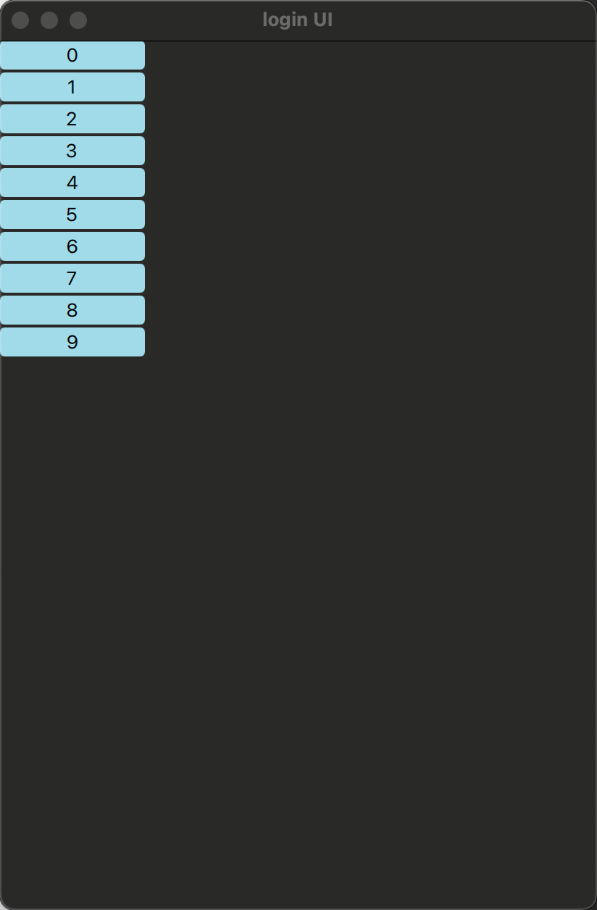
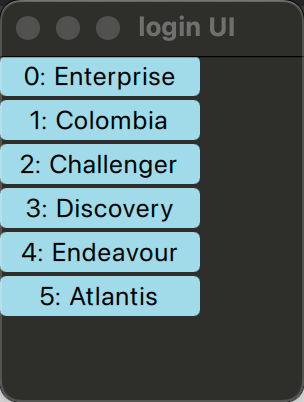
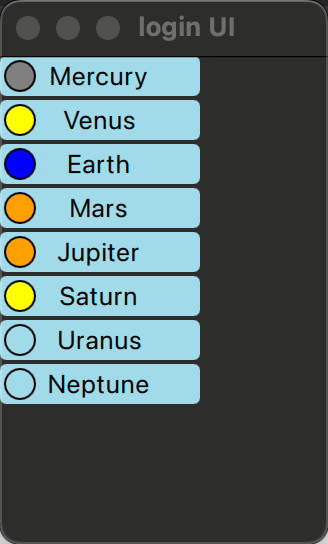
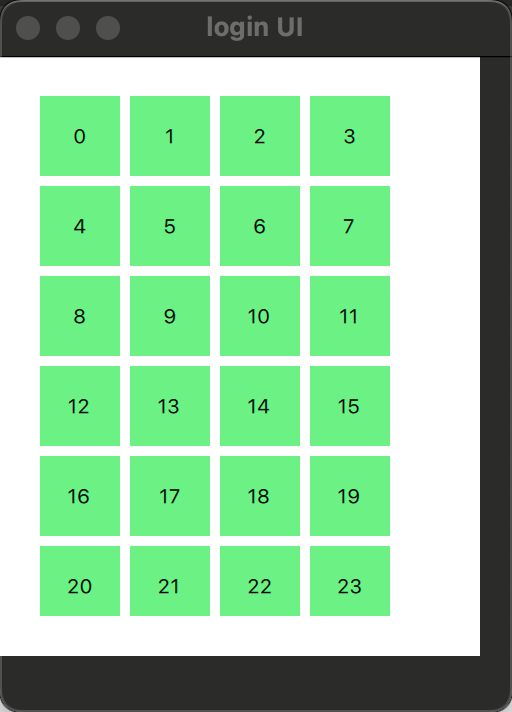

[toc]

## 概念

* 和qt c++的mvd一致

在QML中，model（模型）与view（视图）都通过delegate（代理）连接起来。

* model（模型）提供数据。对于每个数据项，可能有多个值。
* 显示在view（视图）中的每项数据,都是通过delegate（代理）来实现可视化。view（视图）的任务是排列这些delegate（代理）
* 每个delegate（代理）将model item（模型项）的值显示给用户。

## 表格的展示

qml中表格的展示使用Repeater元素。它被用于实例化一组元素项，并且很容易与一个用于填充用户界面的定位器相结合。

* MVD元素都在Repeater内
* repeater的内容的每个子项实例化时绑定了默认的属性delegate（代理）。

### model属性

`model` 决定了要展示多少项数据，每一项的内容由 delegate 来渲染。同时，他也可以提供数据。

model属性既可以用来：

1. **提供数据内容**，
2. **也可以单纯用于告诉视图「我有多少项」**。

* **`model` 可以是一个 JavaScript 数组，数组中的元素可以是对象、数组、甚至嵌套结构（“多维”）**，用来表示**行列数据**完全没问题。只要配合 `delegate` 正确访问结构，就能渲染出类似二维表格的内容。

`多维数据例子`

```
property var tableModel: [
    ["A1", "A2"],
    ["B1", "B2"],
    ["C1", "C2"]
]

ListView {
    width: 200; height: 300
    model: tableModel

    delegate: Row {
        spacing: 10

        Repeater {
            model: modelData  // 每一行是一个数组
            delegate: Rectangle {
                width: 60; height: 30
                color: "lightgray"
                Text {
                    anchors.centerIn: parent
                    text: modelData  // "A1", "A2" ...	//model只是一整行数据，至于每列怎么展示，需要使用代理
                }
            }
        }
    }
}
```


### 简单例子

```
import QtQuick
import QtQuick.Controls
import QtQuick.Controls.Basic

ApplicationWindow{
    id: root
    width: 1280
    height:800
    visible: true
    title: "login UI"

    color: "#00000000"
    Column {
        spacing: 2

        Repeater {
            model: 10

            Rectangle {		//等同于 delegate: Rectangle
            							//使用矩形作为代理展示
                width: 100
                height: 20

                radius: 3

                color: "lightBlue"

                Text {
                    anchors.centerIn: parent
                    text: index
                }
            }
        }
    }
}
```



### 复杂的数据

Rectangle中嵌入Rectangle

```
import QtQuick
import QtQuick.Controls
import QtQuick.Controls.Basic

ApplicationWindow{
    id: root
    width: 1280
    height:800
    visible: true
    title: "login UI"

    color: "#00000000"
    Column {
        spacing: 2

        Repeater {
            model: ["Enterprise", "Colombia", "Challenger", "Discovery", "Endeavour", "Atlantis"]

            Rectangle {
                width: 100
                height: 20

                radius: 3

                color: "lightBlue"

                Text {
                    anchors.centerIn: parent
                    text: index +": "+modelData
                }
            }
        }
    }
}
```




### 更复杂的

```
import QtQuick
import QtQuick.Controls
import QtQuick.Controls.Basic

ApplicationWindow{
    id: root
    width: 1280
    height:800
    visible: true
    title: "login UI"

    color: "#00000000"
    Column {
        spacing: 2

        Repeater {
            model: ListModel {
                ListElement { name: "Mercury"; surfaceColor: "gray" }
                ListElement { name: "Venus"; surfaceColor: "yellow" }
                ListElement { name: "Earth"; surfaceColor: "blue" }
                ListElement { name: "Mars"; surfaceColor: "orange" }
                ListElement { name: "Jupiter"; surfaceColor: "orange" }
                ListElement { name: "Saturn"; surfaceColor: "yellow" }
                ListElement { name: "Uranus"; surfaceColor: "lightBlue" }
                ListElement { name: "Neptune"; surfaceColor: "lightBlue" }
            }

            Rectangle {
                width: 100
                height: 20

                radius: 3

                color: "lightBlue"

                Text {
                    anchors.centerIn: parent
                    text: name
                }

                Rectangle {
                    anchors.left: parent.left
                    anchors.verticalCenter: parent.verticalCenter
                    anchors.leftMargin: 2

                    width: 16
                    height: 16

                    radius: 8

                    border.color: "black"
                    border.width: 1

                    color: surfaceColor
                }
            }
        }
    }
}
```



## 动态视图

可以在Reppeater元素中嵌入view来实现动态视图

### 自定义代理以及使用ListVIew

```
import QtQuick
import QtQuick.Controls
import QtQuick.Controls.Basic

ApplicationWindow{
    id: root
    width: 1280
    height:800
    visible: true
    title: "login UI"

    color: "#00000000"
    Rectangle {
        width: 80
        height: 300

        color: "white"

        ListView {
            anchors.fill: parent
            anchors.margins: 20

            clip: true

            model: 100

            delegate: numberDelegate
            spacing: 5
        }

        Component {		//用于定义一个组件 此处用于定义一个自定义代理
            id: numberDelegate

            Rectangle {
                width: 40
                height: 40

                color: "lightGreen"

                Text {
                    anchors.centerIn: parent

                    font.pixelSize: 10

                    text: index
                }
            }
        }
    }
}

```

### ListVIew列表展示方向

ListView视图只提供了一个垂直方向的滚动条，但是水平滚动条也是需要的。ListView的方向由属性orientation控制。它能够被设置为默认值ListView.Vertical或者ListView.Horizontal。

`水平列表`

```
import QtQuick
import QtQuick.Controls
import QtQuick.Controls.Basic

ApplicationWindow{
    id: root
    width: 1280
    height:800
    visible: true
    title: "login UI"

    color: "#00000000"
    Rectangle {
        width: 480
        height: 80

        color: "white"

        ListView {
            anchors.fill: parent
            anchors.margins: 20

            clip: true

            model: 100

            orientation: ListView.Horizontal

            delegate: numberDelegate
            spacing: 5
        }

        Component {
            id: numberDelegate

            Rectangle {
                width: 40
                height: 40

                color: "lightGreen"

                Text {
                    anchors.centerIn: parent

                    font.pixelSize: 10

                    text: index
                }
            }
        }
    }
}
```

### ListVIew高量的实现

focus属性设置为true，它设置链表视图能够获得键盘焦点。

highlight属性，指出使用的高亮代理元素。高亮代理元素的x,y与height属性由当前元素指定。如果宽度没有特别指定，当前元素的宽度也可以用于高亮代理元素。

```
import QtQuick
import QtQuick.Controls
import QtQuick.Controls.Basic

ApplicationWindow{
    id: root
    width: 1280
    height:800
    visible: true
    title: "login UI"

    color: "#00000000"
    Rectangle {
        width: 240
        height: 300

        color: "white"

        ListView {
            anchors.fill: parent
            anchors.margins: 20

            clip: true

            model: 100

            delegate: numberDelegate
            spacing: 5

            highlight: highlightComponent
            focus: true
        }

        Component {
            id: highlightComponent

            Rectangle {
                width: ListView.view.width
                color: "lightGreen"
            }
        }

        Component {
            id: numberDelegate

            Item {
                width: 40
                height: 40

                Text {
                    anchors.centerIn: parent

                    font.pixelSize: 10

                    text: index
                }
            }
        }
    }
}

```

`淡出、移动、淡入的实现`

```
import QtQuick
import QtQuick.Controls
import QtQuick.Controls.Basic

ApplicationWindow{
    id: root
    width: 1280
    height:800
    visible: true
    title: "login UI"

    color: "#00000000"
    Rectangle {
        width: 240
        height: 300

        color: "white"

        ListView {
            anchors.fill: parent
            anchors.margins: 20

            clip: true

            model: 100

            delegate: numberDelegate
            spacing: 5

            highlight: highlightComponent
            focus: true
        }

        Component {
                id: highlightComponent

                Item {
                    width: ListView.view.width
                    height: ListView.view.currentItem.height

                    y: ListView.view.currentItem.y

                    Behavior on y {
                        SequentialAnimation {
                            PropertyAnimation { target: highlightRectangle; property: "opacity"; to: 0; duration: 200 }
                            NumberAnimation { duration: 1 }
                            PropertyAnimation { target: highlightRectangle; property: "opacity"; to: 1; duration: 200 }
                        }
                    }

                    Rectangle {
                        id: highlightRectangle
                        anchors.fill: parent
                        color: "lightGreen"
                    }
                }
            }

        Component {
            id: numberDelegate

            Item {
                width: 40
                height: 40

                Text {
                    anchors.centerIn: parent

                    font.pixelSize: 10

                    text: index
                }
            }
        }
    }
}

```

### ListVIew页眉与页脚

可以向链表视图中插入一个页眉（header）元素和一个页脚（footer）元素。这部分是链表的开始或者结尾处被作为代理元素特殊的区域。对于一个水平链表视图，不会存在页眉或者页脚，但是也有开始和结尾处，这取决于layoutDirection的设置。

```
import QtQuick
import QtQuick.Controls
import QtQuick.Controls.Basic

ApplicationWindow{
    id: root
    width: 1280
    height:800
    visible: true
    title: "login UI"

    color: "#00000000"
    Rectangle {
        width: 80
        height: 300

        color: "white"

        ListView {
            anchors.fill: parent
            anchors.margins: 20

            clip: true

            model: 4

            delegate: numberDelegate
            spacing: 5

            header: headerComponent
            footer: footerComponent
        }

        Component {
            id: headerComponent

            Rectangle {
                width: 40
                height: 20

                color: "yellow"
            }
        }

        Component {
            id: footerComponent

            Rectangle {
                width: 40
                height: 20

                color: "red"
            }
        }

        Component {
            id: numberDelegate

            Rectangle {
                width: 40
                height: 40

                color: "lightGreen"

                Text {
                    anchors.centerIn: parent

                    font.pixelSize: 10

                    text: index
                }
            }
        }
    }
}

```

### 网格视图

网格视图（GridView）不依赖于元素间隔和大小来配置元素。它使用单元宽度（cellWidth）与单元高度（cellHeight）属性来控制数组内的二维元素的内容。每个元素从左上角开始依次放入单元格。

```
import QtQuick 2.0

Rectangle {
    width: 240
    height: 300

    color: "white"

    GridView {
        anchors.fill: parent
        anchors.margins: 20

        clip: true

        model: 100

        cellWidth: 45
        cellHeight: 45

        delegate: numberDelegate
    }

    Component {
        id: numberDelegate

        Rectangle {
            width: 40
            height: 40

            color: "lightGreen"

            Text {
                anchors.centerIn: parent

                font.pixelSize: 10

                text: index
            }
        }
    }
}
```



## 代理

代理在创建显示时扮演了大量的角色。在模型中的每个元素通过代理来实现可视化，用户真实可见的是这些代理元素。

### 使用代理展示不同列的数据

```
import QtQuick
import QtQuick.Controls
import QtQuick.Controls.Basic

ApplicationWindow {
    id: root
    width: 1280
    height: 800
    visible: true
    title: "login UI"
    color: "#00000000"

    // 👇 定义在 ApplicationWindow 层级
    property var tableModel: [
        { name: "Alice", age: 25, city: "Beijing" },
        { name: "Bob", age: 30, city: "Shanghai" }
    ]

    Rectangle {
        width: 400
        height: 300
        anchors.centerIn: parent
        color: "white"

        ListView {
            anchors.fill: parent
            spacing: 10
            model: root.tableModel  // 👈 使用 root.tableModel
            delegate: Row {
                width: parent.width
                height: 30
                spacing: 20

                Text { text: modelData.name; width: 100 }	//展示不同列的数据
                Text { text: modelData.age.toString(); width: 50 }
                Text { text: modelData.city; width: 100 }
            }
        }
    }
}

```

### 形变的代理

下面的例子点击代理项后，代理项将会展开并填充整个view

```
import QtQuick
import QtQuick.Controls
import QtQuick.Controls.Basic

ApplicationWindow {
    id: root
    width: 1280
    height: 800
    visible: true
    title: "login UI"
    color: "#00000000"

    Item {
        width: 300
        height: 480

        ListView {
            id: listView

            anchors.fill: parent

            delegate: detailsDelegate
            model: planets
        }

        ListModel {
            id: planets

            ListElement { name: "Mercury"; imageSource: "images/mercury.jpeg"; facts: "Mercury is the smallest planet in the Solar System. It is the closest planet to the sun. It makes one trip around the Sun once every 87.969 days." }
            ListElement { name: "Venus"; imageSource: "images/venus.jpeg"; facts: "Venus is the second planet from the Sun. It is a terrestrial planet because it has a solid, rocky surface. The other terrestrial planets are Mercury, Earth and Mars. Astronomers have known Venus for thousands of years." }
            ListElement { name: "Earth"; imageSource: "images/earth.jpeg"; facts: "The Earth is the third planet from the Sun. It is one of the four terrestrial planets in our Solar System. This means most of its mass is solid. The other three are Mercury, Venus and Mars. The Earth is also called the Blue Planet, 'Planet Earth', and 'Terra'." }
            ListElement { name: "Mars"; imageSource: "images/mars.jpeg"; facts: "Mars is the fourth planet from the Sun in the Solar System. Mars is dry, rocky and cold. It is home to the largest volcano in the Solar System. Mars is named after the mythological Roman god of war because it is a red planet, which signifies the colour of blood." }
        }

        Component {
            id: detailsDelegate

            Item {
                id: wrapper

                width: listView.width
                height: 30

                Rectangle {
                    anchors.left: parent.left
                    anchors.right: parent.right
                    anchors.top: parent.top

                    height: 30

                    color: "#ffaa00"

                    Text {
                        anchors.left: parent.left
                        anchors.verticalCenter: parent.verticalCenter

                        font.pixelSize: parent.height-4

                        text: name
                    }
                }

                Rectangle {
                    id: image

                    color: "black"

                    anchors.right: parent.right
                    anchors.top: parent.top
                    anchors.rightMargin: 2
                    anchors.topMargin: 2

                    width: 26
                    height: 26

                    Image {
                        anchors.fill: parent

                        fillMode: Image.PreserveAspectFit

                        source: imageSource
                    }
                }

                MouseArea {
                    anchors.fill: parent
                    onClicked: parent.state = "expanded"
                }

                Item {
                    id: factsView

                    anchors.top: image.bottom
                    anchors.left: parent.left
                    anchors.right: parent.right
                    anchors.bottom: parent.bottom

                    opacity: 0

                    Rectangle {
                        anchors.fill: parent

                        color: "#cccccc"

                        Text {
                            anchors.fill: parent
                            anchors.margins: 5

                            clip: true
                            wrapMode: Text.WordWrap

                            font.pixelSize: 12

                            text: facts
                        }
                    }
                }

                Rectangle {
                    id: closeButton

                    anchors.right: parent.right
                    anchors.top: parent.top
                    anchors.rightMargin: 2
                    anchors.topMargin: 2

                    width: 26
                    height: 26

                    color: "red"

                    opacity: 0

                    MouseArea {
                        anchors.fill: parent
                        onClicked: wrapper.state = ""
                    }
                }

                states: [
                    State {
                        name: "expanded"

                        PropertyChanges { target: wrapper; height: listView.height }
                        PropertyChanges { target: image; width: listView.width; height: listView.width; anchors.rightMargin: 0; anchors.topMargin: 30 }
                        PropertyChanges { target: factsView; opacity: 1 }
                        PropertyChanges { target: closeButton; opacity: 1 }
                        PropertyChanges { target: wrapper.ListView.view; contentY: wrapper.y; interactive: false }
                    }
                ]

                transitions: [
                    Transition {
                        NumberAnimation {
                            duration: 200;
                            properties: "height,width,anchors.rightMargin,anchors.topMargin,opacity,contentY"
                        }
                    }
                ]
            }
        }
    }
}

```

