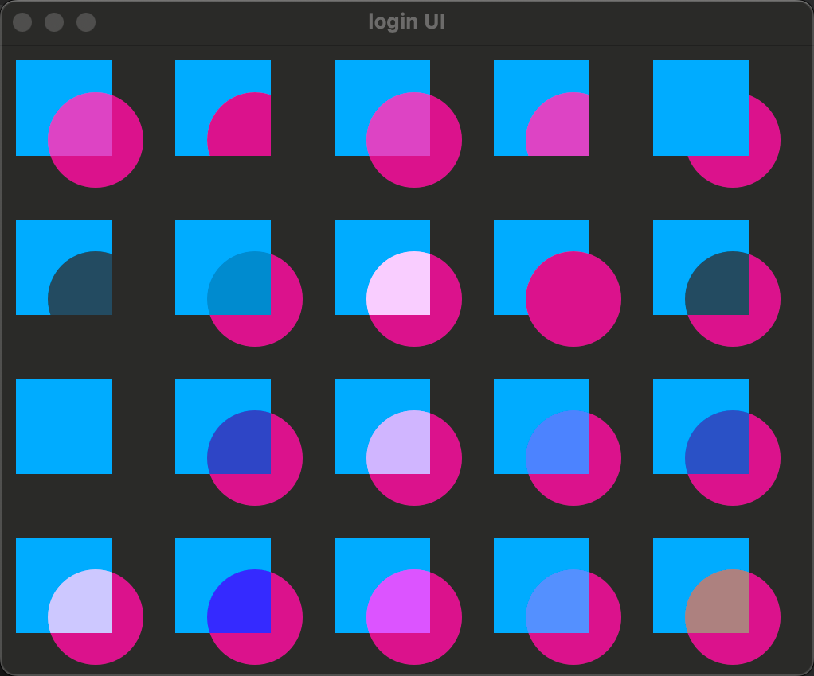

[toc]

## 概念

Qt5中引进了画布元素（canvas element），允许脚本绘制。画布元素（canvas element）提供了一个依赖于分辨率的位图画布，你可以使用JavaScript脚本来绘制图形，制作游戏或者其它的动态图像。画布元素（canvas element）是基于HTML5的画布元素来完成的。

* 它类似于qt c++中的paintEvent
* 画布自身提供了典型的二维笛卡尔坐标系统，左上角是（0,0）坐标。Y轴坐标轴向下，X轴坐标轴向右。

## 简单绘图示例

* 画布元素（canvas element）的基本思想是使用一个2D对象来渲染路径。这个2D对象包括了必要的绘图函数，画布元素（canvas element）充当绘制画布。2D对象支持画笔，填充，渐变，文本和绘制路径创建命令。
* 画布元素（canvas element）充当了绘制的容器。2D绘制对象提供了实际绘制的方法。绘制需要在onPaint事件中完成。
* 典型绘制命令调用如下：
  1. 装载画笔或者填充模式
  2. 创建绘制路径
  3. 使用画笔或者填充绘制路径

```
import QtQuick
import QtQuick.Controls
import QtQuick.Controls.Basic

ApplicationWindow {
    id: root
    width: 1280
    height: 800
    visible: true
    title: "login UI"
    color: "#00000000"

    Canvas {
        id: root2
        // canvas size
        width: 200; height: 200
        // handler to override for drawing
        onPaint: {
            // get context to draw with
            var ctx = getContext("2d")
            // setup the stroke
            ctx.lineWidth = 4
            ctx.strokeStyle = "blue"
            // setup the fill
            ctx.fillStyle = "steelblue"
            // begin a new path to draw
            ctx.beginPath()
            // top-left start point
            ctx.moveTo(50,50)
            // upper line
            ctx.lineTo(150,50)
            // right line
            ctx.lineTo(150,150)
            // bottom line
            ctx.lineTo(50,150)
            // left line through path closing
            ctx.closePath()
            // fill using fill style
            ctx.fill()
            // stroke using line width and stroke style
            ctx.stroke()
        }
    }
}

```

### 渐变示例

下列渐变色定义在开始点（100,0）到结束点（100,200）。在画布中是一个中间垂直的线。渐变色在停止点定义一个颜色，范围从0.0到1.0。这里我们使用一个蓝色作为0.0（100,0），一个高亮刚蓝色作为0.5（100,200）。渐变色的定义比我们想要绘制的矩形更大，所以矩形在它定义的范围内对渐变进行了裁剪。

```
 onPaint: {
        var ctx = getContext("2d")

        var gradient = ctx.createLinearGradient(100,0,100,200)
        gradient.addColorStop(0, "blue")
        gradient.addColorStop(0.5, "lightsteelblue")
        ctx.fillStyle = gradient
        ctx.fillRect(50,50,100,100)
    }
```

### 阴影示例

2D对象的路径可以使用阴影增强显示效果。阴影是一个区域的轮廓线使用偏移量，颜色和模糊来实现的。

```
Canvas {
        id: canvas
        // canvas size
        width: 200; height: 200
        // handler to override for drawing
        onPaint: {
                var ctx = getContext("2d")
                
                // 绘制黑色北京
                ctx.strokeStyle = "#333"
                ctx.fillRect(0,0,canvas.width,canvas.height);
                
                //定义阴影配置
                ctx.shadowColor = "blue";
                ctx.shadowOffsetX = 2;
                ctx.shadowOffsetY = 2;
                //绘制文本
                ctx.font = 'Bold 80px Ubuntu';
                ctx.fillStyle = "#33a9ff";
                ctx.fillText("Earth",30,180);
           }
    }
```

### 图片展示

* QML画布支持多种资源的图片绘制。在画布中使用一个图片需要先加载图片资源。

### 转换示例

画布有多种方式来转换坐标系。这些操作非常类似于QML元素的转换。你可以通过缩放（scale），旋转（rotate），translate（移动）来转换坐标系。与QML元素的转换不同的是，转换原点就是画布原点（左上角0,0）。

* 注意：转换必须在绘制前进行，绘制后进行转换大概率不生效

```
import QtQuick
import QtQuick.Controls
import QtQuick.Controls.Basic

ApplicationWindow {
    id: root1
    width: 1280
    height: 800
    visible: true
    title: "login UI"
    color: "#00000000"

    Canvas {
        id: root
        width: 240
        height: 120
        onPaint: {
            var ctx = getContext("2d")
            ctx.lineWidth = 4

            // 画蓝色正方形（未旋转）
            ctx.save()
            //把当前坐标系的原点移动到 (120, 60)，使得之后的所有绘图、旋转、缩放等操作，都是以这个新原点为基准进行的。
            ctx.translate(120, 60)
            ctx.strokeStyle = "blue"
            ctx.beginPath()
            ctx.rect(-20, -20, 40, 40)
            ctx.stroke()
            ctx.restore()

            // 画绿色正方形（旋转 45°）
            ctx.save()
            //把当前坐标系的原点移动到 (120, 60)，使得之后的所有绘图、旋转、缩放等操作，都是以这个新原点为基准进行的。
            ctx.translate(120, 60)
            ctx.rotate(Math.PI / 4)
            ctx.strokeStyle = "green"
            ctx.beginPath()
            ctx.rect(-20, -20, 40, 40)
            ctx.stroke()
            ctx.restore()
        }
    }
}
```

### 组合模式

组合允许你绘制一个形状然后与已有的像素点集合混合。画布提供了多种组合模式，使用globalCompositeOperation(mode)来设置。

* 重叠模式决定了你有重叠的多个图像最后的叠加效果。

`所有取值以及示例`

```
import QtQuick
import QtQuick.Controls
import QtQuick.Controls.Basic

ApplicationWindow {
    id: root1
    width: 1280
    height: 800
    visible: true
    title: "login UI"
    color: "#00000000"

    Canvas {
        id: root
        width: 500
        height: 1000
        property var operation : [
                'source-over', 'source-in', 'source-over',
                'source-atop', 'destination-over', 'destination-in',
                'destination-out', 'destination-atop', 'lighter',
                'copy', 'xor', 'qt-clear', 'qt-destination',
                'qt-multiply', 'qt-screen', 'qt-overlay', 'qt-darken',
                'qt-lighten', 'qt-color-dodge', 'qt-color-burn',
                'qt-hard-light', 'qt-soft-light', 'qt-difference',
                'qt-exclusion'
                ]

            onPaint: {
                var ctx = getContext('2d')

                for(var i=0; i<operation.length; i++) {
                    var dx = Math.floor(i%6)*100
                    var dy = Math.floor(i/6)*100
                    ctx.save()
                    ctx.fillStyle = '#33a9ff'
                    ctx.fillRect(10+dx,10+dy,60,60)
                    // TODO: does not work yet
                    ctx.globalCompositeOperation = root.operation[i]
                    ctx.fillStyle = '#ff33a9'
                    ctx.globalAlpha = 0.75
                    ctx.beginPath()
                    ctx.arc(60+dx, 60+dy, 30, 0, 2*Math.PI)
                    ctx.closePath()
                    ctx.fill()
                    ctx.restore()
                }
            }
    }
}
```



### 像素缓冲

用画布时，你可以检索读取画布上的像素数据，或者操作画布上的像素。

读取画布上的图像数据使用createImageData(sw,sh)或者getImageData(sx,sy,sw,sh)。

这两个函数都会返回一个包含宽度（width），高度（height）和数据（data）的图像数据（ImageData）对象。图像数据包含了一维数组像素数据，使用RGBA格式进行检索。每个数据的数据范围在0到255之间。

设置画布的像素数据你可以使用putImageData(imagedata,dx,dy)函数来完成。

* 另一种检索画布内容的方法是将画布的数据存储进一张图片中。使用画布的函数save(path)或者toDataURL(mimeType)来完成，toDataURL(mimeType)会返回一个图片的地址，这个链接可以直接用Image元素来读取。

  下面的例子每秒绘制一个图片，当点击画布时，打印图片原始数据

```
import QtQuick
import QtQuick.Controls
import QtQuick.Controls.Basic

ApplicationWindow {
    id: root1
    width: 1280
    height: 800
    visible: true
    title: "login UI"
    color: "#00000000"

    Rectangle {
        width: 500; height: 400
        Canvas {
            id: canvas
            x: 10; y: 10
            width: 100; height: 100
            property real hue: 0.0
            onPaint: {
                var ctx = getContext("2d")
                var x = 10 + Math.random(80)*80
                var y = 10 + Math.random(80)*80
                hue += Math.random()*0.1
                if(hue > 1.0) { hue -= 1 }
                ctx.globalAlpha = 0.7
                ctx.fillStyle = Qt.hsla(hue, 0.5, 0.5, 1.0)
                ctx.beginPath()
                ctx.moveTo(x+5,y)
                ctx.arc(x,y, x/10, 0, 360)
                ctx.closePath()
                ctx.fill()
            }
            MouseArea {
                anchors.fill: parent
                onClicked: {
                    var url = canvas.toDataURL('image/png')
                    print('image url=', url)
                    image.source = url
                }
            }
        }

        Image {
            id: image
            x: 130; y: 10
            width: 100; height: 100
        }

        Timer {
            interval: 1000
            running: true
            triggeredOnStart: true
            repeat: true
            onTriggered: canvas.requestPaint()
        }
    }
}

```

