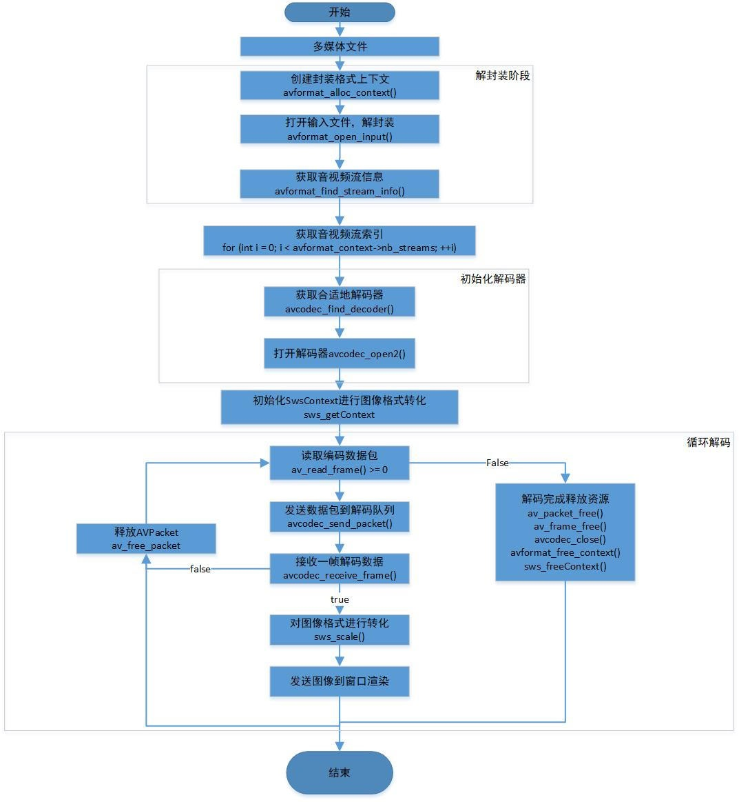

## 多媒体文件解码流程图

* 1.获取媒体文件格式信息：使用avformat_open_input通过文件获取AVFormatContext结构。

* 2.找到视频流：调用avformat_find_stream_info，传入AVFormatContext，读取视频中一段数据，并且解码(函数内部操作)，之后根据解码数据填充AVFormatContext中流信息。

* 3.找到合适的视频流：调用av_find_best_stream，传入AVFormatContext，自动搜索到合适的视频流索引，或是循环判断AVFormatContext中的每个streams的codecpar->codec_type来找到对应的视频流索引(对应的streams数组中的下标)。

* 4.查找对应的解码器：调用avcodec_find_decoder，传入AVFormatContext中结构streams里对应的流的codecpar->codec_id，来返回一个解码器。

* 5.初始化编码器参数：调用avcodec_parameters_to_context，传入AVCodecContext结构与AVFormatContext中结构streams里对应的流的codecpar，来初始化解码器上下文的参数

* 6.打开编码器：调用avcodec_open2，传入解码器上下文与解码器，打开该解码器，之后解码器上下文可以接收数据并进行解码。

* 7.初始化SwsContext结构：该结构为原始数据格式化上下文结构，为后面的格式化做准备。

---开始循环

* 8.开始从流中读取数据包：调用 av_read_frame 传入AVFormatContext与AVPacket，函数将会写入一个数据包的数据到AVPacket。
* 9.判断包中的数据是否为自己想要的：因为av_read_frame读取包数据的时候不指定流，所以该包数据可能来自于流媒体文件中的任何流，此时可以根据获得AVPacket中的stream_index(流媒体文件中流的索引)字段判断该数据包是否来自自己想要的流。
* 10.传入数据开始解码：调用avcodec_send_packet，传入对应的AVCodecContext与AVPacket来将数据添加到待解码队列。
* 11.获取解码完成的数据帧：调用avcodec_receive_frame，传入对应的AVCodecContext与AVFrame来从已经解码完成的队列中获取一阵数据。
* 12.使用SwsContext来格式化数据(原数据最终格式，yuv420 rgb24 rgb32等)。
* 13.读取数据并且交给应用层处理。
* 14.清空AVPacket中的数据(并不释放分配的空间)。

---结束循环

* 13.释放之前初始化了的结构体。