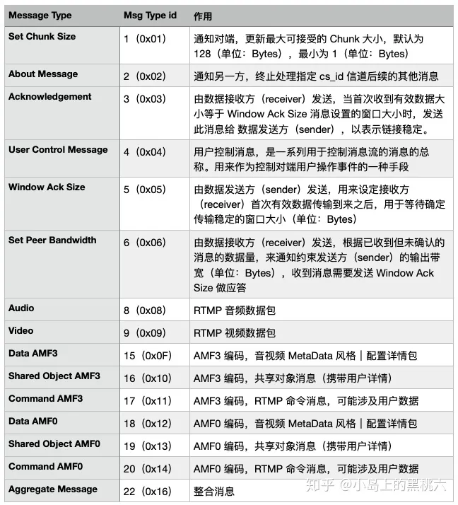

[toc]

## RTMP

RTMP（Real Time Messaging Protocol） 是由 Adobe 公司基于 Flash Player 播放器对应的音视频 flv 封装格式提出的一种，基于TCP 的数据传输协议。本身具有稳定、兼容性强、高穿透的特点。常被应用于流媒体直播、点播等场景。常用于推推流方（主播）的稳定传输需求。


## RTMP消息块

RTMP 协议为了维持稳定连续传递，避免单次传输数据量问题，采用了传输层封包，数据流切片的实现形式。被用来对当前带宽进行划分和复用的最小传输单位，被称为 Chunk 即消息块。


一个有效的消息，如果数据量超出当前 Chunk Size 的话，则会被拆分成多个分块来分批传输。通过指定首个 Chunk 和后续 Chunk 类型，以及 Chunk Header 其他标志性数据，来使当前被切割的消息，能够在对端得到有效的还原和执行。


## RTMP消息块的组成

### 结构

```
| basic Header | Message Header | Extended Timestamp | Chunk Data |
```


#### 基础数据头（Basic Header）

包含了要发送的实际信息（可能是完整的，也可能是一部分）的描述信息。Message Header的格式和长度取决于Basic Header的chunk type（fmt）取值，共有4种不同的格式，由上fmt字段控制。


`结构`

```
| format message type | chunk stream id |
```

##### stream id

Chunk stream ID 可以配置为3～65599 这 65597 个不同标志中的其中一种。根据持有 Chunk stream ID 的长度，RTMP 规格将基础数据头分为3种：ID 在 2～63 范围内的 1-Byte 版；ID 在 64～319 范围内的 2-Byte 版；ID 在 64～65599 范围内的 3-Byte 版。

```
// id 2~63
|  fmt  | cs id | 
|  2bit | 6bit  |

// id 64~319
|  fmt  |  0   | cs id |
|  2bit | 6bit | 8bit  |

//id 64~65599
|  fmt  |  1   | cs id |
|  2bit | 6bit | 16bit  |
```

cs id 字段（6-bits）：用来表示 63 以内的ID的标志位，0、1两个标记被占用做扩展标记

cs id 字段（8 or 16-bits）：用来根据扩展标志扩充的，广范围标志位


##### format message type

用来标志消息类型，也被称为 Chunk Type，其决定了后续的message type格式与长度

`取值表`

| 取值  | 意义                                                         |
| ----- | ------------------------------------------------------------ |
| fmt=0 | Message Header占用11个字节，类型0必须用在块流的开头位置，或者每次当块流的时间戳后退的时候（例如向后拖动的操作） |
| fmt=1 | Message Header占用7个字节，省去了表示msg stream id的4个字节，表示此chunk和上一次发的chunk所在的流相同，如果在发送端只和对端有一个流链接的时候可以尽量去采取这种格式 |
| fmt=2 | Message Header占用3个字节，相对于type＝1格式又省去了表示消息长度的3个字节和表示消息类型的1个字节，表示此chunk和上一次发送的chunk所在的流、消息的长度和消息的类型都相同 |
| fmt=3 | 表示这个chunk的Message Header和上一个是完全相同的，不存在消息头，当它跟在Type＝0的chunk后面时，表示和前一个chunk的时间戳都是相同的，就是一个Message拆分成了多个chunk，这个chunk和上一个chunk同属于一个Message； |

`消息格式示例`

* 下列消息中，cont表示字段连续

* fmt=0示例


* fmt=1示例


* fmt=2示例


#### 消息数据头（Message Header）

包含被发送消息的相关信息，类型Chunk Type决定，其完整长度如下：


##### timestamp 

消息时间戳（3Byte），标记当前消息绝对时间戳，有效位 24 bits，如果超出16777215（0xFFFFFF）则启用扩展时间戳（Extended Timestamp）。扩展位启用时，timestamp 位恒定为 16777215，通过还原 32 bits 的扩展位，加合为有效时间戳数据。时间戳在运用上对于不同消息类型会有区分，fmt=0 时为绝对时间戳，fmt=1或fmt=2 时为相对时间戳（时间差值）。

##### msg length

消息头长度（3Byte），携带 Chunk Header 数据长度信息

##### msg type id

消息类型（1Byte），携带消息类型信息，这是实际消息的类型，区别于消息头。

`取值如下`




##### message stream id 

消息归属消息流 ID 标志位（4Byte），标识消息所使用的流


#### 扩展时间戳（Extended Timestamp）

32-bits，消息头携带的时间戳扩展位，配合 Message Header 中事件戳使用


#### CSID与message stream id 的区别

##### CSID

Chunk stream ID 是用来区分消息信道的。因为 RTMP 协议，所有的通信都是通过同一个 TCP 来完成的，因此所有类型的通信信道需要由 Chunk stream ID 来进行区分，从而判断当前收到的消息所属的信道类型。

* 官方约束(不一定会严格遵循官方约束)

| CSID | 意义       |
| ---- | ---------- |
| 0x02 | 控制流通道 |
| 0x03 | 命令信道   |
| 0x05 | 数据流通道 |
| 0x06 | 视频信道   |
| 0x07 | 音频信道   |

##### ms id

ms id唯一标识一个消息

##### 区别

一个消息可以被分割成多个块（chunks）进行传输。他们使用同一个message stream id 。并且这些chunks使用同一个CSID往某一个信道或通道发送。


## RTMP消息类型

### 协议控制消息

在RTMP的chunk流会有一些特殊的值来代表协议的控制消息，它们的Message Stream ID必须为0（代表控制流信息），CSID必须为2，Message Type ID可以为1，2，3，5，6。控制消息的接受端会忽略掉chunk中的时间戳，收到后立即生效。

#### Set Chunk Size(message type id=1，chunk最大size设置)

设置chunk中Data字段所能承载的最大字节数，默认为128B。通信双方会各自维护一个chunkSize，两端的chunkSize是独立的。比如当A想向B发送一个200B的Message，但默认的chunkSize是128B，因此就要将该消息拆分为Data分别为128B和72B的两个chunk发送。实际一般会把chunk size设置的很大，有的会设置为4096，这样设置的好处是避免了频繁的拆包组包，占用过多的CPU。

`格式`

```
|   0  | chunk size |
| 1bit |     31bit  |
```

#### Abort Message (message type id=2，中止)

用于中止正在进行的消息传输的消息类型。它的作用是在通信中断或错误发生时，通知对方立即停止当前的消息传输。

当一个Message被切分为多个chunk，接受端最终只接收到了部分chunk时，发送方发送该控制消息表示发送端不再传输同Message的chunk，接受端接收到这个消息后要丢弃这些不完整的chunk。Data数据中只需要一个CSID，表示丢弃该CSID的所有已接收到的chunk。

`格式`

```
| Abort Message  |
|      32bit     |
```

#### Acknowledgement(message type id=3，回应)

客户端或者服务器在接收到等同于窗口大小的字节之后必须要发送给对端一个确认。

* 窗口大小：由发送方和接收方自行维。发送者在没有收到接收者确认之前发送的最大数量的字节。这个消息定义了序列号，也就是目前接收到的字节数。

`格式`

```
| squence number   |
|       32bit      |
```

#### Window Acknowledgement Size (message type id==5，窗口大小确认)

客户端或者服务器端发送这条消息来通知对端发送和应答之间的窗口大小。发送者在发送完窗口大小字节之后期望对端的确认。接收端在上次确认发送后接收到的指示数值后，或者会话建立之后，接收端尚未发送任何确认消息但收到窗口确认大小的指示数值时，必须发送一个Acknowledgement。

`格式`

```
| Window Acknowledgement Size |
|             32bit            |
```

#### Set Peer Bandwidth (message type id==6)

限制对端的输出带宽。接受端接收到该消息后会通过设置消息中的Window ACK Size来限制已发送但未接受到反馈的消息的大小来限制发送端的发送带宽。如果消息中的Window ACK Size与上一次发送给发送端的size不同的话，对端要回馈一个Window Acknowledgement Size的控制消息。

`格式`

```
| Window Acknowledgement Size | limit type|
|             32bit           |    8bit   |
```

* Hard(Limit Type＝0)：接受端应该将Window Ack Size设置为消息中的值。

* Soft(Limit Type=1)：接受端可以讲Window Ack Size设为消息中的值，也可以保存原来的值（前提是原来的Size小与该控制消息中的Window Ack Size）。

* Dynamic(Limit Type=2)：如果上次的Set Peer Bandwidth消息中的Limit Type为0，本次也按Hard处理，否则忽略本消息，不去设置Window Ack Size。
  

### 用户控制消息

告知对方执行该信息中包含的用户控制事件，比如Stream Begin事件告知对方流信息开始传输。和前面提到的协议控制信息（Protocol Control Message）不同，这是在RTMP协议层的，而不是在RTMP chunk流协议层的，这个很容易弄混。该信息在chunk流中发送时，Message Stream ID=0,Chunk Stream Id=2,Message Type Id=4。

`支持以下用户控制事件类型`


### 命令消息

表示在客户端盒服务器间传递的在对端执行某些操作的命令消息，使用AMF格式编码。当信息使用AMF0编码时，Message Type ID＝20，AMF3编码时Message Type ID＝17。

* 回应：这类回应消息，通过 Transaction ID 来标记被回应的方法，并通过固定的命名格式来进行约束：
  * [ 命令消息 ] + _result
  * [ 命令消息 ] + _error

* 分类：命令消息主要分为两种类型：

1. **NetConnection**：网络连接命令，用来管理 C-S 间双向链接，并提供远程方法异步调用。
2. **NetStream**：数据流命令，被用来管理 音视频流 和 数据通道 相关的管理和业务操作。

#### NetConnection类指令

#### connect指令

connect 指令是由客户端发给服务器端，用来获取一个可用于建立对端通信的服务端应用实例的一个指令。指令分为请求指令 connect 和 应答指令 connect_result。

* 请求指令组成


* 应答指令组成


* 请求指令连接配置可用参数


* audioCodecs、videoCodecs、videoFunction、objectionEncoding规范取值
  * 这些规定好的类型能够覆盖大部分使用情况。但不是全部，如果有不支持的，可以自行定义


#### call指令

指令发送端通过call 指令，来调用对端的 Remote Procedure Calls（即远程程序调用 RPC），来执行对端指定的方法或处理过程，获取结果返回。具体程序需要独立实现。指令分为请求指令 call 和 应答指令 call_result。

* 请求指令组成


* 应答指令组成


#### close指令

close 指令在官方的 RTMP 规格说明文档中并未公开，如用到需要双端协定。（这个指令貌似是专门针对 Flash Media Player 流媒体处理上的一则资源协同释放的指令，如果不用 Flash Media Player 的话，貌似并不需要用到）

#### createStream指令

createStream 由C端发送给S端，来通知服务端建立一个能够进行音视频数据及相关元数据传输的流媒体信道。服务端在收到客户端的 createStream 请求，会在信道创建成功后，向客户端发送应答指令，告知客户端当前用来做数据传输的 ms_id ( Message Stream ID)。指令分为请求指令 createStream 和 应答指令 createStream_result。


通过 createStream 拿到的 ms_id 代表着一个成功建立的 NetConnection 对象的实例。具体 id 由双端协定，默认为 0。同一时间，我们可以开启多个信道来分别传输不同的数据。


* 请求指令组成


* 应答指令组成


#### releaseStream指令

releaseStream 指令是由C端发送给S端，在C端作为推流方，用来在推流结束时通知服务端销毁当前数据信道分配的资源的命令。分请求指令 releaseStream 和 应答指令 releaseStream_result。

* 请求指令组成


* 应答指令组成


#### NetStream类命令

数据流命令是在数据信道建立完毕后，用来对音视频数据流进行直接控制的命令类型。这些命令作用于当前信道对应数据的操控行为。

数据流命令的请求命令所对应的应答命令，被统一命名为 “onStatus” 以描述数据所处的状态发生变更，因此具有统一的格式：


* 当 error 发生时，除了 onStatus 异常外，还会返回 `[方法名]_error 消息` ，这个也是一致的。

#### play指令

用于请求S端开始播放(传输)

* 请求格式


#### play2指令

用于请求S端开始播放(传输)，同play，但是可以动态的切换bitrate而不改变已播放的数据

* 请求格式


#### deleteStream指令

请求S端销毁当前ms_id对应的数据信道，这个消息只用来通知服务器，没有统一应答返回。

* 请求格式


#### closeStream指令

请求S端关闭当前ms_id对应的数据信道

* 请求格式


#### receiveAudio指令

通知S端发送音频数据时机

如果，Bool Flag = false 这个消息只用来通知服务器，没有统一应答返回。
如果，Bool Flag = true则应答消息’code’为 NetStream.Seek.Notify 或 NetStream.Play.Start

* 请求格式


#### receiveVideo指令

通知S端发送视频数据时机

如果，Bool Flag = false 这个消息只用来通知服务器，没有统一应答返回。
如果，Bool Flag = true则应答消息’code’为 NetStream.Seek.Notify 或 NetStream.Play.Start

* 请求格式


#### pushlish指令

通知S端准备接收流数据(C端推流)

publish 的返回状态 NetStream.Publish.Start，这个消息不止由 onStatus 统一应答携带，也会由 onFCPublish返回。

* 请求格式


#### seek指令

通知S端跳转到指定时间戳位置(C端拉流)

seek 成功后，会有 ’code’ 为 NetStream.Seek.Notify 消息返回。

* 请求格式


#### pause指令

通知S端暂停数据推送(C端拉流)

pause 成功后，会有 ’code’ 为 NetStream.Pause.Notify 消息返回。
unpause 成功后，会有 ’code’ 为 NetStream.Unpause.Notify 消息返回。

* 请求格式


