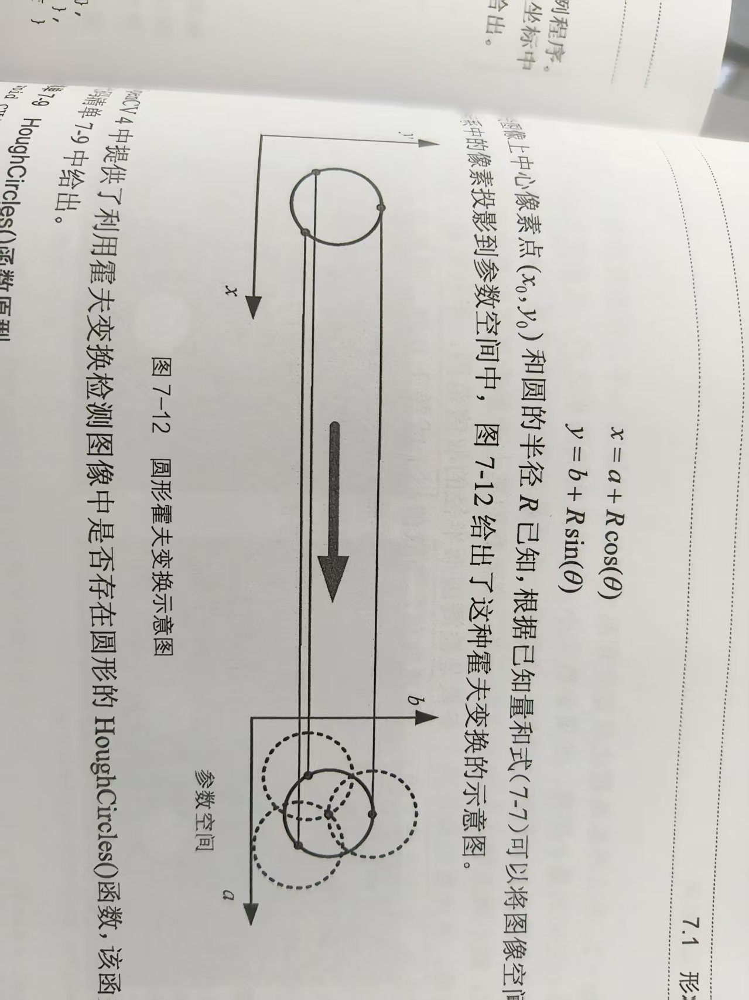

### 霍夫曼圆型检测

### 原理

原上的点在变换到到参数坐标系后，如果判断圆的原理



### 函数原型

```c++
void HoughCircles(InputArray image, 
                  OutputArray circles, 
                  int method, 
                  double dp, 
                  double minDist,
                  double param1=100, 
                  double param2=100,
                  int minRadius=0, 
                  int maxRadius=0);
```

### 参数解析

**image** - 输入图像

- 类型：8位单通道灰度图像
- 通常需要先进行模糊处理以减少噪声影响

**circles** - 输出检测到的圆

- 类型：`vector<Vec3f>` 或 `Mat`
- 每个圆表示为3元素浮点向量 (x, y, radius)，其中：
  - x, y: 圆心坐标
  - radius: 圆的半径

**method** - 检测方法

- 目前唯一可用的方法是 `HOUGH_GRADIENT` (基于梯度的方法)

**dp** - 累加器分辨率与图像分辨率的反比

- dp=1: 累加器与输入图像相同分辨率
- dp=2: 累加器分辨率为输入图像的一半
- 值越大，计算越快但精度越低

**minDist** - 检测到的圆之间的最小距离

- 小于此距离的圆会被合并
- 值过小会导致多个相邻圆被检测出来
- 值过大会漏掉一些圆

**param1** - 边缘检测的高阈值

- 用于Canny边缘检测的高阈值
- 低阈值自动设置为高阈值的一半

**param2** - 累加器阈值

- 值越小，检测到的圆越多(包括假圆)
- 值越大，检测到的圆越少(但更可靠)

**minRadius** - 待检测圆的最小半径

- 设为0表示不限制

**maxRadius** - 待检测圆的最大半径

- 设为0表示不限制

### 实例

```c++
#include <opencv2/opencv.hpp>
#include <iostream>

int main() {
    // 1. 读取图像（建议使用灰度图）
    cv::Mat src = cv::imread("1.png", cv::IMREAD_COLOR);
    if (src.empty()) {
        std::cerr << "图像读取失败！" << std::endl;
        return -1;
    }

    cv::Mat gray;
    cv::cvtColor(src, gray, cv::COLOR_BGR2GRAY);

    // 2. 高斯模糊（降低噪声）
    cv::GaussianBlur(gray, gray, cv::Size(9, 9), 2, 2);

    // 3. 霍夫圆检测
    std::vector<cv::Vec3f> circles;
    cv::HoughCircles(
            gray, circles,
            cv::HOUGH_GRADIENT, // 检测方法
            1,                  // dp：累加器分辨率与图像的比值
            10,      // minDist：两个圆心之间的最小距离
            100,                // param1：Canny边缘检测高阈值
            75,                 // param2：圆心累加器阈值（越小越灵敏，越大约精准）
            0, 0                // minRadius, maxRadius：可选，限制圆半径范围
    );

    // 4. 绘制圆
    for (size_t i = 0; i < circles.size(); i++) {
        cv::Vec3f c = circles[i];
        cv::Point center = cv::Point(cvRound(c[0]), cvRound(c[1]));
        int radius = cvRound(c[2]);
        cv::circle(src, center, radius, cv::Scalar(0, 255, 0), 2); // 圆边
        cv::circle(src, center, 2, cv::Scalar(0, 0, 255), 3);      // 圆心
    }

    // 5. 显示结果
    cv::imshow("Detected Circles", src);
    cv::waitKey(0);
    return 0;
}

```

