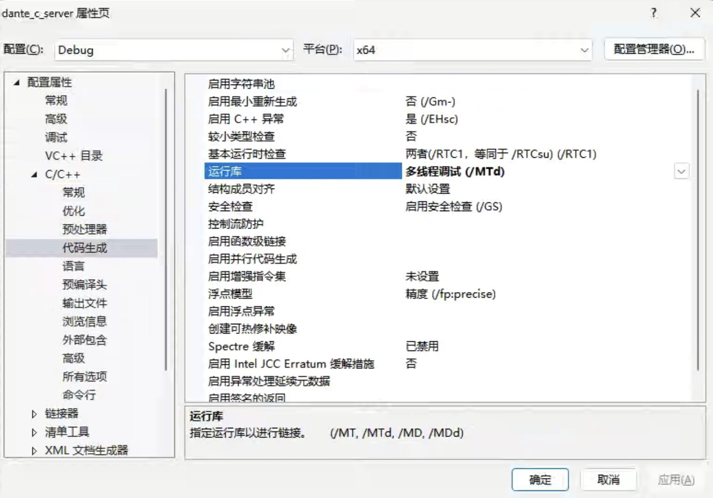

## VC中的多线程运行库

VC在编译时可以指定程序运行时使用哪种多线程运行库，VC中可以选择下面四种多线程运行库来链接

* 注意，vc中在调用不同的c库时，如果这些c库是使用不同的多线程运行库编译时，会导致程序无法编译(程序设置也应该设置为对应的对线程运行库)

| 选项   | 说明                                                         |      |      |      |      |
| ------ | ------------------------------------------------------------ | ---- | ---- | ---- | ---- |
| `/MD`  | **动态多线程**（Multi-threaded DLL）—— 使用 **Release 版本**的动态链接库（`MSVCRT.dll`） |      |      |      |      |
| `/MDd` | **动态多线程调试**（Multi-threaded Debug DLL）—— 使用 **Debug 版本**的动态链接库（`MSVCRTD.dll`） |      |      |      |      |
| `/MT`  | **静态多线程**（Multi-threaded）—— 使用 **Release 版本**的静态库（`libcmt.lib`） |      |      |      |      |
| `/MTd` | **静态多线程调试**（Multi-threaded Debug）—— 使用 **Debug 版本**的静态库（`libcmtd.lib`） |      |      |      |      |

