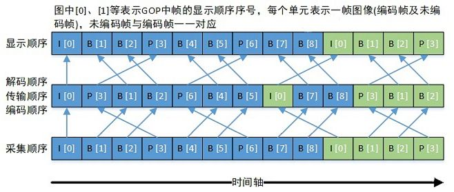

## ffmpeg中的时间单位

> AVRational

定义

```c++
typedef struct AVRational{
    int num; ///< Numerator
    int den; ///< Denominator
} AVRational;
```

代表时间基的结构单位，代表num/den秒


> AV_TIME_BASE

定义

```c++
#define AV_TIME_BASE            1000000
```

AV_TIME_BASE的意义为1000000us，相当于1秒


> AV_TIME_BASE_Q

定义

```c++
#define AV_TIME_BASE_Q          (AVRational){1, AV_TIME_BASE}
```

AV_TIME_BASE_Q代表秒数，1 AV_TIME_BASE_Q = 1/1000000 秒


## 时间基

时间基表示秒/单位刻度，即一个刻度是多少秒。

在时间中定义时间基相当于在长度中自定义一个长度单位(比如我定义一个时间基为25ms，则2个时间基长度为50ms，就如同我定义一个长度单位假设为zm且1zm = 6m，则2zm = 12m)。

封装格式不同、数据状态不同、时间基不同。

例如原始数据(YUV)的时间基time_base = AVRational{1，25}，压缩后的数据对应的时间基就可能是time_base = AVRational{1，90000}。

time_base=AVRational{1，25}，表示该刻度中1个时间基为40ms。

* ffmpeg不同层时间戳量级不一样。


> ffmpeg中的三种时间戳

tbn： 对应容器中的时间基。 值是AVStream.time_base的倒数

tbc： 对应编解码器中的时间基。 值是AVCodecContext.time_base的倒数

tbr： 从视频流中猜算得到，可能是帧率或场率(帧率的2倍)

* tbn与tbr可以使用ffprobe命令查看到

## 时间戳

DPS(Decoding Time Stamp, 解码时间戳)：表示压缩帧的解码时间。

PTS(Presentation Time Stamp, 显示时间戳)：表示将压缩帧解码后得到的原始帧的显示时间。


音频中DTS和PTS是相同的。视频中由于某些视频编码中的某种帧需要根据前后的帧来预测双向预测(比如h264有B帧)，因此含当解析或编码某个视频时使用这种类型编码格式的视频解码顺序与显示顺序不同，即DTS与PTS不同。当然，如果某种编码的视频不含这种类型的帧，其DTS和PTS是相同的。

DPS与TPS的例图：



**采集顺序**：指图像传感器采集原始信号得到图像帧的顺序。
**编码顺序**：指编码器编码后图像帧的顺序。存储到磁盘的本地视频文件中图像帧的顺序与编码顺序相同。
**传输顺序**：指编码后的流在网络中传输过程中图像帧的顺序。
**解码顺序**：指解码器解码图像帧的顺序。
**显示顺序**：指图像帧在显示器上显示的顺序。

* 采集顺序与显示顺序相同。编码顺序、传输顺序和解码顺序相同。