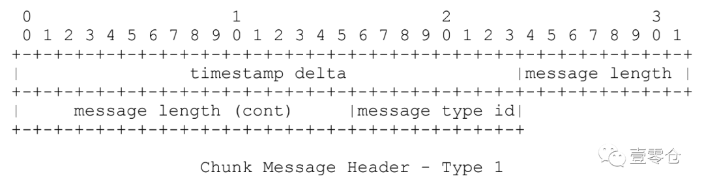

[toc]

## RTMP

RTMP（Real Time Messaging Protocol） 是由 Adobe 公司基于 Flash Player 播放器对应的音视频 flv 封装格式提出的一种，基于TCP 的数据传输协议。本身具有稳定、兼容性强、高穿透的特点。常被应用于流媒体直播、点播等场景。常用于推推流方（主播）的稳定传输需求。


## RTMP消息块

RTMP 协议为了维持稳定连续传递，避免单次传输数据量问题，采用了传输层封包，数据流切片的实现形式。被用来对当前带宽进行划分和复用的最小传输单位，被称为 Chunk 即消息块。


一个有效的消息，如果数据量超出当前 Chunk Size 的话，则会被拆分成多个分块来分批传输。通过指定首个 Chunk 和后续 Chunk 类型，以及 Chunk Header 其他标志性数据，来使当前被切割的消息，能够在对端得到有效的还原和执行。


## RTMP消息块的组成

### 结构

```
| basic Header | Message Header | Extended Timestamp | Chunk Data |
```


#### 基础数据头（Basic Header）

包含了要发送的实际信息（可能是完整的，也可能是一部分）的描述信息。Message Header的格式和长度取决于Basic Header的chunk type（fmt）取值，共有4种不同的格式，由上fmt字段控制。


`结构`

```
| format message type | chunk stream id |
```

##### stream id

Chunk stream ID 可以配置为3～65599 这 65597 个不同标志中的其中一种。根据持有 Chunk stream ID 的长度，RTMP 规格将基础数据头分为3种：ID 在 2～63 范围内的 1-Byte 版；ID 在 64～319 范围内的 2-Byte 版；ID 在 64～65599 范围内的 3-Byte 版。

```
// id 2~63
|  fmt  | cs id | 
|  2bit | 6bit  |

// id 64~319
|  fmt  |  0   | cs id |
|  2bit | 6bit | 8bit  |

//id 64~65599
|  fmt  |  1   | cs id |
|  2bit | 6bit | 16bit  |
```

cs id 字段（6-bits）：用来表示 63 以内的ID的标志位，0、1两个标记被占用做扩展标记

cs id 字段（8 or 16-bits）：用来根据扩展标志扩充的，广范围标志位


##### format message type

用来标志消息类型，也被称为 Chunk Type，其决定了后续的message type格式与长度

`取值表`

| 取值  | 意义                                                         |
| ----- | ------------------------------------------------------------ |
| fmt=0 | Message Header占用11个字节，类型0必须用在块流的开头位置，或者每次当块流的时间戳后退的时候（例如向后拖动的操作） |
| fmt=1 | Message Header占用7个字节，省去了表示msg stream id的4个字节，表示此chunk和上一次发的chunk所在的流相同，如果在发送端只和对端有一个流链接的时候可以尽量去采取这种格式 |
| fmt=2 | Message Header占用3个字节，相对于type＝1格式又省去了表示消息长度的3个字节和表示消息类型的1个字节，表示此chunk和上一次发送的chunk所在的流、消息的长度和消息的类型都相同 |
| fmt=3 | 表示这个chunk的Message Header和上一个是完全相同的，不存在消息头，当它跟在Type＝0的chunk后面时，表示和前一个chunk的时间戳都是相同的，就是一个Message拆分成了多个chunk，这个chunk和上一个chunk同属于一个Message； |

`消息格式示例`

* 下列消息中，cont表示字段连续

* fmt=0示例


* fmt=1示例



* fmt=2示例


#### 消息数据头（Message Header）

包含被发送消息的相关信息，类型Chunk Type决定，其完整长度如下：


##### timestamp 

消息时间戳（3Byte），标记当前消息绝对时间戳，有效位 24 bits，如果超出16777215（0xFFFFFF）则启用扩展时间戳（Extended Timestamp）。扩展位启用时，timestamp 位恒定为 16777215，通过还原 32 bits 的扩展位，加合为有效时间戳数据。时间戳在运用上对于不同消息类型会有区分，fmt=0 时为绝对时间戳，fmt=1或fmt=2 时为相对时间戳（时间差值）。

##### msg length

消息头长度（3Byte），携带 Chunk Header 数据长度信息

##### msg type

消息类型（1Byte），携带消息类型信息，这是实际消息的类型，区别于消息头。

`取值如下`


##### message stream id 

消息归属消息流 ID 标志位（4Byte），标识消息所使用的流


#### 扩展时间戳（Extended Timestamp）

32-bits，消息头携带的时间戳扩展位，配合 Message Header 中事件戳使用


#### CSID与message stream id 的区别

##### CSID

Chunk stream ID 是用来区分消息信道的。因为 RTMP 协议，所有的通信都是通过同一个 TCP 来完成的，因此所有类型的通信信道需要由 Chunk stream ID 来进行区分，从而判断当前收到的消息所属的信道类型。

* 官方约束(不一定会严格遵循官方约束)

| CSID | 意义       |
| ---- | ---------- |
| 0x02 | 控制流通道 |
| 0x03 | 命令信道   |
| 0x05 | 数据流通道 |
| 0x06 | 视频信道   |
| 0x07 | 音频信道   |

##### ms id

ms id唯一标识一个消息

##### 区别

一个消息可以被分割成多个块（chunks）进行传输。他们使用同一个message stream id 。并且这些chunks使用同一个CSID往某一个信道或通道发送。