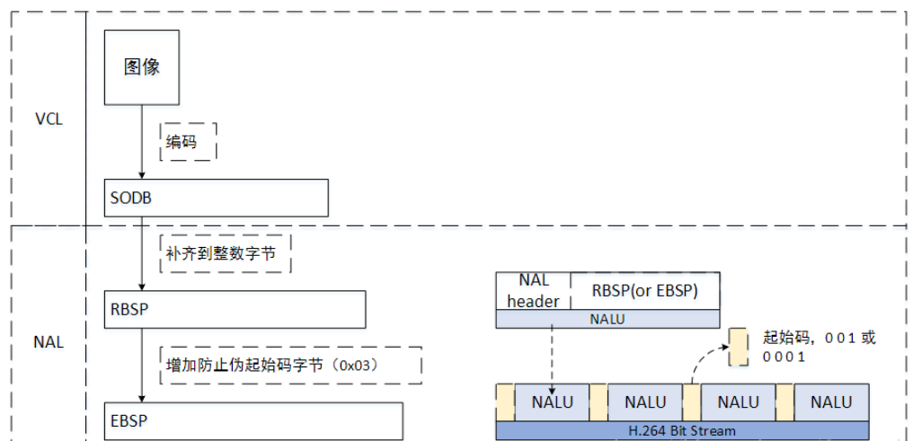

## I,P,B,IDR

I帧/IDR帧数：关键帧，采用帧内压缩技术。
P帧：向前参考帧，在压缩时，只参考前面已经处理的帧。采用帧音压缩技术。
B帧：双向参考帧，在压缩时，它即参考前而的帧，又参考它后面的帧。采用帧间压缩技术。

> IDR帧和I帧的区别

1. I帧和IDR帧都是使用帧内预测的。它们都是同一个东西, 在编码和解码中为了方便，要把首个I帧和其他I帧区别开，所以首个I帧叫IDR，以方便控制编码和解码流程，一个视频从一个IDR帧开始。

2. IDR帧的作用是立刻刷新, 使错误不致传播。从IDR帧开始, 重新算一个新的序列开始编码。而I帧不具有随机访问的能力，这个功能是由IDR承担。IDR帧会导致DPB (DecodedPictureBuffer 参考帧列表——这是关键所在）清空，而I不会。

3. 对于IDR帧来说，在IDR帧之后的所有帧都不能引用任何IDR帧之前的帧的内容。与此相反，对于普通的I-帧来说，位于其之后的B-和P-帧可以引用位于普通I-帧之前的I-帧。

4. IDR帧表示一个新的序列的开始，而且该序列不可参考之前的序列。

> I P B的压缩率对比

压缩率从大到小 B > P > I

> B帧数的数量对视频的影响

B帧的压缩率最大，当B帧增多时，编解码效率变低，码率变小，同时由于B帧为前后参考帧，所以适当的增加B帧能够提升运动场景清晰度。

B帧在控制码率的场景使用比较多。

## 图像序列

GOP(图像序列):两个I帧之间是一个图像序列；一个图像序列中只有一个I帧。
一般来说，编码器编出来的首帧数据是PPS，然后是SPS,接下来是I帧，P帧、B帧等；

在h.264传输过程中，一个序列 == 一个SPS的NALU + 1个PPS的NALU + 包含一个IDR帧的NALU + 若干P/B/I帧序列。

> SPS和PPS

SPS和PPS，包含了初始化H.264解码器所需要的重要信息参数，一旦丢失，视频将会难以被解析出。

> GOP长度对视频的影响

GOP在一定程度上会影响视频画面质量，因为许多情况下，码率或帧率是要求限定的，这种情况下的GOP增大，减小都可能会导致画质的增减或视频的卡顿。

## h.264的传输分层

H.264的传输中分两层：
VCL(Video Codeing Layer)：视频编码层，负责的是视频内容的处理，重点在编解码算法；

NAL(Network Abstraction Layer)：网络抽象层，负责将编码后的数据以网络要求的格式进行打包和传输；



## h264编码过程中的三种数据格式

> SODB(String of Data Bits)数据比特串

最原始的编码数据比特流，即VCL数据，长度不一定是8的倍数，所以需要补齐

> RBSP(Raw Byte Sequence Payload)原始字节序列载荷

在SODB数据后面加了结尾比特(rbsp_trailing_bits)，一个bit的"1"，若干比特的"0",目的是为了字节对齐；
RBSP = SODB + rbsp_trailing_bits

>EBSP(Encapsulated Byte Sequence Packets)扩展字节序列载荷

在 RBSP 数据的基础上添加了防止竞争的一个字节“0x03”；

`EBSP存在的原因`

H264中NALU的起始码为0x000001或0x00000001，同时H264规定，当检测到0x000000时也可以表示当前NALU的结束，
但是如果在NALU的内部出现了0x000001或0x00000001时该怎么办？
所以H264就提出了“防止竞争”这样一种机制，当编码器编完一个NALU时，
应该检测NALU内部是否出现了如下左侧的数据，如果检测到它们的存在，
编码器就在最后一个字节前，插入一个新字节“0x03”：
0x000000 --> 0x00000300
0x000001 --> 0x00000301
0x000002 --> 0x00000302
0x000003 --> 0x00000303


* NALU的头是0x000001或0x00000001，都按上面的方式处理，对于0x000001就是在第2个字节后插入0x03，对于0x00000001就是在第3个字节后插入0x03。当解码器解码时，将0x03去掉即可，也称为脱壳操作。
* EBSP = RBSP + “0x03”

## h.264传输过程

H.264的基本流（elementary stream）就是一系列NALU的集合

一个h264流由一系列的图像序列组成，而一个图像序列为一个特定内容与顺序的NALU集合组成

## NALU组成

> NALU的起始码

> NAL头

NAL头由一个字节组成，语法如下：

```
±---------------+
|0|1|2|3|4|5|6|7|
±±±±±±±±±±±±±±±±±
|F|NRI|   Type  |
±---------------+
```

* F: 1 个比特.forbidden_zero_bit. 在 H.264 规范中规定了这一位必须为 0.

* NRI: 2 个比特.nal_ref_idc. 取 00 ~ 11, 似乎指示这个 NALU 的重要性, 如00的NALU解码器可以丢弃它而不影响图像的回放,取值越大，表示当前NAL越重要，需要优先受到保护。如果当前NAL是属于参考帧的片，或是序列参数集，或是图像参数集这些重要的单位时，本句法元素必需大于0。

* Type: 5 个比特.nal_unit_type. 这个 NALU 单元的类型. 简述如下:

```
	0    没有定义
	1     一个非IDR图像的编码条带 （bp帧）   
	2     编码条带数据分割块A 
	3     编码条带数据分割块B     
	4     编码条带数据分割块C   
	5     IDR图像的编码条带 (i帧)    
	6     辅助增强信息 (SEI) 
	7     序列参数集 （sps帧）
	8     图像参数集 
	9     访问单元分隔符 
	10     序列结尾 
	11     流结尾 
	12     填充数据 
	13     序列参数集扩展    
	14...18     保留      
	19     未分割的辅助编码图像的编码条带    
	20...23     保留      
	24    STAP-A   单一时间的组合包
	25    STAP-B   单一时间的组合包
	26    MTAP16   多个时间的组合包
	27    MTAP24   多个时间的组合包
	28    FU-A     分片的单元
	29    FU-B     分片的单元
	30-31 没有定义
```

> NALU载体

即视频数据