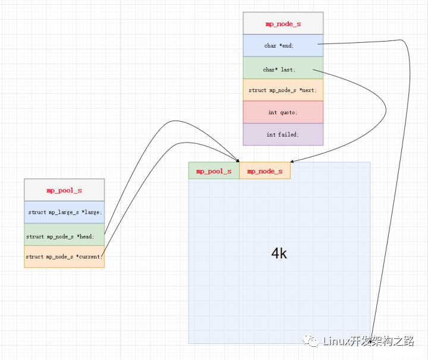
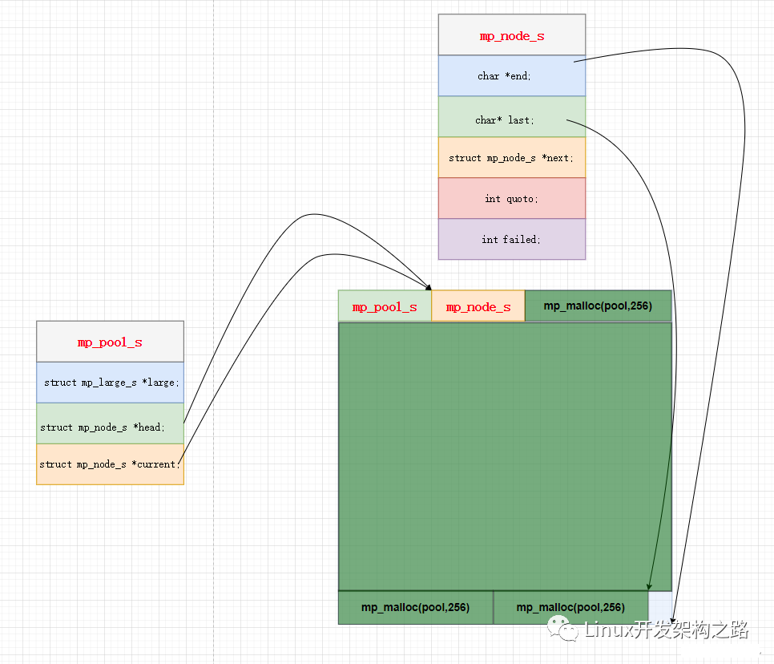
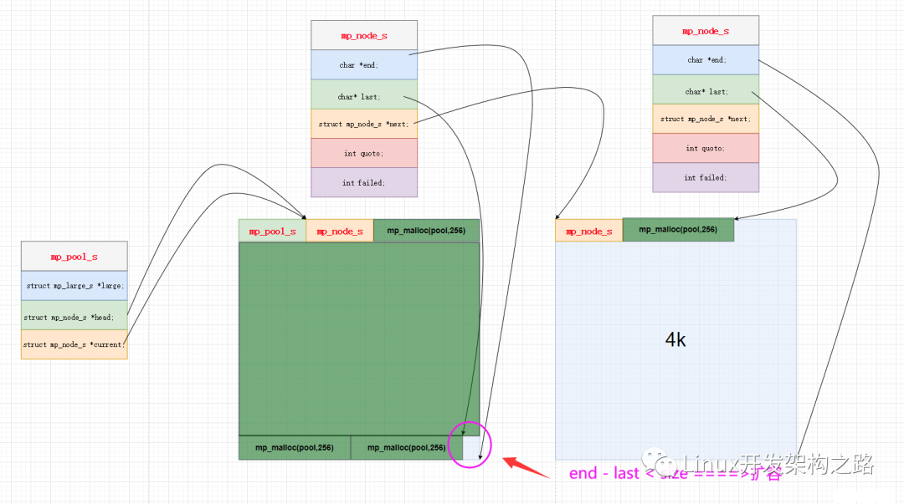
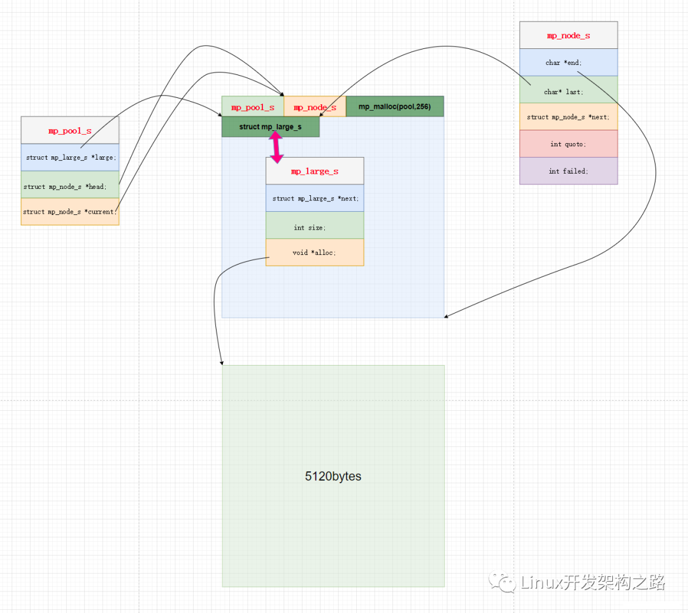

[toc]

## 图解

### 初始化状态



### 分配了部分内存



### 扩容



### 大块内存分配与管理



## 代码


```c++
//
// Created by 68725 on 2022/7/26.
//
#include <stdlib.h>
#include <stdio.h>
#include <string.h>

#define PAGE_SIZE 4096
#define MP_ALIGNMENT 16 //设置内存空间16字节对齐
#define mp_align(n, alignment) (((n)+(alignment-1)) & ~(alignment-1))
#define mp_align_ptr(p, alignment) (void *)((((size_t)p)+(alignment-1)) & ~(alignment-1))

//每4k一block结点
struct mp_node_s {
    unsigned char *end;//块的结尾
    unsigned char *last;//使用到哪了
    struct mp_node_s *next;//链表
    int quote;//引用计数
    int failed;//失效次数
};

struct mp_large_s {
    struct mp_large_s *next;//链表
    int size;//alloc的大小
    void *alloc;//大块内存的起始地址
};

struct mp_pool_s {
    struct mp_large_s *large;
    struct mp_node_s *head;
    struct mp_node_s *current;
};

struct mp_pool_s *mp_create_pool(size_t size);

void mp_destroy_pool(struct mp_pool_s *pool);

void *mp_malloc(struct mp_pool_s *pool, size_t size);

void *mp_calloc(struct mp_pool_s *pool, size_t size);

void mp_free(struct mp_pool_s *pool, void *p);

void mp_reset_pool(struct mp_pool_s *pool);

void monitor_mp_poll(struct mp_pool_s *pool, char *tk);


void mp_reset_pool(struct mp_pool_s *pool) {
    struct mp_node_s *cur;
    struct mp_large_s *large;

    for (large = pool->large; large; large = large->next) {
        if (large->alloc) {
            free(large->alloc);
        }
    }

    pool->large = NULL;
    pool->current = pool->head;
    for (cur = pool->head; cur; cur = cur->next) {
        cur->last = (unsigned char *) cur + sizeof(struct mp_node_s);
        cur->failed = 0;
        cur->quote = 0;
    }
}

//创建内存池
struct mp_pool_s *mp_create_pool(size_t size) {
    struct mp_pool_s *pool;
    if (size < PAGE_SIZE || size % PAGE_SIZE != 0) {
        size = PAGE_SIZE;
    }
    //分配4k以上不用malloc，用posix_memalign
    /*
        int posix_memalign (void **memptr, size_t alignment, size_t size);
     */

    int ret = posix_memalign((void **) &pool, MP_ALIGNMENT, size); //4K + mp_pool_s
    if (ret) {
        return NULL;
    }
    pool->large = NULL;
    pool->current = pool->head = (unsigned char *) pool + sizeof(struct mp_pool_s);
    pool->head->last = (unsigned char *) pool + sizeof(struct mp_pool_s) + sizeof(struct mp_node_s);
    pool->head->end = (unsigned char *) pool + PAGE_SIZE;
    pool->head->failed = 0;

    return pool;
}

//销毁内存池
void mp_destroy_pool(struct mp_pool_s *pool) {
    struct mp_large_s *large;
    for (large = pool->large; large; large = large->next) {
        if (large->alloc) {
            free(large->alloc);
        }
    }

    struct mp_node_s *cur, *next;
    cur = pool->head->next;

    while (cur) {
        next = cur->next;
        free(cur);
        cur = next;
    }
    free(pool);
}

//size>4k
void *mp_malloc_large(struct mp_pool_s *pool, size_t size) {
    unsigned char *big_addr;
    int ret = posix_memalign((void **) &big_addr, MP_ALIGNMENT, size); //size
    if (ret) {
        return NULL;
    }

    struct mp_large_s *large;
    //released struct large resume
    int n = 0;
    for (large = pool->large; large; large = large->next) {
        if (large->alloc == NULL) {
            large->size = size;
            large->alloc = big_addr;
            return big_addr;
        }
        if (n++ > 3) {
            break;// 为了避免过多的遍历，限制次数
        }
    }
    large = mp_malloc(pool, sizeof(struct mp_large_s));
    if (large == NULL) {
        free(big_addr);
        return NULL;
    }
    large->size = size;
    large->alloc = big_addr;
    large->next = pool->large;
    pool->large = large;
    return big_addr;
}

//new block 4k
void *mp_malloc_block(struct mp_pool_s *pool, size_t size) {
    unsigned char *block;
    int ret = posix_memalign((void **) &block, MP_ALIGNMENT, PAGE_SIZE); //4K
    if (ret) {
        return NULL;
    }
    struct mp_node_s *new_node = (struct mp_node_s *) block;
    new_node->end = block + PAGE_SIZE;
    new_node->next = NULL;

    unsigned char *ret_addr = mp_align_ptr(block + sizeof(struct mp_node_s), MP_ALIGNMENT);

    new_node->last = ret_addr + size;
    new_node->quote++;

    struct mp_node_s *current = pool->current;
    struct mp_node_s *cur = NULL;

    for (cur = current; cur->next; cur = cur->next) {
        if (cur->failed++ > 4) {
            current = cur->next;
        }
    }
    //now cur = last node
    cur->next = new_node;
    pool->current = current;
    return ret_addr;
}

//分配内存
void *mp_malloc(struct mp_pool_s *pool, size_t size) {
    if (size <= 0) {
        return NULL;
    }
    if (size > PAGE_SIZE - sizeof(struct mp_node_s)) {
        //large
        return mp_malloc_large(pool, size);
    }
    else {
        //small
        unsigned char *mem_addr = NULL;
        struct mp_node_s *cur = NULL;
        cur = pool->current;
        while (cur) {
            mem_addr = mp_align_ptr(cur->last, MP_ALIGNMENT);
            if (cur->end - mem_addr >= size) {
                cur->quote++;//引用+1
                cur->last = mem_addr + size;
                return mem_addr;
            }
            else {
                cur = cur->next;
            }
        }
        return mp_malloc_block(pool, size);// open new space
    }
}

void *mp_calloc(struct mp_pool_s *pool, size_t size) {
    void *mem_addr = mp_malloc(pool, size);
    if (mem_addr) {
        memset(mem_addr, 0, size);
    }
    return mem_addr;
}

//释放内存
void mp_free(struct mp_pool_s *pool, void *p) {
    struct mp_large_s *large;
    for (large = pool->large; large; large = large->next) {//大块
        if (p == large->alloc) {
            free(large->alloc);
            large->size = 0;
            large->alloc = NULL;
            return;
        }
    }
    //小块 引用-1
    struct mp_node_s *cur = NULL;
    for (cur = pool->head; cur; cur = cur->next) {
//        printf("cur:%p   p:%p   end:%p\n", (unsigned char *) cur, (unsigned char *) p, (unsigned char *) cur->end);
        if ((unsigned char *) cur <= (unsigned char *) p && (unsigned char *) p <= (unsigned char *) cur->end) {
            cur->quote--;
            if (cur->quote == 0) {
                if (cur == pool->head) {
                    pool->head->last = (unsigned char *) pool + sizeof(struct mp_pool_s) + sizeof(struct mp_node_s);
                }
                else {
                    cur->last = (unsigned char *) cur + sizeof(struct mp_node_s);
                }
                cur->failed = 0;
                pool->current = pool->head;
            }
            return;
        }
    }
}

void monitor_mp_poll(struct mp_pool_s *pool, char *tk) {
    printf("\r\n\r\n------start monitor poll------%s\r\n\r\n", tk);
    struct mp_node_s *head = NULL;
    int i = 0;
    for (head = pool->head; head; head = head->next) {
        i++;
        if (pool->current == head) {
            printf("current==>第%d块\n", i);
        }
        if (i == 1) {
            printf("第%02d块small block  已使用:%4ld  剩余空间:%4ld  引用:%4d  failed:%4d\n", i,
                   (unsigned char *) head->last - (unsigned char *) pool,
                   head->end - head->last, head->quote, head->failed);
        }
        else {
            printf("第%02d块small block  已使用:%4ld  剩余空间:%4ld  引用:%4d  failed:%4d\n", i,
                   (unsigned char *) head->last - (unsigned char *) head,
                   head->end - head->last, head->quote, head->failed);
        }
    }
    struct mp_large_s *large;
    i = 0;
    for (large = pool->large; large; large = large->next) {
        i++;
        if (large->alloc != NULL) {
            printf("第%d块large block  size=%d\n", i, large->size);
        }
    }
    printf("\r\n\r\n------stop monitor poll------\r\n\r\n");
}


int main() {
    struct mp_pool_s *p = mp_create_pool(PAGE_SIZE);
    monitor_mp_poll(p, "create memory pool");
#if 0
    printf("mp_align(5, %d): %d, mp_align(17, %d): %d\n", MP_ALIGNMENT, mp_align(5, MP_ALIGNMENT), MP_ALIGNMENT,
           mp_align(17, MP_ALIGNMENT));
    printf("mp_align_ptr(p->current, %d): %p, p->current: %p\n", MP_ALIGNMENT, mp_align_ptr(p->current, MP_ALIGNMENT),
           p->current);
#endif
    void *mp[30];
    int i;
    for (i = 0; i < 30; i++) {
        mp[i] = mp_malloc(p, 512);
    }
    monitor_mp_poll(p, "申请512字节30个");

    for (i = 0; i < 30; i++) {
        mp_free(p, mp[i]);
    }
    monitor_mp_poll(p, "销毁512字节30个");

    int j;
    for (i = 0; i < 50; i++) {
        char *pp = mp_calloc(p, 32);
        for (j = 0; j < 32; j++) {
            if (pp[j]) {
                printf("calloc wrong\n");
                exit(-1);
            }
        }
    }
    monitor_mp_poll(p, "申请32字节50个");

    for (i = 0; i < 50; i++) {
        char *pp = mp_malloc(p, 3);
    }
    monitor_mp_poll(p, "申请3字节50个");


    void *pp[10];
    for (i = 0; i < 10; i++) {
        pp[i] = mp_malloc(p, 5120);
    }
    monitor_mp_poll(p, "申请大内存5120字节10个");

    for (i = 0; i < 10; i++) {
        mp_free(p, pp[i]);
    }
    monitor_mp_poll(p, "销毁大内存5120字节10个");

    mp_reset_pool(p);
    monitor_mp_poll(p, "reset pool");

    for (i = 0; i < 100; i++) {
        void *s = mp_malloc(p, 256);
    }
    monitor_mp_poll(p, "申请256字节100个");

    mp_destroy_pool(p);
    return 0;
}
```

