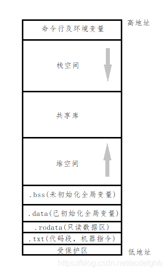

## 结构



* 数据(初始化的数据)段（data segment ）：通常是指用来存放程序中已初始化的全局变量的

  一块内存区域。数据段属于静态内存分配。data段中的静态数据区存放的是程序中已初始化的全局变

  量、静态变量和常量。

* BSS 段（bss segment ）：通常是指用来存放程序中未初始化的全局变量的一块内存区域。BSS 是英文Block Started by Symbol 的简称。BSS 段属于静态内存分配，  即程序一开始就将其清零了。一般在初始化时BSS段部分将会清零。后续给这些变量复制不会让其转移到数据段。

* 代码(文本)段（code segment/text segment ）：通常是指用来存放程序执行代码的一块内存区域。 这部分区域的大小在程序运行前就已经确定，并且内存区域通常属于只读, 某些架构也允许代码段为可写，即允许修改程序在代码段中，也有可能包含一些只读的常数变量，例如字符串常量等。 

* rodata段： 只读数据段，通常存放const修饰的值。

## const变量存放位置

### 文件作用域的 `const` 变量（全局 `const` 变量）

**(1) 默认情况下：存放在 `.rodata` 只读数据段**

```
#include <stdio.h>

const int global_const_var = 100; // 存放在 .rodata 段

int main() {
    printf("%d\n", global_const_var);
    return 0;
}
```

- `global_const_var` 具有 **文件作用域**，是 **只读的全局变量**，通常被存放在 `.rodata` 段（只读数据段）。
- `.rodata` 段是只读的，不能修改该变量的值，否则会导致**段错误（Segmentation Fault）**。

------

#### **(2) 如果 `const` 变量没有 `extern`，它的作用域是 `static`**

```
const int global_const_static_var = 200; // 作用域仅限本文件
```

- 编译器可能会将其优化为 **内联**，使得它不占用存储，而是直接在代码中替换它的值。

------

#### **(3) 如果 `const` 变量带有 `extern`，存储在 `.data` 或 `.bss`**

```
extern const int external_const_var; // 可能存放在 .data 段（非只读）
```

- 如果 `const` 变量在另一个文件中被 `extern` 声明，编译器不会强制它必须是只读的，可能存放在 **.data 段**。

------

### **2. 局部作用域的 `const` 变量**

#### **(1) `const` 局部变量（自动存储）**

```
void func() {
    const int local_const_var = 300; // 存放在栈上
}
```

- `local_const_var` 是**局部变量**，存放在 **栈（stack）**，在函数调用结束后销毁。
- `const` 仅仅意味着它的值不能修改，并不改变它的存储位置。

------

#### **(2) `const` 修饰的局部 `static` 变量**

```
c复制编辑void func() {
    static const int static_const_var = 400; // 存放在 .rodata 段 或 .data 段
}
```

- `static` 变量的存储周期是 **整个程序运行期间**，不会随函数调用结束而销毁。
- `static const` 变量通常存放在 **.rodata 段**，如果没有被优化掉。