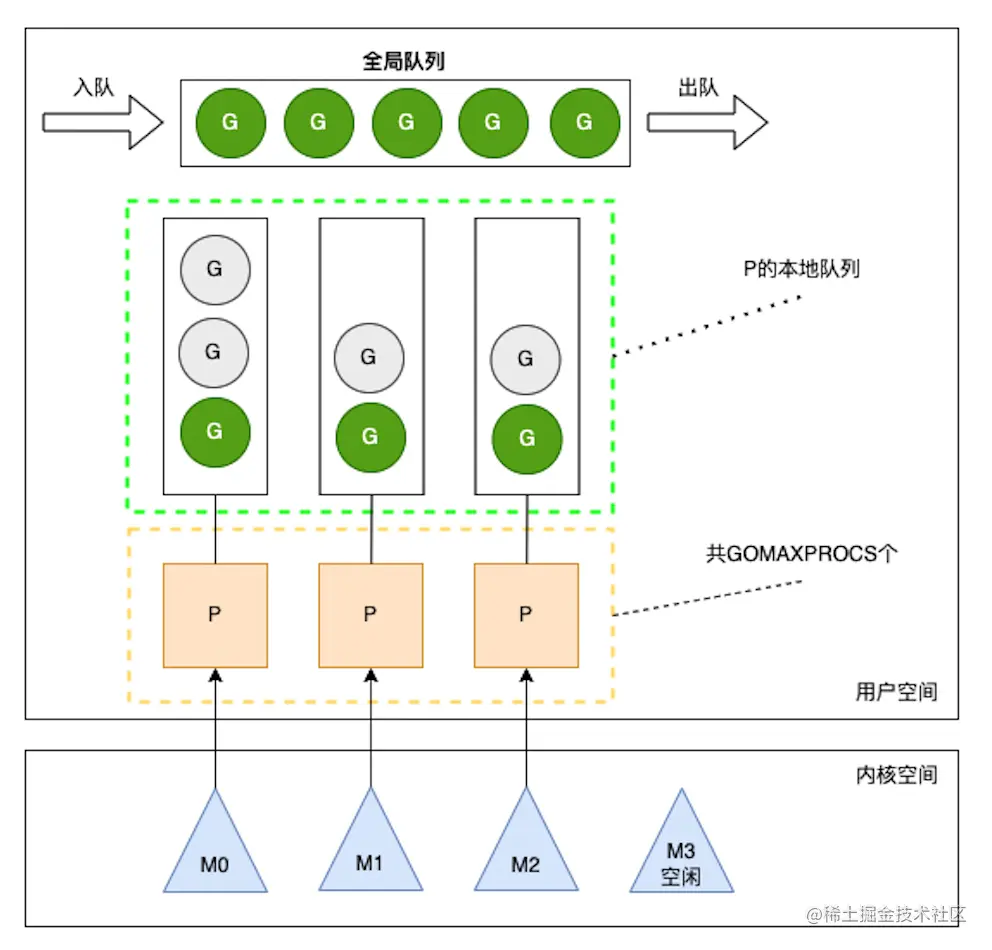

[toc]

##  GO程序运行结构

GO程序运行为GPM模型

### G

GO的协程，包含程序逻辑代码

### P

执行G的调度器，每一个P都有一个G队列。默认情况下P的个数等于计算机CPU核心个数

* 最多有GOMAXPROCS个，可通过runtime.GOMAXPROCS(N)修改
* P的本地队列：和全局队列类似，存放的也是等待运行的G，存放数量上限256个。新建G时，`G优先加入到P的本地队列，如果队列满了，则会把本地队列中的一半G移动到全局队列`

#### 核心策略

 调度器核心思想是尽可能避免频繁的创建、销毁线程，对线程进行复用以提高效率。

`work stealing机制`

当本线程绑定的P无G可运行时，该P将从其他线程绑定的P窃取G，而不是直接销毁线程。

`hand off机制`

当本线程M1因为G进行的系统调用阻塞时，线程释放绑定的P，把P转移给其他空闲的M0执行。

`抢占`

一个goroutine最多占用CPU **10ms**，防止其他goroutine等待太久得不到执行被“饿死”。

### M

实际计算机中的内核线程，比如C语言中用thread_create创建的实际线程。

### 结构

## 早期GM模型

G-M模型使得起初的Go并发性能并不十分亮眼，协程和系统线程的调度比较粗暴，导致很多性能问题，如全局资源锁、M的内存过高等造成许多性能损耗。