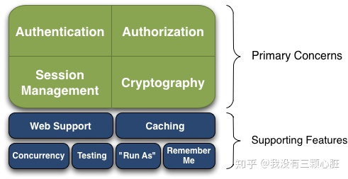
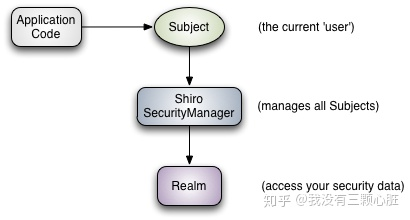
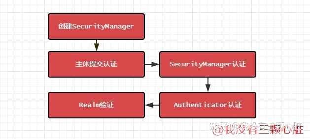

## Shiro

Apache Shiro 是一个强大灵活的开源安全框架，可以完全处理身份验证、授权、加密和会话管理。

Shiro 具有以下几个特点：

- **易于使用**——易用性是项目的最终目标。应用程序安全非常令人困惑和沮丧,被认为是“不可避免的灾难”。如果你让它简化到新手都可以使用它,它就将不再是一种痛苦了。
- **全面**——没有其他安全框架的宽度范围可以同Apache Shiro一样,它可以成为你的“一站式”为您的安全需求提供保障。
- **灵活**——Apache Shiro可以在任何应用程序环境中工作。虽然在网络工作、EJB和IoC环境中可能并不需要它。但Shiro的授权也没有任何规范,甚至没有许多依赖关系。
- **Web支持**——Apache Shiro拥有令人兴奋的web应用程序支持,允许您基于应用程序的url创建灵活的安全策略和网络协议(例如REST),同时还提供一组JSP库控制页面输出。
- **低耦合**——Shiro干净的API和设计模式使它容易与许多其他框架和应用程序集成。你会看到Shiro无缝地集成Spring这样的框架, 以及Grails, Wicket, Tapestry, Mule, Apache Camel, Vaadin…等。
- **被广泛支持**——Apache Shiro是Apache软件基金会的一部分。项目开发和用户组都有友好的网民愿意帮助。这样的商业公司如果需要Katasoft还提供专业的支持和服务。

## 结构

`结构图`

Authentication（认证）, Authorization（授权）, Session Management（会话管理）, Cryptography（加密）为Shiro框架四大基石。

- **Authentication（认证）：**用户身份识别，通常被称为用户“登录”
- **Authorization（授权）：**访问控制。比如某个用户是否具有某个操作的使用权限。
- **Session Management（会话管理）：**特定于用户的会话管理,甚至在非web 或 EJB 应用程序。
- **Cryptography（加密）：**在对数据源使用加密算法加密的同时，保证易于使用。

还有其他的功能来支持和加强这些不同应用环境下安全领域的关注点。特别是对以下的功能支持：

- **Web支持：**Shiro的Web支持API有助于保护Web应用程序。
- **缓存：**缓存是Apache Shiro API中的第一级，以确保安全操作保持快速和高效。
- **并发性：**Apache Shiro支持具有并发功能的多线程应用程序。
- **测试：**存在测试支持，可帮助您编写单元测试和集成测试，并确保代码按预期得到保障。
- **“运行方式”：**允许用户承担另一个用户的身份(如果允许)的功能，有时在管理方案中很有用。
- **“记住我”：**记住用户在会话中的身份，所以用户只需要强制登录即可。

`主要理念`

- **Subject：**当前用户，Subject 可以是一个人，但也可以是第三方服务、守护进程帐户、时钟守护任务或者其它–当前和软件交互的任何事件。
- **SecurityManager：**管理所有Subject，SecurityManager 是 Shiro 架构的核心，配合内部安全组件共同组成安全伞。
- **Realms：**用于进行权限信息的验证，我们自己实现。Realm 本质上是一个特定的安全 DAO：它封装与数据源连接的细节，得到Shiro 所需的相关的数据。在配置 Shiro 的时候，你必须指定至少一个Realm 来实现认证（authentication）和/或授权（authorization）。

我们需要实现Realms的Authentication 和 Authorization。其中 Authentication 是用来验证用户身份，Authorization 是授权访问控制，用于对用户进行的操作授权，证明该用户是否允许进行当前操作，如访问某个链接，某个资源文件等。

`认证过程`

