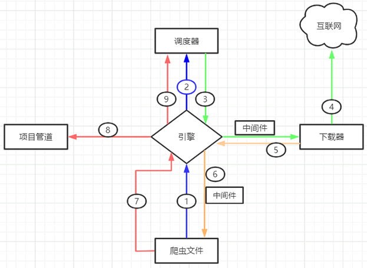

## scrapy框架

scrapy框架是一个纯python的爬虫框架，其让用户不关心http请求的过程，而只用进行http请求的设置与结果相应。

##  五大组建

| 名称               | 作用说明                                                     |
| ------------------ | ------------------------------------------------------------ |
| Engine(引擎)       | 整个 Scrapy 框架的核心，主要负责数据和信号在不同模块间传递。 |
| Scheduler(调度器)  | 用来维护引擎发送过来的 request 请求队列。                    |
| Downloader(下载器) | 接收引擎发送过来的 request 请求，并生成请求的响应对象，将响应结果返回给引擎。 |
| Spider(爬虫程序)   | 处理引擎发送过来的 response， 主要用来解析、提取数据和获取需要跟进的二级URL，然后将这些数据交回给引擎。 |
| Pipeline(项目管道) | 用实现数据存储，对引擎发送过来的数据进一步处理，比如存 MySQL 数据库等。 |

## 结构

## 过程

上述示意图描述如下，当一个爬虫项目启动后，Scrapy 框架会进行以下工作：

- 第一步：由“引擎”向爬虫文件索要第一个待爬取的url，并将其交给调度器加入url请求队列当中（对应图中1/2步骤）。 
- 第二步：调度器处理完请求后， 将第一个 URL 出队列返回给引擎；引擎经由下载器中间件将该 URL 交给下载器去下载 response 对象（对应3/4步骤）。
- 第三步：下载器得到响应对象后，将响应结果交给引擎，引擎收到后，经由蜘蛛中间件将响应结果交给爬虫文件（对应5/6步骤）。
- 第四步：爬虫文件对响应结果进行处理、分析，并提取出所需要的数据或是yield返回多个新的url请求到队列。
- 第五步：最后，提取的数据会交给管道文件去存数据库，同时将需要继续跟进的二级页面url交给调度器去进行url请求并入请求队列（对应7/8/9步骤）。

上述过程会一直循环，当url请求队列为空时才会停止。在爬虫文件中用yield返回request都相当于加入一个新的url请求到url请求队列