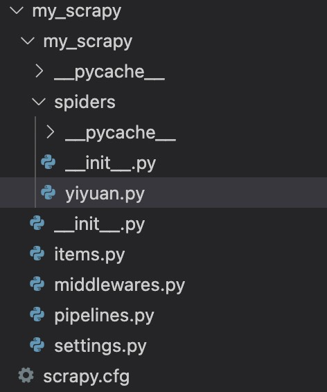

## 项目结构

* scrapy创建项目时，会根据传入的项目名，创建一里一外两个同名的目录，其中里面的那个目录为存放项目文件的真目录

> spiders目录

该目录下主要用于存放用户编写的爬虫逻辑文件，如图中的yiyuan,py

> items.py文件

该文件用于定义用户在爬取数据过程中的数据的结构，以便于后续的存储

> pipelines.py文件

该文件类型在scrapy中被称为管道，用于接受用户定义的item结构数据并且进行相关存储

> Middleware.py文件

用于定义爬取过程中的中间件，包括下载中间件与一开始的请求中间件，用于装饰或代理一些下载与请求时的过程。

> settings.py文件

scrapy项目的配置文件。