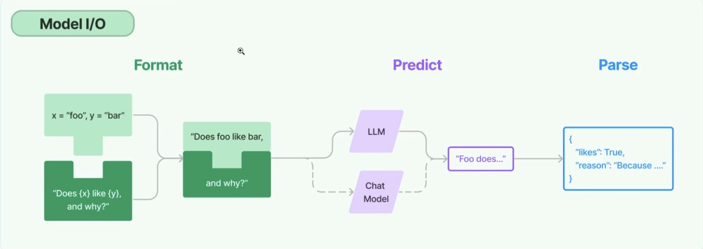

[toc]

## 框架组成

* langChain库：python和js库。
* langChain模板：langChain官方提供的一些AI任务模板
* langServe：基于FastAPI可以将Langchain定义的链(Chain)，发布成为REST API
* langSmith：开发平台，一个云服务，支持langChain debug、任务监控。

## 库组成

* langchain-core：基础抽象和langChain表达语言。
* langchain-community：第三方集成。
* langchain：主要包括链(chain)、代理(agent)和检索策略。

## 任务处理流程

## 核心概念

### LLMs

LangChain封装的基础模型，模型接受一个文本输入，然后返回一个文本输出

### Chat Models

聊天模型，接受一组对话消息并返回对话消息。

### 消息(message)

Chat Models中的消息内容，类型包括HumanMessage，AIMessage，SystemMessage等

### 提示(prompts)

LangChain封装了一组专门用于提示词管理的工具类，方便我们格式化提示词内容。

### 输出解析器(Output Parsers)

将大模型的输出解析成需要的结果，如json，xml等

### 检索框架(Retrievers)

LangChain封装了检索框架，用于加载文档数据，并切割存储和检索文档的数据。

### 向量存储(Vector stores)

langChain支持多种向量数据库。

### 智能体(Agents)

大模型作为决策引擎，根据用户输入的任务，自动调用外部系统、硬件设备共同完成用户的任务