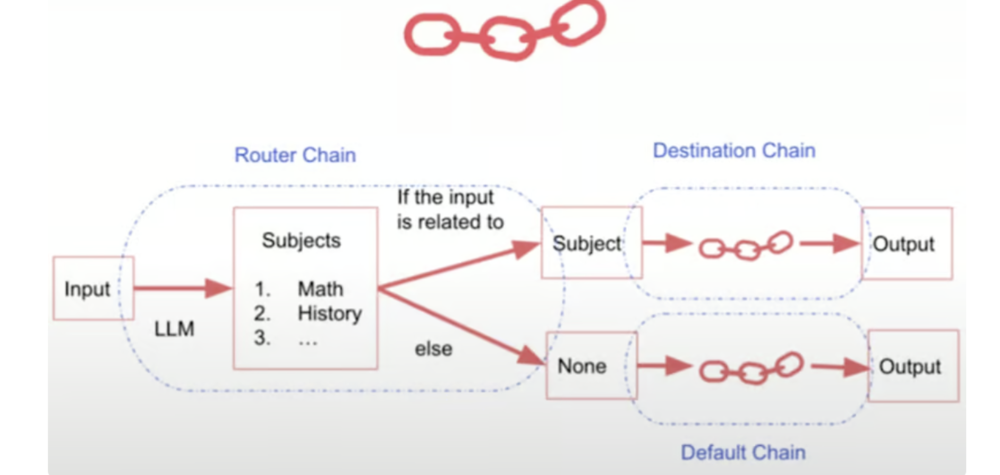

## SimpleSequentialChain

SimpleSequentialChain是一种简单的顺序链，它允许简单的串联多个chain。

```python
from langchain.chains import SimpleSequentialChain

# Initialize the language model
llm = ChatOpenAI(temperature=0.9, model=llm_model)

# 链1，输出推荐公司名称
first_prompt = ChatPromptTemplate.from_template("What is the best name to describe a company that makes {product}?")
chain_one = LLMChain(llm=llm, prompt=first_prompt)

# 链2，输出公司名相关的简介
second_prompt = ChatPromptTemplate.from_template("Write a 20-word description for the following company: {company_name}")
chain_two = LLMChain(llm=llm, prompt=second_prompt)

# 创建简单串行链
overall_simple_chain = SimpleSequentialChain(chains=[chain_one, chain_two], verbose=True)

# 运行串行链
product = "Queen Size Sheet Set"
chain_output = overall_simple_chain.invoke(product)
print(chain_output)
```

## SequentialChain

SequentialChain允许并行的链和处理多个输入和输出

```python
from langchain.chains import SequentialChain

# Initialize the language model
llm = ChatOpenAI(temperature=0.9, model=llm_model)

# chain1 翻译评论为英文
first_prompt = ChatPromptTemplate.from_template("Translate the following review to English:\n\n{Review}")
chain_one = LLMChain(llm=llm, prompt=first_prompt, output_key="English_Review")

# chain2 总结评论
second_prompt = ChatPromptTemplate.from_template("Can you summarize the following review in 1 sentence:\n\n{English_Review}")
chain_two = LLMChain(llm=llm, prompt=second_prompt, output_key="summary")

# chain3 输出评论的语言
third_prompt = ChatPromptTemplate.from_template("What language is the following review:\n\n{Review}")
chain_three = LLMChain(llm=llm, prompt=third_prompt, output_key="language")

# chain4 产生后续回应
fourth_prompt = ChatPromptTemplate.from_template("Write a follow-up response to the following summary in the specified language:\n\nSummary: {summary}\n\nLanguage: {language}")
chain_four = LLMChain(llm=llm, prompt=fourth_prompt, output_key="followup_message")

# 创建复杂工作流
overall_chain = SequentialChain(
    chains=[chain_one, chain_two, chain_three, chain_four],		#按顺序调用链
  																														#但是实际效果上好像是有部分链并行了
  																														#注意其中部分链将其他链的输入作为输出
    input_variables=["Review"],
    output_variables=["English_Review", "summary", "followup_message"],
    verbose=True,
)

# 测试
review = "Je trouve le goût médiocre. La mousse ne tient pas, c'est bizarre. J'achète les mêmes dans le commerce et le goût est bien meilleur...\nVieux lot ou contrefaçon !?"
chain_output = overall_chain.invoke(review)
print(chain_output)
```

* 上述代码完成了以下的任务


## MultiPromptChain

MultiPromptChain 允许我们定义这些专用提示，然后根据输入内容将输入动态路由到适当的提示。

```python
from langchain.chains.router import MultiPromptChain
from langchain.chains.router.llm_router import LLMRouterChain, RouterOutputParser
from langchain.prompts import PromptTemplate

# Define specialized prompt templates
physics_template = """You are a very smart physics professor. \
You are great at answering questions about physics in a concise\
and easy to understand manner. \
When you don't know the answer to a question you admit\
that you don't know.

Here is a question:
{input}"""


math_template = """You are a very good mathematician. \
You are great at answering math questions. \
You are so good because you are able to break down \
hard problems into their component parts, 
answer the component parts, and then put them together\
to answer the broader question.

Here is a question:
{input}"""

history_template = """You are a very good historian. \
You have an excellent knowledge of and understanding of people,\
events and contexts from a range of historical periods. \
You have the ability to think, reflect, debate, discuss and \
evaluate the past. You have a respect for historical evidence\
and the ability to make use of it to support your explanations \
and judgements.

Here is a question:
{input}"""


computerscience_template = """ You are a successful computer scientist.\
You have a passion for creativity, collaboration,\
forward-thinking, confidence, strong problem-solving capabilities,\
understanding of theories and algorithms, and excellent communication \
skills. You are great at answering coding questions. \
You are so good because you know how to solve a problem by \
describing the solution in imperative steps \
that a machine can easily interpret and you know how to \
choose a solution that has a good balance between \
time complexity and space complexity. 

Here is a question:
{input}"""

# Create prompt info dictionaries
prompt_infos = [
    {
   
   
        "name": "physics",
        "description": "Good for answering questions about physics",
        "prompt_template": physics_template,
    },
    {
   
   
        "name": "math",
        "description": "Good for answering math questions",
        "prompt_template": math_template,
    },
    {
   
   
        "name": "History",
        "description": "Good for answering history questions",
        "prompt_template": history_template,
    },
    {
   
   
        "name": "computer science",
        "description": "Good for answering computer science questions",
        "prompt_template": computerscience_template,
    },
]

# Initialize the language model
llm = ChatOpenAI(temperature=0, model=llm_model)

# 为每个prompt创建目标chain链
destination_chains = {
   
   }
for p_info in prompt_infos:
    name = p_info["name"]
    prompt_template = p_info["prompt_template"]
    prompt = ChatPromptTemplate.from_template(template=prompt_template)
    chain = LLMChain(llm=llm, prompt=prompt)
    destination_chains[name] = chain

# 为不匹配任何特殊提示符的输入定义一个默认chain链
default_prompt = ChatPromptTemplate.from_template("{input}")
default_chain = LLMChain(llm=llm, prompt=default_prompt)


#router提示模板
MULTI_PROMPT_ROUTER_TEMPLATE = """Given a raw text input to a \
language model select the model prompt best suited for the input. \
You will be given the names of the available prompts and a \
description of what the prompt is best suited for. \
You may also revise the original input if you think that revising\
it will ultimately lead to a better response from the language model.

<< FORMATTING >>
Return a string snippet enclosed by triple backticks a JSON object formatted to look like below:
{
    "destination": string \ name of the prompt to use or "default"
    "next_inputs": string \ a potentially modified version of the original input
}

REMEMBER: "destination" MUST be one of the candidate prompt \
names specified below OR it can be "default" if the input is not \
well suited for any of the candidate prompts. \
REMEMBER: "next_inputs" can just be the original input \
if you don't think any modifications are needed.

<< CANDIDATE PROMPTS >>
{destinations}

REMEMBER: If destination name not there input the question

<< INPUT >>
{input}

<< OUTPUT (remember to include the ```

json

```)>>"""

# 创建router提示模板，给路由器使用
router_template = MULTI_PROMPT_ROUTER_TEMPLATE.format(destinations=destinations_str)
router_prompt = PromptTemplate(template=router_template, input_variables=["input"], output_parser=RouterOutputParser())
router_chain = LLMRouterChain.from_llm(llm, router_prompt)

# 创建路由链
chain = MultiPromptChain(
    router_chain=router_chain,
    destination_chains=destination_chains,
    default_chain=default_chain,
    verbose=True,
)

# Run the chain on some input data
physics_question = "What is black body radiation?"
chain_output = chain.invoke(physics_question)
print(chain_output)
# Output 
# Entering new MultiPromptChain chain...
# physics: {'input': 'What is black body radiation?'}
# Finished chain.
# {'input': 'What is black body radiation?',
#  'text': "Black body radiation is the electromagnetic radiation emitted by a perfect absorber of radiation, known as a black body. A black body absorbs all incoming radiation and emits radiation across the entire electromagnetic spectrum. The spectrum of black body radiation is continuous and follows a specific distribution known as Planck's law. This phenomenon is important in understanding the behavior of objects at different temperatures and is a key concept in the field of thermal physics."}

math_question = "what is 2 + 2"
chain_output = chain.invoke(math_question )
print(chain_output)
# Output 
# Entering new MultiPromptChain chain...
# math: {'input': 'what is 2 + 2'}
# Finished chain.
# {'input': 'what is 2 + 2', 'text': 'The answer to 2 + 2 is 4.'}

biology_question = "Why does every cell in our body contain DNA?"
chain_output = chain.invoke(biology_question )
print(chain_output)
# Output
# Entering new MultiPromptChain chain...
# None: {'input': 'Why does every cell in our body contain DNA?'}
# Finished chain.
# {'input': 'Why does every cell in our body contain DNA?',
#  'text': 'Every cell in our body contains DNA because DNA carries the genetic information that determines the characteristics and functions of an organism. DNA contains the instructions for building and maintaining an organism, including the proteins that are essential for cell function and structure. This genetic information is passed down from parent to offspring and is essential for the growth, development, and functioning of all cells in the body. Having DNA in every cell ensures that the genetic information is preserved and can be used to carry out the necessary processes for life.'}
```


