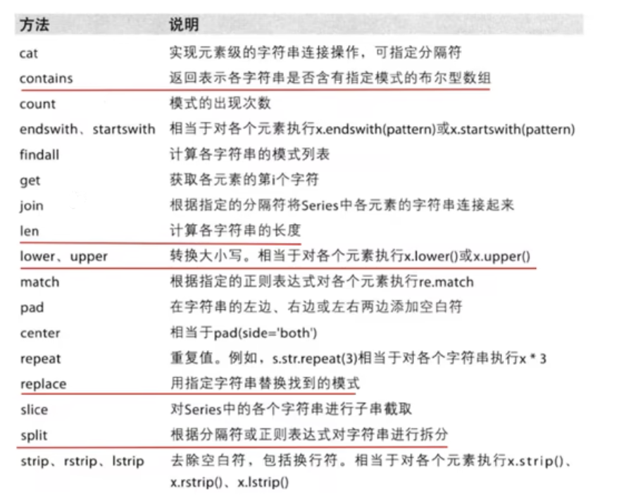

## pandas

pandas相当于能处理非数值数据的numpy

* pandas中的统计不会统计NaN的对应位置

## pandas常用数据类型

- series：带标签的一维数组
- DataFrame：带标签的二维数组

#### 1. series

series中带标签是指每个数据都有索引，而且索引可以不为数字

> 创建

```python
t = pd.Series([1,2,3])	#不指定索引，默认索引为0,1,2,...,n
#0	1
#1	2
#2	3

t = pd.Series([1,2,3],index = list("abc")) 	#指定索引为a,b,c
#a	1
#b	2
#c	3

#重新指定索引，新索引中与与原索引重复的部分保留，新的部分为NaN
t2 = pd.Series(t,index = list("ade"))	#重新指定索引为d,e,f,g
#a	1
#d	NaN
#e	NaN

#通过字典创建，key变索引，value变值
tmp_dict = {"name":"xiaoming","age":30,"tel":10086}
t3 = pd.Series(tmp_dict)
#age	30
#name	xiaoming
#tel	10086
```

> 常用成员

| 成员  | 作用                                                         |
| ----- | ------------------------------------------------------------ |
| dtype | 查看数组值类型                                               |
| index | 取出index列表(使用可以同list,但是类型不是list，可以拿来生成list) |
| value | 取出value列表(使用可以同list,类型为nmupy.ndarray，可以拿来生成list) |

> 常用方法

| 方法                                                         | 作用                       |
| ------------------------------------------------------------ | -------------------------- |
| astype(type)                #例：t.astype(float)             | 改变数据类型               |
| operator[index]            #index为数值或用户规定索引都可以，因为series为一维 | 通过索引获取数据           |
| operator[index,index2]         #index的值同上                | 取多行                     |
| operator[index:index:index]                                  | 同python中切片             |
| operator[条件]                  #例：(series) t=[1,2,3,4,5]                t[t>2] = [3,4,5] | 获取满足条件的值           |
| where(条件,替换值)       #例：(series) t=[1,2,3,4]        t.where(t>2,0) = [1,2,0,0] | 将满足条件的列替换为其他值 |

#### 2.DataFrame

DataFrame中的数据为二维，而且两个维度也允许拥有独特的索引，DataFrame的打印会显示行列索引，当DataFrame中的行数据太多时，打印会用...来忽略中间的内容。列数据会用 \\ 换行

* DataFrame为一个series容器

> 创建

```python
t = pandas.DataFrame(np.arange(12).reshape((3,4)))
#   0  1  2  3
#0  0  1  2  3
#1  4  5  6  7
#2  8  9  10 11

#创建时指定索引
t = pandas.DataFrame(np.arange(12).reshape((3,4)),index=list("abc"),columns=list("WXYZ"))
#   W  X  Y  Z
#a  0  1  2  3
#b  4  5  6  7
#c  8  9  10 11

#用字典创建
d1 = {"name":["xiaohong","xiaoming"]
     "age":[20,30],
     "tel":[10086,10001]}
d2 = {"name":["xiaohong","xiaoming"]
     "age":[20,30],
     "tel":[10086]}
t = pd.DataFrame(d1)
t2 = pd.DataFrmae(d2)
#t
#   age  name      tel
#0	20	 xiaohong  10086
#1	30	 xiaoming  10001
                     
#t2
#   age  name      tel
#0	20	 xiaohong  10086
#1	30	 xiaoming  NaN
```

> 常用成员

| 成员    | 作用                              |
| ------- | --------------------------------- |
| shape   | 行数与列数                        |
| Dtypes  | 列数据类型                        |
| ndim    | 数据维度                          |
| index   | 行索引列表                        |
| columns | 列索引列表                        |
| values  | 存储的数值(不带索引)，二维ndarray |

> 常用方法

| 方法                                                         | 作用                                                         |
| ------------------------------------------------------------ | ------------------------------------------------------------ |
| head()                                                       | 显示头部几行，可以传入数字，不传入时默认5行。                |
| tail()                                                       | 显示末尾几行，可以传入数字，不传入时默认5行。                |
| info()                                                       | 显示该DataFrame的详细信息                                    |
| describe()                                                   | 快速综合统计结果(计数，均值，标准差，最大值，四分位数，最小值)，调用后返回一个DataFrame来存储这些数据。 |
| sort_values()        #常用参数by，传入str，表示要排序的列名(列名为数字则传入数字)。ascending，传入bool，表示生序还是降序 | 按什么来排序                                                 |
| operator[index:index:index]                                  | 同python数组的切片，但是以行数据为单位                       |
| operator[index]            #[]重载传入数字时，表示取行操作，传入字符或单个数字(此时列为数字索引)时表示进行列操作 | 取的某一列，df[0]表示取第0列的所有数据，df[:20]表示取前20行数据，df["name"]表示取name列的所有数据 |
| loc[row_index,column_index]    #精确获取单个<br />loc[ [row1 , row2] ]    #获取row1和row2的数据<br />loc[ : , [column_index,column_index] ]      #获取对应列的全部数据 | 精确获取，索引可以为对应的行列索引，一般不能为数字，如果需要用位置来获取，需要使用iloc，只有当索引为数字时，才可以传入数字来进行索引 |
| iloc                                                         | 操作同loc，但是使用的位置                                    |
| operator[ (bool) & (bool) & (bool) \| (bool) ]               | 条件筛选，用&或\|来连接多个条件，一般条件针对列              |
| dropna()                                                     | 删除含有Nan的相关数据                                        |

> DataFrame中的自己的str方法



* 该str方法可以用于bool索引判断中

```python
df[df["name"].str.len()>4]			#名字列长度大于4的单元
```

> NaN的判断与修改

* 判断

使用pandas的isnull

```python
#t
#   0  1  2  3
#0  0  NaN  2  3
#1  4  5  6  7
#2  8  9  10 NaN
pandas.isnull(t)
#返回一个DataFrame
#   0  	   Nan    2      3
#0  Flase  True   Flase  Flase
#1  Flase  Flase  Flase  Flase
#2  Flase  Flase  Flase  True

pandas.notnull(t)
#返回类型同isnull，但是bool相反

#isnull与notnull可以用于dataframe中的bool筛选，用来筛选含有或未含有Nan的行
```

* 修改

```
#t
#   0  1  2  3
#0  0  NaN  2  3
#1  4  5  6  7
#2  8  9  10 NaN

#axis=0表示删除相关行，=1表示删除相关列，how = "all"表示只有改行中全为NaN时才删除,="any"表示只要有一个NaN就删除相关行
t.dropna(axis=0,how="all")


#填充所有的NaN数据为某个数据
t.fillna(0)
t.fillna("hello")
```


## pandas数据的读取

* 读取的数据类型可能为series或DataFrame

> 常用方法

| 方法                                   | 作用                                                         |
| -------------------------------------- | ------------------------------------------------------------ |
| read_csv                               | 从csv文件                                                    |
| read_clipboard                         | 从剪切板读取(常在命令行使用)                                 |
| read_excel    #常用参数为sheet(工作薄) | 从excel读取，指定工作薄为None时，读取整个excel，并且组成一个字典(内部存储 "SheetName" : 对应数据的DataFrame ，如果只读取一个工作薄，则获取一个DataFrame) |
| read_sql                               | 从mysql等sql数据库读取                                       |
| read_...                               | 从各种读取                                                   |
