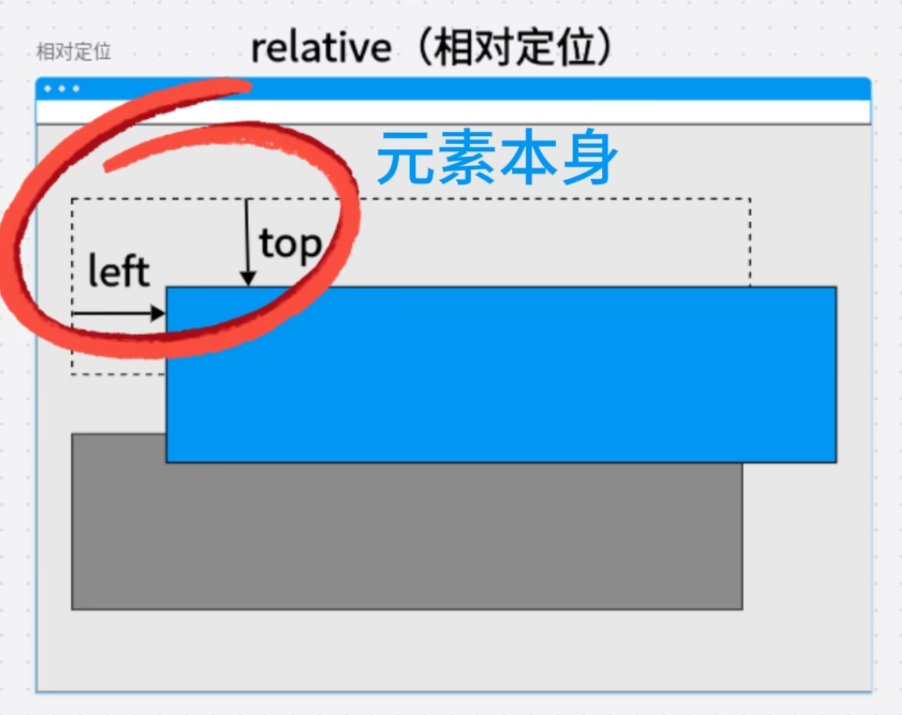
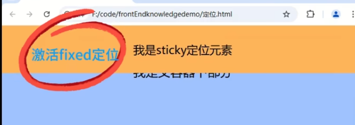
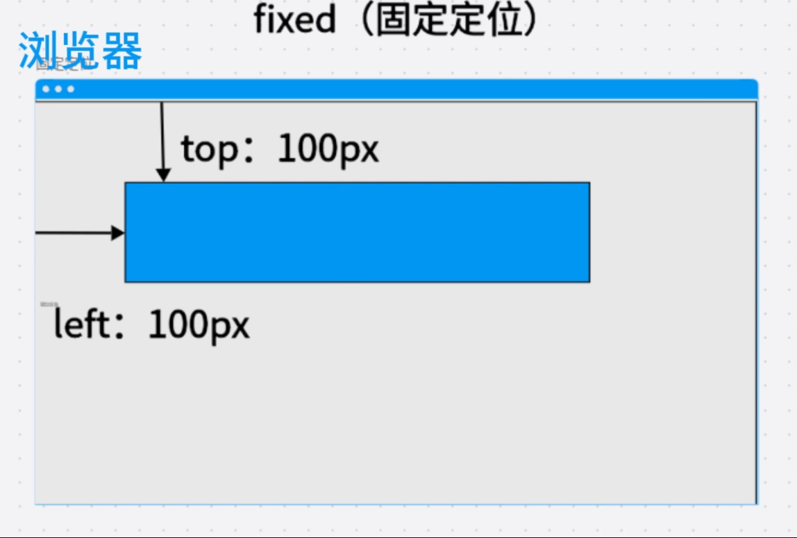
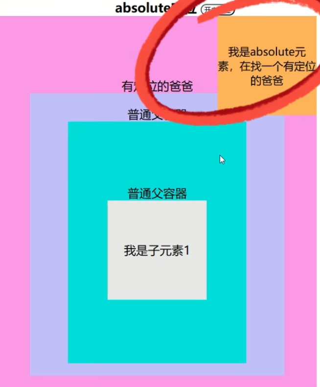

## css定位

position元素相关解释

### 正常文档流

该定位仍然占用布局空间

* static(静态定位)：元素不指定position值的默认定位，按照正常的文档流进行定位，此时设置控制方位都是无效的
* relative(相对定位)：相较于正常文档流中自己的本身进行定位，但是原来的位置还在，不影响其他元素的位置
  * 
* sticky（粘性定位）:始终在浏览器内部，不会收到滚动条等功能将元素滚动到外面，类似于excel中的固定行和列
  * 

### 脱离文档

该定为不占用布局空间

* fixed(固定定位)：参照物为浏览器左上角，影响其他元素的位置

  * 

* absolute(绝对定位)：参照物为最近的一个非static父容器，如果都没有，则拿顶级容器浏览器为参照物。

  * 

  

### 控制方位

用于控制定位的偏移，可以为负

* top：
* bottom：
* left：
* right：