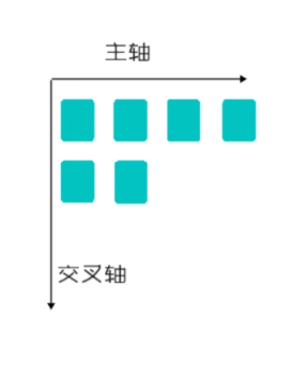
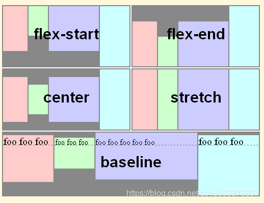
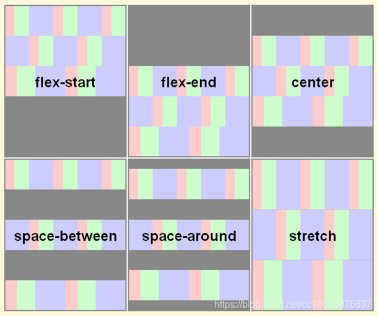

[toc]

## 介绍

一个现代化的布局，其可以解决80%布局问题

## flex布局的启用

首先需要一个容器

``` css
.container{
	display: flex;		/*启用flex*/
}
```

## flex布局常用属性

### 排版



flex默认以水平方向为主方向，从左到右方向，交叉轴为垂直方向，从上到下

可以通过flex-direction来规定轴方向

* row（默认）
* row-revers（与row轴相同，但方向相反）
* column（主轴为垂直方向，元素先从上到下再从左到右）
* column-revers（与column轴相同，但方向相反）

### 轴排列方式

可以通过justify-content来设置轴中元素的排列方式

* flex-start：左对齐
* flex-end： 右对齐
* center：居中
* space-between：元素之间均匀分布剩余空间，但是最左和最右元素会靠边
* space-around：元素之间均匀分布剩余空间，但是最左和最右元素不会靠边
* baseline：第一行文本的基线对其

### 垂直轴排列方式

可以通过align-items来实现

* stretch： 子项会拉伸以填充 Flex 容器在交叉轴上的可用空间，默认，前提是flex项目未设置高度
* flex-start：顶部对齐
* flex-end：底部对齐
* center：居中对齐
* baseline：第一行文本的基线对其

[align-items](https://www.w3.org/TR/css-flexbox-1/#propdef-align-items)属性可以应用于所有的flex容器，它的作用是设置flex子项在每个flex行的交叉轴上的默认对齐方式。不同取值的效果如下：



### 多行元素垂直排列方式

* 单行对align-content不生效

通过align-content，行为等同于垂直版justify-content。

* stretch：
* flex-start：
* flex-end：
* center：
* space-between：
* space-around：

[align-content](https://www.w3.org/TR/css-flexbox-1/#propdef-align-content) **只适用**多行的flex容器（也就是flex容器中的子项不止一行时该属性才有效果），它的作用是当flex容器在交叉轴上有多余的空间时，将子项作为一个整体（属性值为：flex-start、flex-end、center时）进行对齐。不同取值的效果如下所示：

