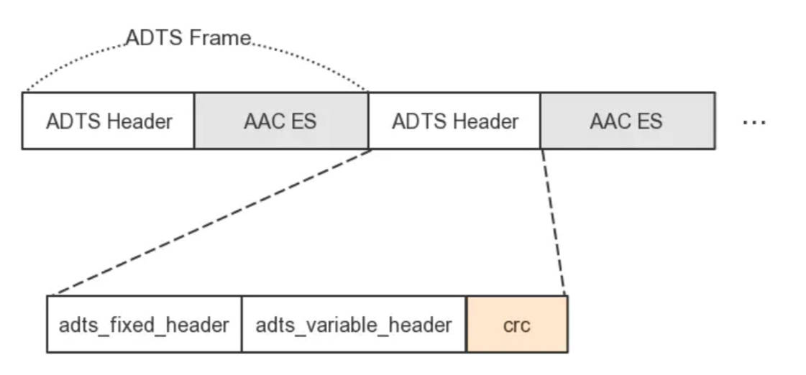

[toc]

## AAC的组成

AAC音频文件的每一帧都由一个ADTS头和AAC ES(AAC音频数据)组成。


> 组成图




> ADTS头

ADTS头包含了AAC文件的采样率、通道数、帧数据长度等信息。ADTS头分为固定头信息和可变头信息两个部分，固定头信息在每个帧中的是一样的，可变头信息在各个帧中并不是固定值。


ADTS的头信息分为：固定头信息(adts_fixed_header)和可变头信息(adts_variable_header)两部分。如果数据有CRC，最后还要加上CRC内容(16bit)。

* **CRC（Cyclic Redundancy Check，循环冗余校验）** 是一种用于检测数据在传输或存储过程中是否发生错误的 **校验算法**，广泛用于网络通信、存储设备、压缩文件等领域。


ADTS头一般是7个字节((28+28)/ 8)长度，如果需要对数据进行CRC校验，则会有2个Byte的校验码，所以ADTS头的实际长度是7个字节或9个字节。


adts_fixed_header的每一帧的内容是不变的。
adts_variable_header的每一帧的内容是存在变化的。


## 固定头信息(adts_fixed_header)

| 字段                     | <span style="display:inline-block;width: 50px">比特数</span> | 说明                                                         |
| ------------------------ | ------------------------------------------------------------ | ------------------------------------------------------------ |
| syncword                 | 12                                                           | 同步头代表着1个ADTS帧的开始，所有bit置1，即 0xFFF            |
| ID                       | 1                                                            | MPEG标识符，0标识MPEG-4，1标识MPEG-2                         |
| layer                    | 2                                                            | 所有位必须为0                                                |
| protection_absent        | 1                                                            | CRC标识符，1代表没有CRC，0代表有。                           |
| profile                  | 2                                                            | 配置级别，ffmpeg中可以直接使用编码器上下文中对应流的参数的profile |
| sampling_frequency_index | 4                                                            | 标识使用的采样率的下标，具体见下表                           |
| private_bit              | 1                                                            | 私有位，编码时设置为0，解码时忽略                            |
| channel_configuration    | 3                                                            | 声道数标识                                                   |
| original_copy            | 1                                                            | 编码时设置为0，解码时忽略                                    |
| home                     | 1                                                            | 编码时设置为0，解码时忽略                                    |

> 关于采样率下标

| 下标 | 采样率  |
| ---- | ------- |
| 0    | 96000Hz |
| 1    | 88200Hz |
| 2    | 64000Hz |
| 3    | 48000Hz |
| 4    | 44100Hz |
| 5    | 32000Hz |
| 6    | 24000Hz |
| 7    | 22050Hz |
| 8    | 16000Hz |
| 9    | 12000Hz |
| 10   | 11025Hz |
| 11   | 8000Hz  |
| 12   | 7350Hz  |
| 13   | 保留    |
| 14   | 保留    |
| 15   | 保留    |

> 关于配置级别 profile

在MPEG-2 AAC中定义了3种profile：

- MPEG-2 AAC Main
- MPEG-2 AAC LC (Low Complexity)
- MPEG-2 AAC SSR (Scalable Sampling Rate)

在MPEG-4 AAC中定义了6种profile：

- MPEG-4 AAC Main
- MPEG-4 AAC LC (Low Complexity)
- MPEG-4 AAC SSR (Scalable Sample Rate)
- MPEG-4 AAC LTP (Long Term Predicition)
- MPEG-4 AAC LD (Low Delay)
- MPEG-4 AAC HE (High Efficiency) AACPlusV1/V2(3GPP)


## 可变头信息(adts_variable_header)

| 字段                                | <span style="display:inline-block;width: 50px">比特数</span> | 说明                                                         |
| ----------------------------------- | ------------------------------------------------------------ | ------------------------------------------------------------ |
| copyright_identification_bit        | 1                                                            | 直接置0，解码时忽略这个参数                                  |
| copyright_identification_start      | 1                                                            | 直接置0，解码时忽略这个参数                                  |
| aac_frame_lenght                    | 13                                                           | 帧长度,包括header和crc的长度                                 |
| adts_buffer_fullness                | 11                                                           | 当设置为0x7FF时表示时可变码率                                |
| number_of_raw_data_blocks_in_frames | 2                                                            | 当前音频包里面包含的音频编码帧数， 置为 aac_nums - 1, 即只有一帧音频时置0 |

## ES

使用AAC相关算法压缩后的数据。

* 一般MP4、FLV、RTMP等不需要AAC头
* TS、原始AAC中需要AAC头


## ffmpeg实例写入一个aac数据

```c++
//采样率
const int sampling_frequencies[] = {
        96000,  // 0x0
        88200,  // 0x1
        64000,  // 0x2
        48000,  // 0x3
        44100,  // 0x4
        32000,  // 0x5
        24000,  // 0x6
        22050,  // 0x7
        16000,  // 0x8
        12000,  // 0x9
        11025,  // 0xa
        8000    // 0xb
        // 0xc d e f是保留的
};

int adts_header(char* const p_adts_header, const int data_length,
                const int profile, const int sample_rate, const int channels) {
    int sampling_frequency_index = 3;  // 默认使用48000hz
    int adtsLen = data_length + 7;

    int frequencies_size =
            sizeof(sampling_frequencies) / sizeof(sampling_frequencies[0]);
    int i;
    //查找采样率
    for (i = 0; i < frequencies_size; i++) {
        if (sampling_frequencies[i] == sample_rate) {
            sampling_frequency_index = i;
            break;
        }
    }

    if (i >= frequencies_size) {
        std::cout<<"not found sample rate!"<<std::endl;
    }

    //大端顺序存放
    p_adts_header[0] = 0xff;       // syncword:0xfff                 高8bits
    p_adts_header[1] = 0xf0;       // syncword:0xfff                 低4bits
    p_adts_header[1] |= (0 << 3);  // MPEG Version : 0代表MPEG-4,1代表MPEG-2, 1bit
    p_adts_header[1] |= (0 << 1);  // layer字段 2位   所有位必须为0
    p_adts_header[1] |= 1;         // protection absent:1代表没有CRC，0代表有 1bit

    p_adts_header[2] = (profile) << 6;  // profile: 配置级别，可以使用编码器中的profile，详情见aac头       2bits
    p_adts_header[2] |= (sampling_frequency_index & 0x0f) << 2;  // sampling frequency index: 标识使用的采样频率 频率表同上述全局数组的定义  4bits
    p_adts_header[2] |= (0 << 1);  // private bit: 私有位，编码时设置为0，解码时忽略  1bit
    p_adts_header[2] |= (channels & 0x04) >> 2;  // channel configuration: 标识声道数  高1bit

    p_adts_header[3] = (channels & 0x03) << 6;       // channel configuration: 标识声道数  低2bits
    p_adts_header[3] |= (0 << 5);  // original：编码时设置为0，解码时忽略                     1bit
    p_adts_header[3] |= (0 << 4);  // home：编码时设置为0，解码时忽略                         1bit
    p_adts_header[3] |= (0 << 3);  // copyright id bit：编码时设置为0，解码时忽略             1bit
    p_adts_header[3] |= (0 << 2);  // copyright id start：编码时设置为0，解码时忽略           1bit
    p_adts_header[3] |= ((adtsLen & 0x1800) >> 11);  // 帧数长度,包括header和crc的长度  13bit  高2bits

    p_adts_header[4] = (uint8_t)((adtsLen & 0x7f8) >> 3);  // 帧数长度  中间8bits

    p_adts_header[5] = (uint8_t)((adtsLen & 0x7) << 5);  // 帧数长度    低3bits
    p_adts_header[5] |= 0x1f;             // 填充字节 0x7ff 高5bits

    p_adts_header[6] = 0xfc;              // 填充字节 0x7ff 低6bits

    // number_of_raw_data_blocks_in_frame：
    // 表示ADTS帧中有number_of_raw_data_blocks_in_frame + 1个AAC原始帧
    // 当前音频包里面包含的音频编码帧数， 置为 aac_nums - 1, 即只有一帧音频时置0

    //CRC效验位   16bit  如果没有保护,这位为0
    //CRC
    return 0;
}


//main
---
while (av_read_frame(fmt_ctx, &pkt) >= 0) {
	if (pkt.stream_index == audio_index) {
		char adts_header_buf[7] = {0};
		adts_header(
            adts_header_buf, 
            pkt.size,
            //使用编码器上下文中的配置
			fmt_ctx->streams[audio_index]->codecpar->profile,
            fmt_ctx->streams[audio_index]->codecpar->sample_rate,
            fmt_ctx->streams[audio_index]->codecpar->channels
        );
    // 写adts header , ts流不适用，ts流分离出来的packet带了adts header。
    fwrite(adts_header_buf, 1, 7, fp);
    int len = fwrite(pkt.data, 1, pkt.size, fp);  // 写adts data
    if (len != pkt.size) {
    	std::cout<<"data length isn't equal pkt.size"<<std::endl;
    }
}
    av_packet_unref(&pkt); 
---
```